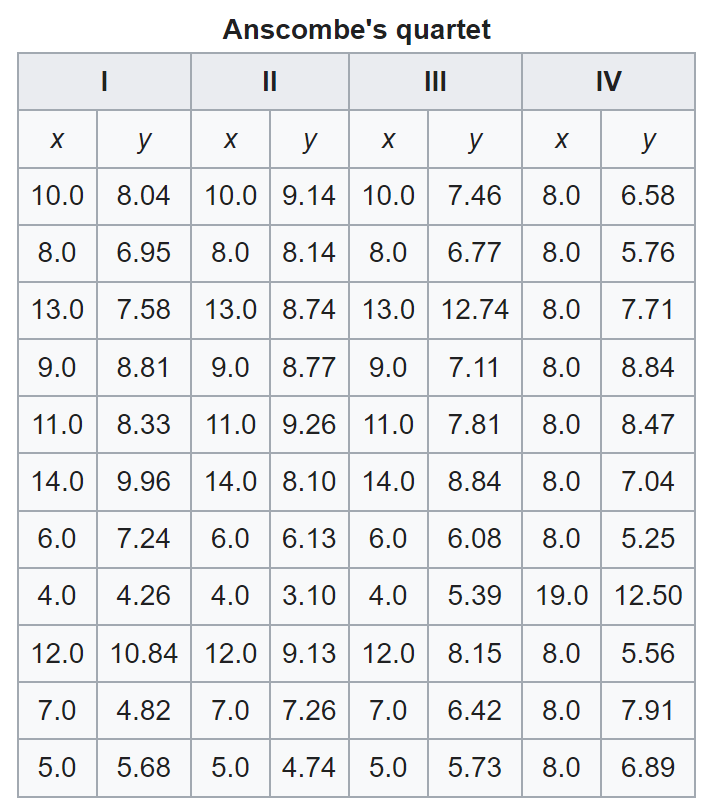
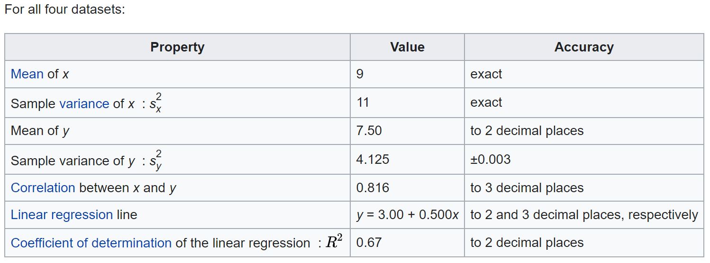
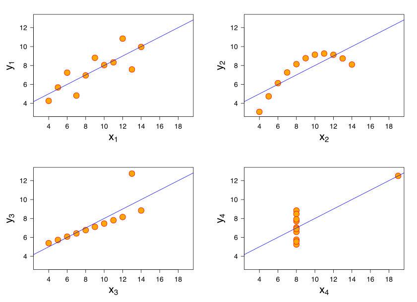
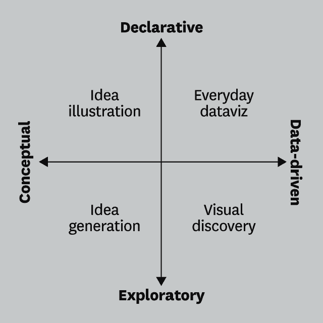
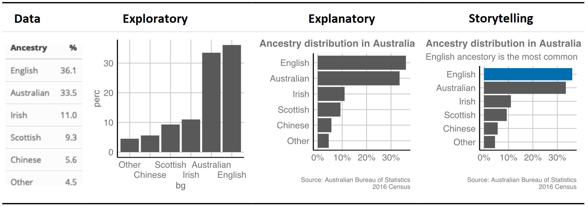
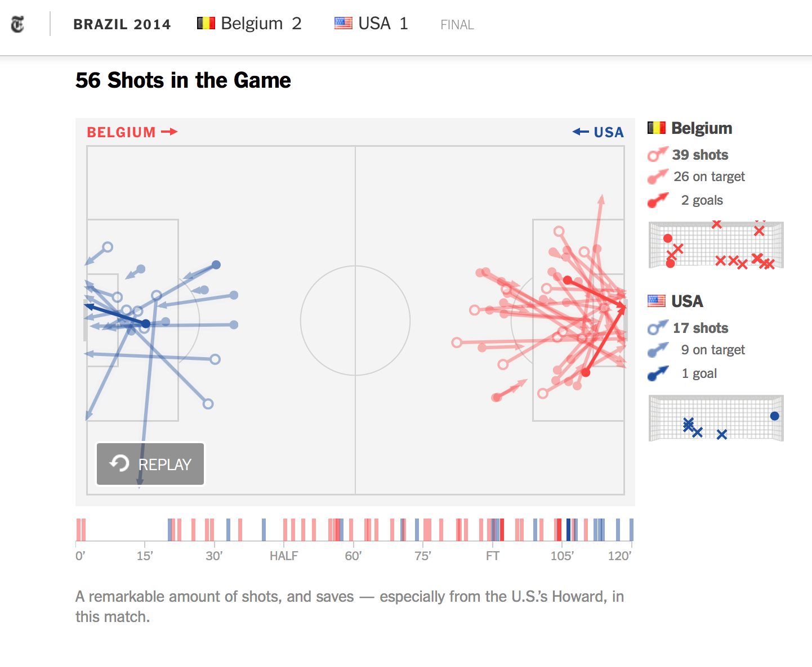
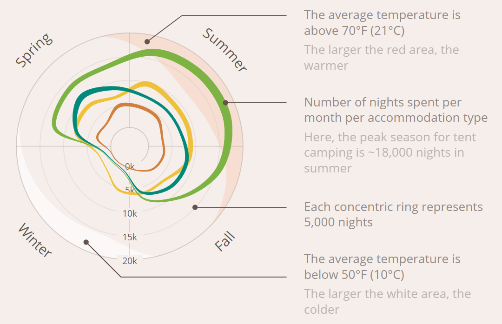
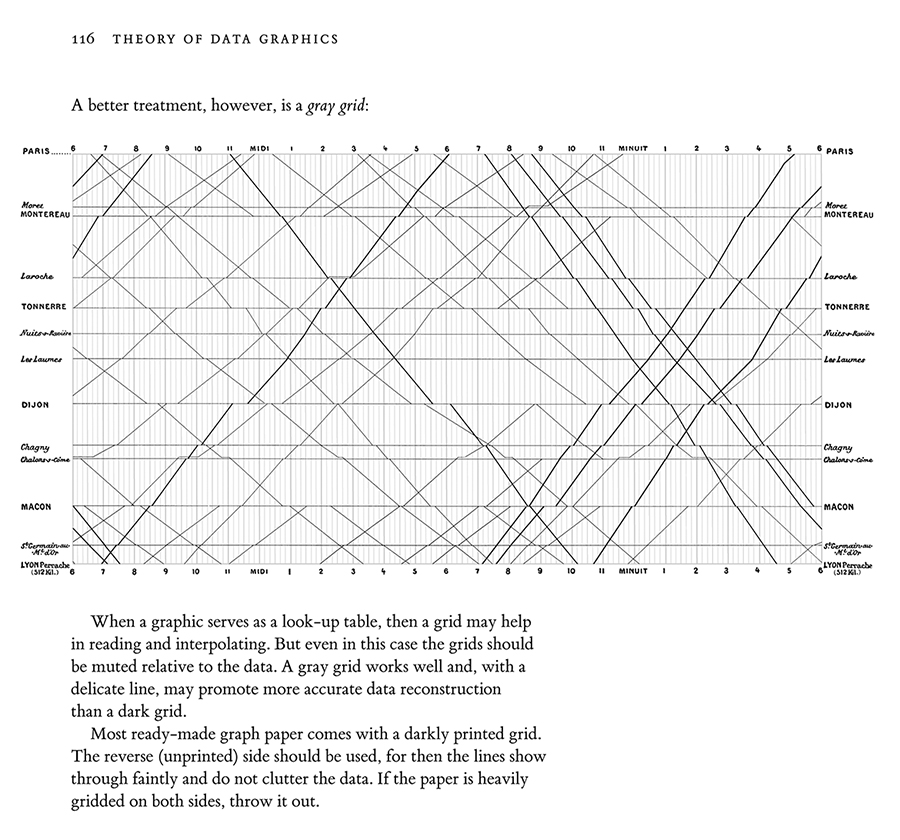
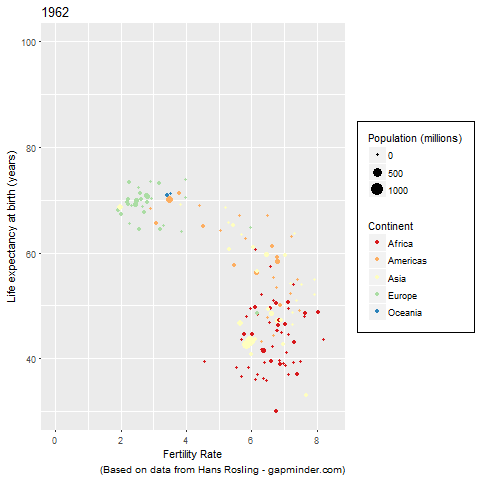

--- 
title: "Ch1 Introduction"
subtitle: "Descriptive Analytics and Data Visualization"
author: "Yichen Qin (qinyn@ucmail.uc.edu), University of Cincinnati"
date: "`r Sys.Date()`"
output: 
  html_document:
    number_sections: true
    code_folding: "show"
    toc: true
bibliography: [book.bib, packages.bib]
biblio-style: apalike
link-citations: yes
---


# Introduction {-}


<!---

# What is Business Analytics?

According to the Institute for Operations Research and the Management Sciences (INFORMS), business analytics is **the scientific process of transforming data into insights for making better decisions** [@Camm2022]. 
Business analytics is used for data-driven or fact-based decision making, which is often seen as more objective than other alternatives for decision making. 
Examples of business analytics include forecast for planning, quantify risk, find better alternatives for optimization.

Business analytics is a broad term that includes four categories of techniques: 

- **Descriptive analytics**
- **Predictive analytics**
- **Prescriptive analytics**

**Descriptive analytics** describes/summarizes what has happened in the past (using the observed data) and extracts meaningful patterns in the data. Examples include data queries, summary statistics, data visualization, data dashboard, and data mining. 

- **Summary statistics and data visualization** are usually the most frequently used descriptive analytics technique. Each visualization or statistic focus on a specific aspect of the data and business process.
- **Data dashboard** is simple a collection of data visualization, summary statistics, tables, and etc, which help the data analyst to understand and monitor the status of the entire business process. Data dashboard gives a holistic view of the entire organization/event/process.
- **Data mining** is also used in descriptive analytics to understand the data and extract meaningful patterns from data. 
For example, sentiment analysis of social media data, dimension reduction for high-dimensional data, and clustering analysis.

**Predictive analytics** uses what has happened in the past to predict what is going to happen in the future.
It usually builds mathematically models on historical data to make predictions, including **regression, time series analysis, simulation, data mining, machine learning**.
For example, past sales/volume/visitor counts can be used to predict future ones using mathematical models. We can understand the sales growth trajectory and seasonality to help us better forecast the future and plan accordingly. 
Using past purchasing behavior, we can predict the future sales of a new product. 

**Prescriptive analytics** tells us what would happen in the future if we make certain changes to our business and identifies the best course of actions.
In other words, prescriptive analytics is generating a sequence of decisions. 
**Optimization and simulation** are frequently used techniques in this area.
For example, airline companies use the past sales data to recommend the best pricing strategy to maximize the profit.
Investors use the past stock data to recommend the best portfolio that maximizes return while controlling the risk.

**Diagnostic analytics** Sometimes, you may see another kind of analytics called diagnostic analytics. 
It addresses the question: Why did this happen?
It isolates the root-cause of the business problems.
Diagnostic analytics is usually performed using such techniques as data discovery, data mining, and correlation analysis.

```{r, echo=FALSE}
knitr::include_graphics("images/Spectrum_BANA.PNG")
```

# The Rise of Business Analytics

In the recent decades, we have witnessed the **explosive growth** in business analytics applications.
This is due to a few factors.

First, as the technology improves, we are able to **collect more comprehensive data**.

Second, we are more capable to store and operate on these data using **powerful and efficient computer hardware**. 

Third, with the **advance in computational methods** such as deep learning and artificial intelligence, we are able to extract meaningful information from the gigantic data using computational intensive methods.
Without either factor, the business analytics in modern era would be difficult.

In the recent years, **Big data** becomes more common in business applications. 
Big data simply refers to the data set that are **too big to be analyzed, stored, and managed by the traditional software and hardware within a reasonable amount of time**. 
Usually, parallel computing tools (or other divide-and-conquer methods) are needed to handle such data. 
Big data is usually involves unstructured data such as text, network, images, and videos. Big data is big in the following way.

- **Volume**: a large amount of data, such as sensors, images, voices, in terabytes (1T=1024G), petabyte (1P = 1024T) exabytes (1E=1024P)
- **Variety**: different types of data, such as structured (tables and databases), unstructured (text, network, voice, images), and multimedia data. 
- **Velocity**: streaming of data with short respond time, such as high-frequency millisecond (0.001 second) financial data, uber dispatching system during rush hours.
- **Veracity**: uncertainty in data due to data inconsistency or missing, variation in data quality.
- **Many other Vs**: Variability/Value/Vulnerability/Validity/Visualization

Eric Schmidt (Google CEO) once said every 48 hours now we create as much information as we did from the dawn of civilization up until 2003. 
GE's aviation team collaborates with Southwest Airlines to analyze the massive volumes of data airplanes generate. One transatlantic flight generates an average of 1,000 gigabytes. 
As the technology advances, the amount of data created has been growing drastically. 
Big data has presented great challenges and opportunities for analytics. In fact, big data directly prompts the usage of analytics in business context.

- Financial analytics
- Human resource analytics
- Marketing analytics
- Healthcare analytics
- Supply chain analytics
- Analytics for government and nonprofit organizations
- Sports Analytics
- Web Analytics

--->

# Data Analysis Flowchart

Descriptive analytics, predictive analytics, and prescriptive analytics use data to help analysts make better decisions.
Therefore, all analytics projects are essentially data analysis projects.
Following @Wickham2017, we would like to start by introducing the data analysis flowchart as follows.

```{r, echo=FALSE}
knitr::include_graphics("images/my_data_analysis_flowchart.PNG")
```

This flowchart gives us an overview of the key components in data analysis.
First, a data analysis project always starts at data collection and data import.
As a data scientist, collecting data and organize data in a format that can be efficiently stored and extracted is the foundation for effective data analysis.
This step is often accompanied with data management and database queries.
The data collection step highly depends on the context and is not our focus.
Instead, we mostly focus more on data import using R, which comes with useful functions and packages.
The most frequently used data format is comma-separated values (csv), which can be imported into R using `read.csv()`.

Once the data is imported, we analyze it through an iterative process where we switch among data wrangling, data visualization, and data modeling.
Data wrangling is to clean, reorganize, and transform data into a structure that are easy for visualization and modeling.
For example, data wrangling may create new variables based on the existing variables or filter out a few observations that satisfy certain requirements so that our analysis can be targeted.

After data is "wrangled", we can visualize data using various tools such as scatterplot, barplot, and etc.
The visualization helps us to get a better understanding about the data, such as strength of the signals in the data.
Based on the visualization, we can select the appropriate models for next step.
Alternatively, visualization may also suggest different data transformation and data wrangling, in which case we go back to data wrangling step.
The loop between data wrangling and data visualization allows us to feel the data more closely and understand the limitations of the data.

Another critical component is data modeling.
This is where the analytics models come in and help us with the hypothesis testing, prediction, diagnosis, and much more.
We do not extensively discuss this modeling component as our focus is on data visualization and data wrangling.

The driving force of the interaction among data wrangling, data visualization, and data modeling is the analytics goal, that is, the motivating questions or the research questions we have about the data.
Theses questions can be formed in different ways and at different stages.
For example, the motivating questions may be formed before we conduct the experiments and collect data.
Then we try to answer these questions using data wrangling/visualization/modeling and may even revise the questions accordingly because of the data quality.
On the other hand, we may be given a data set and asked to analyze it and report any interesting patterns and observations, which could lead to actionable decisions.
In this case, we enter into the data analysis with no specific questions in mind but gradually develop a sequence of questions through the iterative process.
Either way, the question propels the data analysis and helps us to decide the next step.

Once we finish the iterative process and are satisfied with what we find, we are ready to move the final stage of data analysis which is reporting.
In this stage, we communicate our results to the audience in a structured way.
**Storytelling** is the most important part in this stage.
The results and conclusions we find in the iterative process is often fragmented and lack of theme or structure.
In the reporting stage, we organize our findings organically and hierarchically so that the audience can understand and appreciate the impact of the findings, the context of the results, and the suggestions for the next step.
The data visualization is also used in this step.

**Descriptive analytics, or exploratory data analysis (EDA),** consists everything in the figure with less emphasis on modeling and more emphasis on visualization, while **predictive and prescriptive analytics** focuses more on modeling.

Given a data set, the first thing to do is to explore the data and see if the data is good for any modeling/analysis.
This is called exploratory data analysis. 
This step should be done before any formal modeling starts. 
In fact, EDA is one of the most important parts of any data analysis projects because it will help the data analyst to understand the data and select the right model.

EDA is often an iterative process where you **propose a few questions/ideas** that you would like to know/understand, and then analyze the data to **answer these questions** or implement these ideas. 
Some questions can be sufficiently answered using the data, some cannot.
Next, you form **more questions** and explore the data accordingly. 
After this iterative process, you **find a few promising questions** that can be answered by the data, which **lead you to formal modeling**. 

This is similar to **mining**, in that, before you take out the drill and do the work, you would like to check all possible sites and decide which areas could be more productive. 
EDA can be considered as **the step to explore all possible sites and identify the more promising sites**. 
In other words, EDA tells the analysts what kind of analysis/modeling the data at hand can afford and what it cannot afford.

# Why Visualization?

As we can see, visualization plays an important role in data analysis.
Why is visualization so important and effective?
To answer this, let us start with an example of Anscombe's quartet^[https://en.wikipedia.org/wiki/Anscombe%27s_quartet].
Suppose we have four data sets of two variables, x and y, and we are asked to explore the data and report interesting patterns and observations, such as modeling choices. 
Suppose we have imported and wrangled data and present them as follows.

```{r, echo=FALSE, out.width = "50%"}

```

For these data sets, we can compute the summary and descriptive statistics, such as mean, variance, and correlation.
Here is a list of common statistics.

- Measure of location: mean / median / mode / geometric mean / harmonic mean.
- Measure of variability: range / variance / standard deviation / coefficient of variation/ interquartile range (IQR)
- Measure of distribution: probability density function (pdf) / cumulative distribution function (cdf) / percentiles / quartiles / Z-scores
- Measure of association between: Pearson (linear) / Kendall (nonlinear) / Spearman (nonlinear) correlations
- Basic visualization: histogram / boxplot / scatter plot / barplot
- Type of data: continuous(quantitative)/discrete(categorical,qualitative)/cross-sectional/time series/unstructured such as text, networks, images, videos,

However, as we can see below, some of these key statistics are identical across all four data sets.
We simply cannot distinguish them using statistics.

```{r, echo=FALSE, out.width = "90%"}

```

This is because statistics are high level summaries of the data that may overlook intricate details in the data.
Alternatively, if we visualize the data, we immediately see the problem.

```{r, echo=FALSE, out.width = "90%"}

```

It seems that the **first data set is suitable for linear regression analysis**. 
The **second data set is suitable for polynomial regressions or nonparametric regression**.
The first data set clearly has an outlier. 
Once it is removed, linear model seems plausible.
The last data set clearly shows an imbalance in the value of x and requires a different set of models.
These insights would not be possible without data visualization.
**These insights are also useful for modeling.**

Data visualization helps us understand information faster.
In fact, visualization is the fastest way for our brain to process information than descriptive texts or numbers.
So image is the best channel to convey information to our brain than audio and text.

> "Numerical quantities focus on expected values, graphical summaries on unexpected values." --- John Tukey^[https://en.wikipedia.org/wiki/John_Tukey]

> A picture is worth a thousand words

Therefore, the key is to find the easiest form of representation of the data so that our brain can quickly understand the data.
Good visualization simplifies complex data for our brain, whereas bad visualization complicates the data and confuses our brain.

# Visualization in General and Data Visualization

In this book, we mostly focus on data visualization
However, visualization is much more than that.
Visualization in general can be divided in four quadrants as follows^[https://hbr.org/2016/06/visualizations-that-really-work].

```{r, echo=FALSE, out.width = "40%"}

```

Note: **declarative** sometimes is replaced with **explanatory**.

Data visualization is **the graphical representation of the data and information** using charts, graphs, maps, and etc. 
It is used in various places in descriptive analytics. Converting data from tons of numbers to figures and patterns makes it much easier for humans to digest information. **Human brain is much more efficient in processing visual information**, such as shapes and colors, than verbal information, such as text and numbers. 
**A picture is worth a thousand words.**

According the purpose of the visualization, it can be exploratory or explanatory/declarative. 
According to the information being visualized, it can be data-driven or conceptual. We mainly focus on the data-driven visualization, in particular, exploratory data visualization and explanatory data visualization. 
However, it is important to know visualization is equally effective in other areas.

**Exploratory data visualization:** 
The purpose of the exploratory data visualization is to quickly get an idea of the data, such as patterns, trend, and anomalies, so that we can apply more complex tools such as linear regression and machine learning techniques.
The exploratory data visualization often requires generating a figure that presents the data **faithfully**, the visualization does not have to be pretty but should always be accurate. 
Example of Zoo attendance data in Table 1.1 and Figure 1.1 p5 of @Camm2022.


**Explanatory data visualization (or storytelling):**
Once data analysis is complete, we will communicate with audience to deliver our findings, using explanatory data visualization.
Explanatory data visualization tries to present the data in a way to communicate with the audience, which requires **careful design** of the visualization. 
Explanatory data visualization should be **easy to digest** by audience.
Example of Job seeker survey in Table 1.2 on p8 of @Camm2022.


```{r, echo=FALSE}

```

# Successful Data Visualization Examples

Here we go over a few successful data visualization examples.

**Soccer game USA vs Belgium in World Cup 2014:** 
This is a visualization of the soccer match between USA and Belgium in World Cup 2014.
Tim Howard was the goalkeeper of team USA.
This is more like exploratory data visualization where you do not know what you are about to find, and would like to explore the data.
This visualization was created by New York Times.
See [here](https://www.nytimes.com/interactive/2014/07/01/sports/worldcup/world-cup-usa-vs-belgium.html?smid=fb-nytimes&WT.z_sma=SP_UBP_20140701&bicmp=AD&bicmlukp=WT.mc_id&bicmst=1388552400000&bicmet=1420088400000&_r=1&fbclid=IwAR2gsMS1R1MaUv4NSG5s1exTjx7cDfhKhPmv7YZGFfY2LP3DOxytbsQe0LI) and [here](https://www.facebook.com/photo.php?fbid=10150429321459999&set=a.283559809998.33779.5281959998&type=1&theater) for details.

```{r, echo=FALSE, out.width = "90%"}

```

**National parks visitors:** See [here](http://jordan-vincent.com/night-under-the-stars) for details.
This is more like explanatory data visualization where your main goal to present the results to audience and deliver your message, i.e., the patterns in visitor counts throughout the years.

```{r, echo=FALSE, out.width = "80%"}
  
```
```{r, echo=FALSE, out.width = "80%"}
  knitr::include_graphics("images/national_park_smoky.png")
```

**Train schedule between Paris and Lyon:** This is the visualization of the train schedule between Paris and Lyon.
There is a modern version of the Paris-Lyon train schedule visualization: **[Boston MBTA subway system](http://mbtaviz.github.io/)**

```{r, echo=FALSE, out.width = "90%"}

```

**Life expectancy vs fertility rate over time:** 
Original YouTube video at [here](https://www.youtube.com/watch?v=hVimVzgtD6w) and [here](https://www.youtube.com/watch?v=jbkSRLYSojo).

```{r, echo=FALSE, out.width = "90%"}

```

Are there any limitations for data visualization?
Data visualization is effective because human vision is most sensitive to visual patterns. 
Depending the nature of the data, data visualization may not be the most efficient way to present data. 
For example, in [this video](https://www.youtube.com/watch?v=LL_WI12QH_0), the visualization below presents the key stroke for Pachelbel's Canon.
The visualization pales in comparison to listening to the music.
Even though the visualization contains same information as music itself, looking at the visualization does not help identify the patterns in the music.

Therefore, **different data requires different tools to understand**.
Luckily, many data sets can be visualized efficiently and vividly so that we understand the story behind the data, but there are for sure exceptions.

# Resources

## Websites

Data visualization examples

- [New York City temperature](https://www.edwardtufte.com/bboard/q-and-a-fetch-msg?msg_id=00014g)
- [How England, Italy and Germany are dominating the World Cup](https://www.nytimes.com/interactive/2014/07/07/upshot/how-england-italy-and-germany-are-dominating-the-world-cup.html?_r=1&abt=0002&abg=1)
- [Premier League territory control](https://flowingdata.com/2022/02/14/premier-league-territory-control/)
- [Tech company value after IPO](https://archive.nytimes.com/www.nytimes.com/interactive/2012/05/17/business/dealbook/how-the-facebook-offering-compares.html?hp)
- [Four Ways to Slice Obama’s 2013 Budget Proposal](https://archive.nytimes.com/www.nytimes.com/interactive/2012/02/13/us/politics/2013-budget-proposal-graphic.html?hp)
- [Daily routines of famous creative peopole](https://podio.com/site/creative-routines)
- [New York City Street Trees](https://www.cloudred.com/labprojects/nyctrees/)
- [Media Bias Chart](https://adfontesmedia.com/) and [here](https://en.wikipedia.org/wiki/Ad_Fontes_Media#Media_Bias_Chart)
- Maps: [The map of Napoleon's Russian campaign](https://en.wikipedia.org/wiki/Charles_Joseph_Minard#The_map_of_Napoleon's_Russian_campaign)
- Maps: [1854 Broad Street cholera outbreak](https://en.wikipedia.org/wiki/1854_Broad_Street_cholera_outbreak#Investigation_by_John_Snow)
- Maps: [World’s biggest iceberg heads for disaster](https://graphics.reuters.com/CLIMATE-CHANGE/ICEBERG/yzdvxjrbzvx/index.html)
- Maps: [Breathing City](https://www.informationisbeautifulawards.com/showcase/606-breathing-city)
- [How America Uses Its Land](https://www.informationisbeautifulawards.com/showcase/3257-here-s-how-america-uses-its-land)
- [Florence Nightingale's Rose Chart](https://en.wikipedia.org/wiki/Florence_Nightingale#Statistics_and_sanitary_reform)
- [Gender pay gap in US and UK](https://informationisbeautiful.net/visualizations/gender-pay-gap/)
- [Where the Heat and the Thunder hit their shots](https://archive.nytimes.com/www.nytimes.com/interactive/2012/06/11/sports/basketball/nba-shot-analysis.html)
- [Stolen Paintings](https://www.behance.net/gallery/110024405/Stolen-paintings)
- [Selfie city project](http://selfiecity.net/)
- [The Rise of Partisanship in the U.S. House of Representatives](https://www.informationisbeautifulawards.com/showcase/866-the-rise-of-partisanship-in-the-u-s-house-of-representatives)
- [Nobels, no degrees](https://www.informationisbeautifulawards.com/showcase/204-nobels-no-degrees)
- [Dear data project](http://www.dear-data.com/theproject)
- [Twitter followers in first weeks of Musk’s reign](https://www.washingtonpost.com/technology/2022/11/27/musk-followers-bernie-cruz/)
- [Amanda Cox's website](https://amandacox.github.io/)
- [Amanda Cox's notable works](https://en.wikipedia.org/wiki/Amanda_Cox#Notable_works)
- [US school district comparison](https://www.nytimes.com/interactive/2016/04/29/upshot/money-race-and-success-how-your-school-district-compares.html)


Data journalism

- [FiveThirtyEight](https://fivethirtyeight.com/) and its [data source site](https://data.fivethirtyeight.com/)
- [Information is beautiful awards](https://www.informationisbeautifulawards.com/showcase?type=awards)
- [New York Times](https://www.nytimes.com/)
- [New York Times Data Jouralism](https://www.nytimes.com/spotlight/graphics)
- [Wall Street Journal](https://www.wsj.com/)
- [Bloomberg](https://www.bloomberg.com/)
- [Washington Post](https://www.washingtonpost.com/).

People in data visualization

- [Martin Wattenberg](http://www.bewitched.com/),
- [Fernanda Viégas](http://www.fernandaviegas.com/),
- [Alex Endert](https://va.gatech.edu/endert/), and 
- [Michael Freeman](http://mfviz.com/)
- [Karl Broman](https://kbroman.org/) and [his slides](https://www.biostat.wisc.edu/~kbroman/presentations/graphs2017.pdf)
- [Aleszu Bajak](https://aleszu.com/)
- [Amanda Cox](https://amandacox.github.io/)

Collections of data visualization and general discussion

- [List of ggplot2 visualizations](https://exts.ggplot2.tidyverse.org/gallery/) which you should be able to recreate.
- [flowingdata.com](https://flowingdata.com/) 
- [R Graph Gallery](https://www.r-graph-gallery.com/)
- [Data Visualisation Catalogue](https://datavizcatalogue.com/)
- [Observable](https://observablehq.com/@d3/gallery)
- [visualizing.org](https://www.visualizing.org/)
- [data viz project](https://datavizproject.com/)
- [datavisualization.ch](https://datavisualization.ch/)
- [D3JS](https://d3js.org/) and [R Shiny](https://shiny.rstudio.com/) for interactive visualization.
- Many others such as https://ilovecharts.tumblr.com/, http://visualcomplexity.com/vc/, and https://www.visualisingdata.com/

Data visualization courses

- [Data Visualization with R by Claus Wilke@UTAustin](https://wilkelab.org/SDS375/schedule.html)
- [Introduction to Data Visualization by Peter Aldhous@UCBerkeley](http://paldhous.github.io/ucb/2016/dataviz/index.html), 
- [Topics in Data Visualization at Oregon State by Charlotte Wickham](https://canvas.instructure.com/courses/946353)
- [Principles & Practice of Data Visualization by Alison Hill@OHSU](https://apreshill.github.io/data-vis-labs-2018/index.html)
- [Information Visualization by Alex Endert@GaTech](https://va.gatech.edu/courses/cs4460-spring2019/homework-assignments/)
- [Data wrangling, exploration, and analysis with R by Jenny Bryan@UBC](https://stat545.com/) and [here](https://stat545.stat.ubc.ca/)
- [Data Journalism by Amelia McNamara](http://www.amelia.mn/sds236/index.html)
- [Communicating with Data by Amelia McNamara](http://www.amelia.mn/sds136/index.html)
- [Communicating with Data by Di Cook@Monash University](https://cwd.numbat.space/index.html)
- [Exploratory Data Analysis by Di Cook@Monash University](https://eda.numbat.space/)
- [CS 171 Visualization@Harvard](http://www.cs171.org/2017/)
- [Dashboards, Scorecards, and Visualization by Michael Schermann@Santa Clara U](https://mschermann.github.io/msis2629spring2019/)


## Books

There has been extensive literature on data visualization.
@Camm2022 offers a comprehensive introduction to data visualization, which covers important visualization principles as well as important visualization types.
The same authors also provides another book on the general introduction to business analytics which focuses more on modeling (@Camm2021).
Both books uses Excel primarily for its easy access.
For visualization in R, @Wickham2016 provides a detailed introduction to the R data visualization package `ggplot2`.
Focusing more on practical data analysis, @Healy2019 offers an extensive introduction to the principles and the best practice in visualization with extensive examples in R.
Furthermore, @Wilke2019 explains many detailed principles for visualizing various types of data.
These principles are applicable regardless of the programming languages or visualization tools.
@Kabacoff2018 also offers the introduction of data visualization in R and provide many sample code.
@Chang2018 is a detailed cookbook for R graphics and can be used as a reference book.
From a broader perspective, @Peng2016 discusses the exploratory data analysis using R. 
It includes various data visualization topics and also covers descriptive analytics topics such as clustering and dimension reduction.
From a even broader perspective, @Irizarry2019 provides an extensive introduction to the entire subject of data science and covers a wide range of topics including data visualization, regression, inference, and machine learning techniques and much more.
In addition, @Wickham2017 also provides the R foundation for data science and includes a section on data visualization.
Lastly, we use R Markdown to write the chapters, which is a very useful tool. 
The details of R markdown are explained in @xie2015 and @rmarkdown2018.

There are many other excellent data visualization books and articles. 
Their focus are not necessarily on R, but more on visualization principles and case studies.
For example, @Yau2013,
@Tufte2001,
@Tufte1990,
@Tufte1997,
@Gelman2002,
@Robbins2013,
@Cleveland1993,
@Cleveland1994,
@Knaflic2015,
@Cairo2012, and
@Cairo2019.

# References {-}

