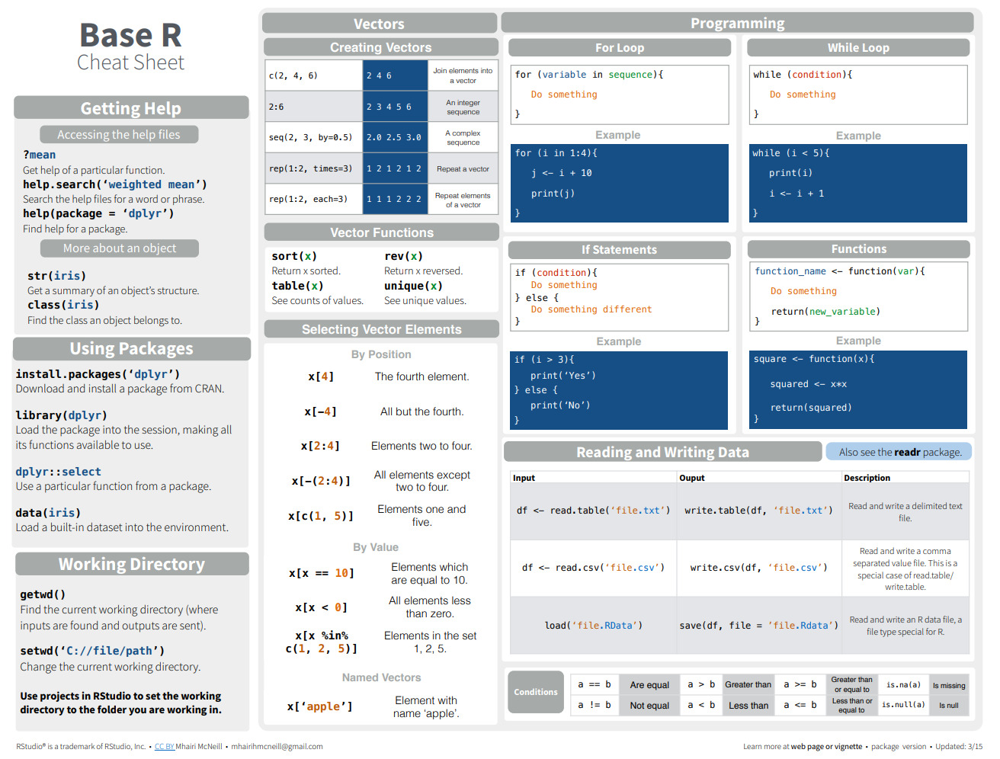
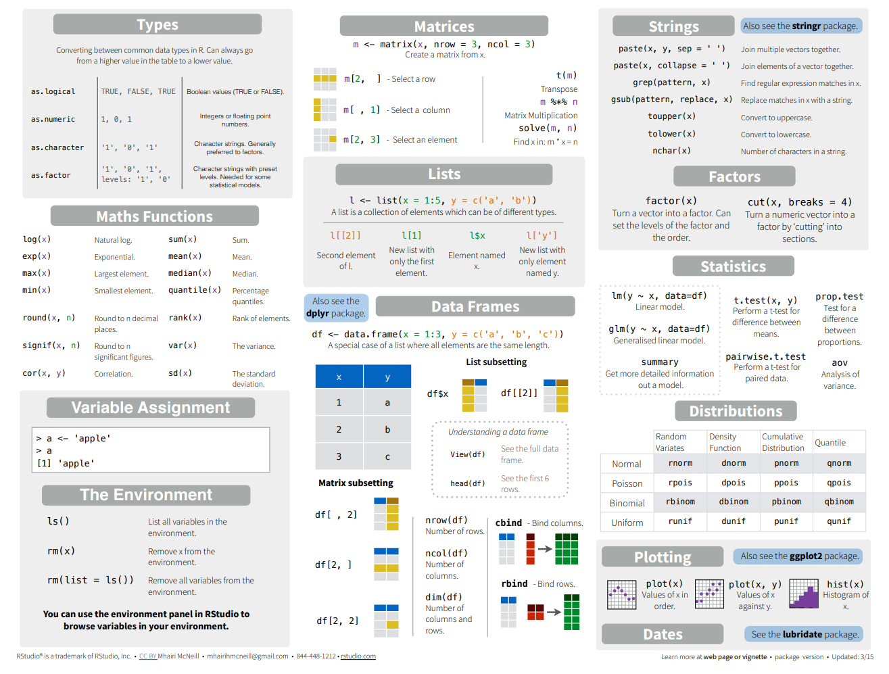

--- 
title: "Ch2 Visualization Tools"
subtitle: "Descriptive Analytics and Data Visualization"
author: "Yichen Qin (qinyn@ucmail.uc.edu), University of Cincinnati"
date: "`r Sys.Date()`"
output: 
  html_document:
    number_sections: true
    code_folding: "show"
    toc: true
bibliography: [book.bib, packages.bib]
biblio-style: apalike
link-citations: yes
---


# Analytics Tools {-}

In this chapter, we introduce some of the most popular tools in visualization. 
We mostly focus on R and touch a little bit on others.


# R and RStudio

R is a free software environment for statistical computing and graphics. It is available for free download from CRAN, the Comprehensive R Archive Network^[https://cran.r-project.org/].
This statistical programming language helps analysts to process, transform, visualize, and analyze data, and present results. 
One of the most important features of R is its ability to generate beautiful visualizations.
RStudio is an integrated development environment (IDE) for R, a powerful user interface for data analysis in R.  

To install R, please go to https://www.r-project.org/, click "CRAN" on the left, select a location in USA (i.e., mirror), click "Download R for Windows/Mac/Linux".  For windows, select "base" and install. For Mac, select R-3.X.X.pkg that aligns with the OS version. 
To install RStudio, please go to https://rstudio.com/, click "Products", select "RStudio", click "RStudio Desktop", click "DOWNLOAD RSTUDIO DESKTOP", select the free version and click "DOWNLOAD" and install.

After the installation is complete, please open RStudio.
In the menu, click "File" - "New File" - "R Script", you will create your first R script file. 
In the R script file, we can type `1+1` and hit **Ctrl+Enter**, then `1+1` is sent to the R console for execution.  You will the R console output as follows.

```{r}
1+1
```

Typically, the Rstudio window has four regions or panes:

- R script(s): This is where your R code is. You can open multiple script files at the same time.  Script files are saved as `filename.R` format.
- R console: This is where output displays (i.e., the results from running your scripts).  The output and code are not automatically saved.
- Environment, history, and workspace related information: It displays the variables, objects, functions currently loaded in memory.
- Files, plots, packages and help:  It shows files in the working directory, displays figures, and installed R packages.

You can click "Tools" - "Global Optinos" - "Pane Layout" to change the pane settings.

For R console, here are some tips.

- You can directly type command such as `1+1` and hit **Enter**. 
- The `>` is a prompt that indicates the R console is ready for the next command. 
- Code is in blue. 
- Output is black. 
- The `[1]` means the first value of the command's results begins here.
- Error messages are in red. 
- You can use R console as a calculator.
- If you hit **Enter** before your command is complete, the prompt becomes `+`.  Once you complete the command, the prompt changes back to `>`.  For example, type `1/(2*` in the console and hit Enter, and see what happens.  Then finish the command with `3)` and hit Enter. Alternatively, you can hit **Esc** to cancel the incomplete command.
- If a command is taking too long to run, you can use the red "STOP" button on top of the console (or **CTRL + c**) to terminate it.

For R script pane, here are some tips

* To execute a command or multiple command, you can highlight the commands and hit **Ctrl+Enter**.  If no command is highlighted, **Ctrl+Enter** will execute the line the cursor is currently in. Alternatively, you can click the "Run" botton on top of the script pane, or execute the entire script by pressing the "Source" button.
* You can use `#` to comment you code.  For example
* Place code in a script to save for later use/editing/additions
* Open a new script by going to File -> New File -> R Script

```{r}
1 + 2 # this line calculates the sum of 1 and 2
# this is another line of comments. the next line is also commented out.
# 2 + 3 
# Note that the "+ 5" in the command below part is not executed.
3 + 4 # + 5
```

You can change many other settings by going to "Tools" -> "Global Options."

## Assignment Operator

Use the assignment operator `<-` to create, store, data into variables.  Equivalently, we can use `=`, however `<-` is usually preferred. You can type the variable's name and press **Enter** to display the variable's value after assignment

```{r}
a <- 1
a
b = 2
b
a + b
```

Note that `a` and `b` are now created and can be seen in the environment pane in RStudio.  Use `ls()` and `rm()` to list and remove objects in R.

```{r}
ls()
rm(list=ls()) #to remove one variable, use rm(a)
ls()
```

## Coding Style

To name R objects or R code files, use meaningful words, phrases, and sentences with words separated by the underscore `_`.
For example, `male_height`, `ave_salary_2020`, and `visualize_salary.R`.
This naming convention is referred to as [snake_case](https://en.wikipedia.org/wiki/Snake_case).
Meanwhile, the R object names should begin with a letter and can only contains letters, digits, and underscores.
Some reserved words in R cannot be used, e.g., `TRUE` and `FALSE`.
R is case sensitive, which means `male_height` and `Male_height` refer to different variables.
R overwrites variable names.

In addition to naming objects, it is highly recommended to provide detailed comments for your code.
A good example is as follows.

```{r}
# create variables
a <- 1
b <- 2
# calculate the sum
a + b
```

Never write code like the following
```{r, eval=FALSE}
command
command
command
command
```

Lastly, please use space as frequently as possible.
Below are the examples.

```{r, eval=FALSE}
ave_height <- mean(observed_height, na.rm = TRUE) # good
ave_height<-mean(observed_height,na.rm = TRUE) # bad
```


## R Packages

So far, we have been using the basis features in R, which includes only core functions that are widely needed for analysis.
Sometimes, we may need a function to perform a special task that is not available in base R. 
Then we will need to use R packages.  
R packages are simply a set of customized functions that are designed for a special set of tasks.  
One of the greatest advantages of R is its extendability with many R packages.  
Some of the most frequently used packages include `ggplot2`, `tidyverse`, `MASS`, and many others.

In order to use functions in a R package, we need two steps: 

- Install the package. We use `install.packages()`. This step needs to be run once in one computer.
- Load the package. We use `library()`. This step needs to be executed every time you open R and RStudio.

Here is an example.

```{r, eval=FALSE}
install.packages("ggplot2") # installation, only need to run once.
library(ggplot2) # loading, need to run everytime you open RStudio.
```

Note that you only need to run `install.packages()` once.  
The installation procedure will download the package files from CRAN to your computer. 
On the other hand, you need to run `library()` every time you open R and RStudio since `library()` takes these downloaded functions and load them into memory for analysis.  
When you open RStudio, none of these packages are loaded.  The loading part cannot be skipped.

To get help on packages, you can use

```{r, eval=FALSE}
help(package="ggplot2")
vignette(package="ggplot2")
```

Now we introduce a few useful packages.

### `ggplot2` Package

`ggplot2` is an R package developed by Hadley Wickham. 
It is a system for declaratively creating graphics, based on the book of The Grammar of Graphics by Leland Wilkinson [@Wilkinson2005]. 
We will mainly use this package for generating figures.
Here we present a simple example.  
Details will be covered in later chapters.

```{r, message=FALSE, warning=FALSE, fig.width=4, fig.height=3}
library(tidyverse)
library(ggplot2)
data(mpg)
ggplot(data=mpg) + geom_point(aes(x=displ,y=hwy))
```

### `dplyr` and `tidyr` Packages

`dplyr` and `tidyr` are two R package for data wrangling.
Here we present a simple example.

```{r}
library(ggplot2)
library(dplyr)
data(mpg)
mpg %>% 
  mutate(ave = (hwy + cty)/2) %>%
  group_by(class) %>%
  summarize(averageMPG_by_class = mean(ave))
```

### `readr` Package

`readr` is an R package for data importing.

### `tidyverse` Package

All the the packages mentioned above belong to a super R package called `tidyverse` which is a "universe" of many R functions.
For more details, please go to the [tidyverse website](https://www.tidyverse.org/).
Therefore in pratice, you only need to run `library(tidyverse)` and then will be able to use all the packages such as `ggplot2`, `dplyr`, `tidyr`, and `readr`.

```{r, eval=FALSE}
install.packages("tidyverse")
library(tidyverse)
```

## R Markdown

R markdown is a file type. An R markdown file contains narrative text and chunks of R code for a analytics project. After compilation (i.e., "knitr"), the R markdown file will generate a (html or pdf) report that contains the text with simply formatting, the R code, and R output from running the code. Therefore, an R Markdown file is able to combine everything about the analytics project into one single file. It allows you to turn your analyses into high quality documents, reports, presentations, and dashboards with easy modification.

R Markdown is different from the traditional Microsoft Word processor. Word is a WYSIWYG processor (i.e., what you see is what you get) in the sense that the document is in a form that resembles its appearance when printed or displayed as a finished product. You click a button to change the format of a sentence and the change is immediately seen. A WYSISYG processor requires the users to pay attention to formatting as well as content at the same time. On the other hand, R markdown file allows users to solely focus on the content and let R markdown file to decide the formatting automatically. User simply specify the a few format requirements and R markdown file decides the best layout, spacing, and many others. Therefore, users can pay more attention to the content. Such a document can be easily transferred to another format. Meanwhile, since the text and R code are embedded in the same R markdown file, the analysis can be easily reproduced.

## Get Help on R

No matter how proficient you are with programming, you will almost always get various errors in your code. To fix these issues, you need to be able to get help yourself.  Here are some of the simplest ways to get help.

- [Google](https://www.google.com/): just add "with R" or "in R" at the end of any search. 
    - The key to use Google efficiently is to form your question precisely.  For example, search "how to read csv file in a different folder in R" is much better than search "read csv file location".
    - One trick that I use the most frequently is that I copy the error message to Google and see if something comes up.
- [Stack Overflow](https://stackoverflow.com/) is an online community oriented toward programming issues.
- [Cross Validated](https://stats.stackexchange.com/) is an online community oriented toward data science.
- [R-bloggers](https://www.r-bloggers.com/) is an online community oriented toward news and tutorials about R.
- [Youtube](https://www.youtube.com/) offers tutorials in R, ggplot2, Rmarkdown and many others.
- If your computer does not work well with R, RStudio, or Rmarkdown, you can use the virtual machine.
- For a particular R function, type `help(function_name)`, `?function_name`,  `??function_name`, `example(function_name)` to get help files. After these commands, you should have a popup website listing the help files for the function. You could also find some examples of the function.

```{r, eval=FALSE}
help(sqrt)
?sqrt
??sqrt
example(sqrt)
```

<!---

# Other Tools

In addition to R, there are many other excellent visualization tools too, such as Tableau, Power BI, Excel, Python, Matplotlib, Seaborn, Matlab, and etc.
Tableau, Power BI, and Excel have a drag and drop type of user interface, which require the user to remember the features in these software.
Python and Matlab are programming languages so they function similarly to R.
Matplotlib, Seaborn are Python packages specializing in data visualization, similar to ggplot2 in R.

We will later introduce other visualization tools --- Tableau and Power BI.
Their has gained significant growth in the recent years.
Their functionalities have also been expanded in many directions.
There is a large community for users of Tebaleau (https://community.tableau.com/s/) and Power BI (https://community.powerbi.com/).

No matter which tool to use, the logic and underlying principles for data visualization are the same.
So the materials in this document is applicable.
We will talk about its features and how to design Tableau dashboards.

R and ggplot2 are powerful and flexible tools, but they requires programming skills. 
Python and Matlab are more similar to R.
Tableau and Power BI need minimum amount of training, but the customization are less flexible and its replicability is also well supported.

Generally, generating data visualization via coding or via a drag-and-drop interface are too major approaches. There are **pros and cons** of data visualization via coding (compared to drag-and-drop interface).

**Cons:** Coding is harder to learn and takes longer to learn.
Drag-and-drop interface is more intuitive and easier.
Tableau is commercial software so you have some supports from the company.

**Pros:** Since the code is essentially just text, we can read the code and understand what have been done to the data to generate the data visualization. 
Therefore, you can replicate the results and apply the same procedure to other data sets. 
One of the most important advantages of coding is its relicability and reproducibility.
On the other hand, in the drag-and-drop interface, when you are given a visualization, you have no idea how the analyst generated such a figure and what operations he or she has taken to manipulate the data and what customization of the figures are used.

--->

# R Basics

In this section, we will discuss some basic features in R. 
These features are the foundation of more advanced analysis.

Each variable stored in R is called an object.
R has four basic types of objects: vectors, matrices, data frames, and lists.
We will go over them briefly.

## Vector

A vector is a sequence of values of the same type, such as a sequence of numbers, or a sequence of strings, and etc. 

```{r}
a=c(5,3,6,7)
a
b=c("Tom","Jerry","John")
b
c=c(TRUE,TRUE,FALSE)
c
```
Here we use the `c()` function to combine values into a vector (or a list).

There are three major types of data, numeric, logical, and character. You can use `is.numeric()`, `is.logical()`, and `is.character()` to test them

```{r}
is.numeric(0.23)
is.numeric("Tom")
is.logical(FALSE)
is.character("Tom")
is.character(TRUE)
```

To determine if an R object is a vector, use `is.vector()` as follows.
```{r}
is.vector(a)
```

`length()` can tell you the length of a vector.  `class()` returns the type of data stored in the vector. 

```{r}
length(a)
class(a)
class(b)
class(c)
```

To select a subset of elements in a vector, use `[]` as follows.

```{r}
a[1]
a[3]
a[c(1,3)]
a[-c(1,3)]
a[a>4]
```
You can modify a vector's elements by the following command.
```{r}
a[3]=100
a
a[c(2,3)]=c(50,10)
a
a[c(2,3)]=-2
a
```

For element-wise comparisons, you can use the following
```{r}
x=c(5,1,3)
y=c(4,1,2)
x == y
x < y
x <= y
x != y
3 %in% x
c(3,4,5,6,7) %in% x
```

Note that here is a list of comparison operators

operator | syntax
---------|-------
greater than | a > b
greater than or equal to | a >= b
less than | a < b
less than or equal to | a <= b
equal to | a == b
belongs to | a %in% b
not equal to | a != b

With these operators, you can modify vectors in many different ways

```{r}
a
a[a<0]=3
a
```

Here are some other ways to create vectors.

```{r}
seq(1,10)
seq(1,10,2)
1:10
rep(10,5)
mean(a)
sd(a)
length(a)
b[2]
sum(c)
d=c(10,20,30,40)
a+d
a*d
```

Combining different data types or forcing functions on certain data types results in **coercion**.  Logical values can be converted to numeric 0 or 1.  Numeric values can be converted to strings. Numeric values can also be converted to logical values (TRUE for nonzero and FALSE for zero)

```{r}
as.numeric(TRUE)
as.numeric(FALSE)
as.character(123.456)
as.logical(123.456)
as.logical(0)
```

Sometimes, coercion can be subtle

```{r}
c
sum(c)
mean(c)
```

## Matrix

A matrix is a two dimensional array of numbers (and numbers only).  Use `matrix()` to create a matrix.
```{r}
a=matrix(1:12,4,3)
a
class(a)
nrow(a)
ncol(a)
dim(a)
```

To access certain values in a matrix, use `[]` as follows.
```{r}
a[2,3]
a[2,]
a[,2]
a[,c(2,3)]
dim(a)
apply(a,1,mean)
apply(a,1,sum)
apply(a,1,sd)
apply(a,2,sd)
apply(a,2,sum)
```

## Data Frame

A data frame is a two dimensional array where each column is of the same data type. Use the `data.frame()` function to create a data frame. Use `str()` to examine the structure of a data frame


```{r}
a=data.frame(name=c("Tom","Jerry","John","Jane"),
             age=c(10,14,13,11),
             gender=c("Male","Male","Male","Female"))
a
str(a)
class(a)
a[2,3]
a[2,]
a[,2]
a$name
a$age[2]
a[,"age"]
a[["age"]]
a[,c("name","age")]
a[2,c("name","age")]
dim(a)
```

`attributes()` returns similar information, but will usually be used later.
`names()` returns the column names

```{r}
names(a)
```

You can modify a data frame's values by the following command.
```{r}
a[3,2]=100
a
a[,2]=55
a
```

## List

A list is a one dimensional array where each element can be of different types. Use the `list()` function to create a list.

```{r}
e=list(current_rank=1,
       name="Tom",
       active=TRUE, 
       metric=matrix(1:6,2,3),
       family_members=c("Mary", "John"))
e
e[[3]]
e$active
e[[4]]
e$metric
e[[4]][1,2]
e[[5]]
e[[5]][2]
```

## Control Statements, Iterations, and Functions

If control statement:

```{r}
x <- 5
if(x > 0){
print("Positive number")
}
```

Some times, we need to repeat one operation for many times, then we will need `for` loop.

```{r}
a=matrix(1:12,3,4)
for (i in 1:nrow(a))
{
  print(
    mean(a[i,])/(max(a[i,])-min(a[i,]))
    )
}
```

If a set of operations are frequently used, you can define a function instead of repeating typing these operations.

```{r}
my_func = function(x)
{
  output = mean(x)/(max(x)-min(x))
  return(output)
}
my_func(a[1,])
```

Data passed into a function is called the function's **argument**
- Arguments can be results from another function
- Use = to specify names of arguments, especially with multiple arguments for readability/QA

# R Cheatsheets for R Basic Commands

**Summary of R command**

**R Cheatsheet** at https://rstudio.com/resources/cheatsheets/

```{r, echo=FALSE, out.width = "100%"}



```


# References {-}