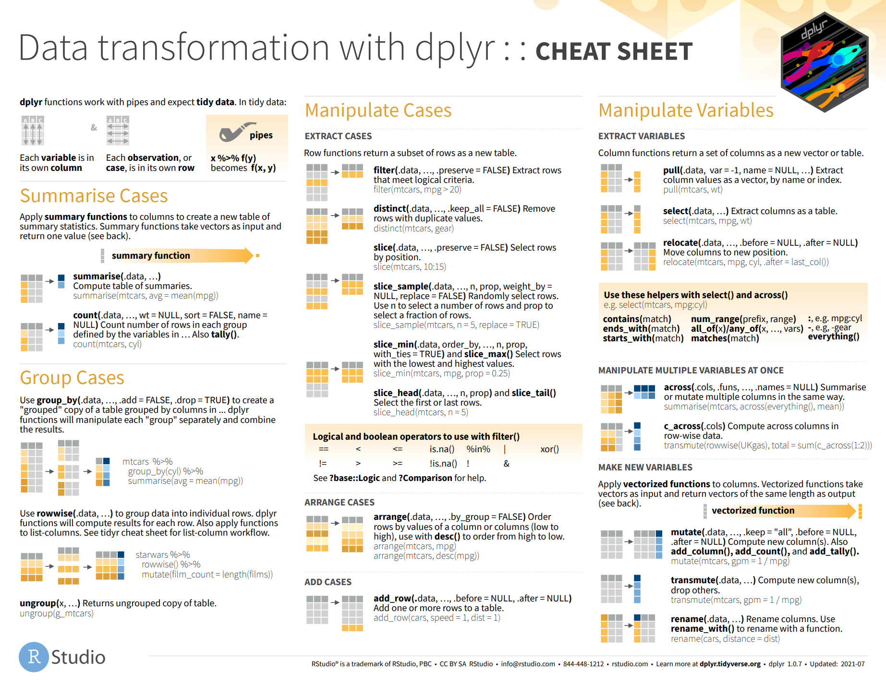
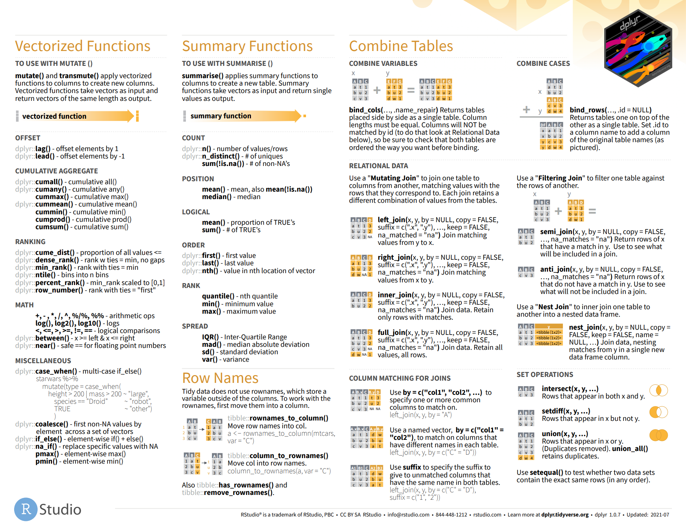
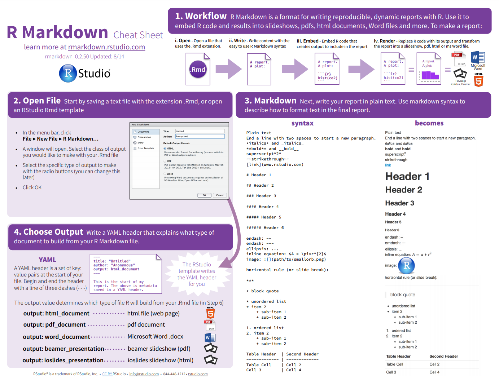
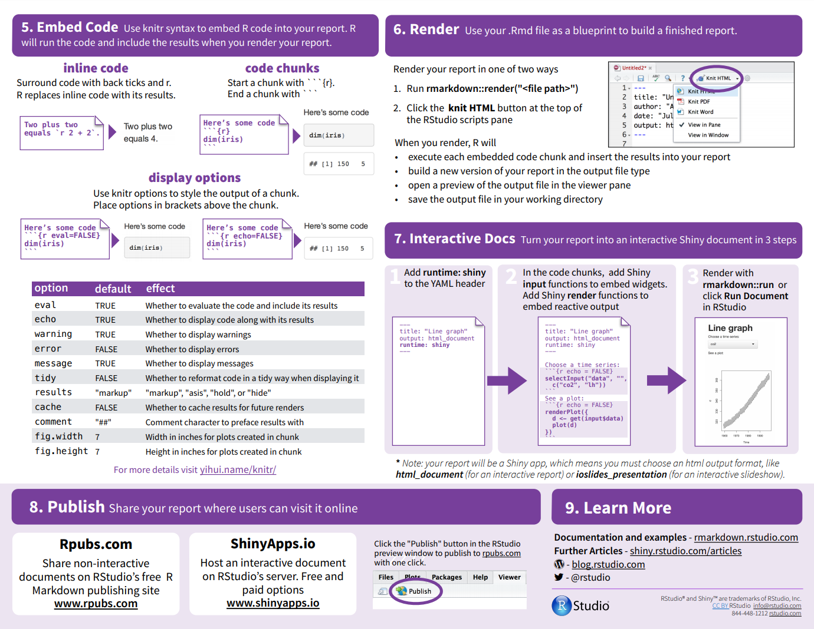

--- 
title: "Ch3 Data Wrangling"
subtitle: "Descriptive Analytics and Data Visualization"
author: "Yichen Qin (qinyn@ucmail.uc.edu), University of Cincinnati"
date: "`r Sys.Date()`"
output: 
  html_document:
    number_sections: true
    code_folding: "show"
    toc: true
bibliography: [book.bib, packages.bib]
biblio-style: apalike
link-citations: yes
---


# Data Wrangling {-}

The following R packages are needed for running the examples in this chapter.
```{r, warning=FALSE, message=FALSE}
library(tidyverse)
library(readxl)
```

# What is Data Wrangling?

Here is a flowchart of data analysis.

```{r, echo=FALSE}
knitr::include_graphics("images/my_data_analysis_flowchart.PNG")
```

Data wrangling includes preprocessing and transforming the data. It is essentially to convert what you have to what you need for visualization and modeling purposes. 
Data wrangling is best learned through examples.  Here we go over a few most frequently used features. Since R is one of the best tools for data wrangling, descriptive analytics, data visualization, and modeling, we will use R throughout the course for demonstration. We start with some basics.


# Set Up Working Directory

When working with R, the first thing is to set up a working directory to store all the code files, data files and others. All subsequent analysis will using files from this working directory. 

Here I first create a directory called `Rworkingdir` in the `C:` drive in my computer and use it as my working directory. In RStudio, in the menu, click "Session" - "Set Working Directory" - "Choose Directory".  Navigate to the folder `Rworkingdir` and click "Open". Then your working directory is set.  Note that R console displays `setwd("C:/Rworkingdir")`.  Alternatively, you can directly type it in R console.

```{r, eval=FALSE}
setwd("C:/Rworkingdir")
```

Note that R use `/` to separe folder names which is different from Windows OS which uses `\`.
You can also directly type in R console to set up the working directory.  For example, the following code will set the working directory to D drive, folder "project1", 

```{r, eval=FALSE}
setwd("D:/project1")
```

At any time, you can check the current working directory by `getwd()`. 
Lastly, R script are usually saved in the working directory.

# Import and Export Data Files

We will demonstrate how to import comma-separated values (csv) files using `read.csv()`. Other file types will follow similarly.  Suppose you have file containing data stored as `my_data.csv`. Suppose the first row of `my_data.csv` is the column/variable names.  Then place this file in the working directory and type

```{r, eval = FALSE}
d <- read.csv("my_data.csv", header = TRUE, stringsAsFactors = FALSE)
```

**Note that when you read a file into R, it is by default a data frame.**

If you create a subfolder in the working directory, say `/data`, and place the data file there, then you can use 

```{r, eval = FALSE}
d <- read.csv("data/my_data.csv", header = TRUE, stringsAsFactors = FALSE)
```

For other file types, for example, Excel files `file_name.xls` and `file_name.xlsx`, you can use R packages, such as `readxl`, `readr`, `data.table`, `GDATA`, `XLConnect`, `ROBC`, and `RExcel`. Here is an example
```{r, eval=FALSE}
install.packages("readxl") # only need to run once
```
```{r}
library(readxl)
excel_sheets("data/my_data.xls")
d=read_excel("data/my_data.xls", sheet = "Sheet2")
```

To take a glance at the data, use `head(d)` and `tail(d)` to print the first and last a few rows of `d`.

```{r}
head(d)
tail(d)
```

Exporting Data: Use the `write.csv()` function to save .csv files to your hard drive

```{r, eval=FALSE}
write.csv(d,"my_exported_data.csv")
```

# Missing Values

R shows missing values as `NA`.  Missing values prevent R from calculating sums, means, equality checks, etc.  Use the `is.na()` function to check for missing values. Use `sum(is.na())` to calculate the total number of missing values.

```{r}
my_vec=c(1,3,NA,8,NA,4,2)
mean(my_vec)
mean(my_vec, na.rm = TRUE)
is.na(my_vec)
which(is.na(my_vec))
mean(my_vec[!is.na(my_vec)])
mean(my_vec[-which(is.na(my_vec))])
sum(is.na(my_vec))
```

For data frames, use `colSums(is.na())` to calculate the number of missing values per column.

```{r}
df <- data.frame(V1 = c(1,3, NA,7, 4, 3.4),
                 V2 = c("this", NA, "is", "text", "OM", "BANA"), 
                 V3 = c(TRUE, FALSE, TRUE, TRUE, TRUE, FALSE), 
                 V4 = c(2.5, NA, NA, NA, NA, 3.3))
is.na(df)
sum(is.na(df))
colSums(is.na(df))
```

Use `complete.cases()` to keep only observations with no missing values. `na.omit()` also removes incomplete observations.
```{r}
complete.cases(df)
df[complete.cases(df), ] 
na.omit(df)
```

Discuss with stakeholders/clients before simply removing observations!  Maybe missing data exists for a reason!


# Data Wrangling via `dplyr` Package

One of the most frequently used functions in R are in dplyr package. Here we go through a few key features.
In this section, we will use a running example data set.

**Example of mpg data set** 
This is a data containing the fuel efficiency information of various cars.
The data is in ggplot2 package.  
It is a data frame with 234 rows and 11 variables.
Each row represents a particular car.
Each column represents a variable describing the cars.
Here is a list of variable explanations.

Variable | Type | Description | Details  
--|--|--|--
`manufacturer` | char | manufacturer name | 15 manufacturers
`model` | char | model name | 38 models
`displ` | numeric | engine displacement in liters, i.e., cylinder volume swept by pistons | range from 1.6 to 7.0 liter
`year` | integer | year of manufacture | two levels: 1999 and 2008 
`cyl` | integer | number of cylinders | four levels: 4, 5, 6, 8 cylinders
`trans` | char | type of transmission | two levels: automatic, manual(int)
`drv` | char | type of drive train | three levels: f,r,4. f = front-wheel drive, r = rear wheel drive, 4 = 4wd
`cty` | integer | city miles per gallon | range from 9 to 35
`hwy` | integer | highway miles per gallon | range from 12 to 44
`fl` | char | fuel type | five levels: p,r,e,d,c. d=diesel, p=petrol, e=electric, etc.
`class` | char | vehicle class | seven levels: compact, midsize, suv, 2seater, minivan, pickup, subcompact

We can take a look at the data set.

```{r}
library(tidyverse)
data(mpg)
#str(mpg)
head(mpg)
```

## Filter Observations via `filter()`

Using `filter()`, we can obtain a subset rows from the original data frame.

```{r}
head(mpg)
mpg_y1999 = filter(mpg,year==1999)
head(mpg_y1999)
mpg_y1999_cyl4 = filter(mpg,year==1999,cyl==4)
head(mpg_y1999_cyl4)
```

Similarly, you can use other criterion such as cyl>=1999, drv=="f", and etc.

Note that `mpg_y1999 = filter(mpg,year==1999)` is equivalent to `mpg_y1999 = mpg[mpg$year==1999,]`, the former runs faster and usually involves less synatx.  For example, to achieve the effect of `mpg_y1999_cyl4 = filter(mpg,year==1999,cyl==4)` we need  `mpg_y1999_cyl4 = mpg[(mpg$year==1999)&(mpg&cyl==4),]`.

## Select Variables via `select()`

Using `select()`, we can obtain a subset columns/variables from the original data frame.

```{r}
mpg_engine = select(mpg,c("manufacturer","model","displ","cyl"))
head(mpg_engine)
```

## Create Variables via `mutate()`

Using `mutate()`, we can create new variables/columns from the original data frame.

```{r}
mpg_ave = mutate(mpg,ave_mpg=(cty+hwy)/2,displ_per_cyl=displ/cyl)
head(mpg_ave)
```

Note that these features can be achieved by 

```{r,eval=FALSE}
mpg$ave_mpg=(mpg$cty+mpg$hwy)/2
mpg$displ_per_cyl=mpg$displ/mpg$cyl)
```

## Summary Statistics via `group_by()` and `summarize()`

Sometimes, we would like to first divide the original data frame into groups or strata by one or two variables. Within each strata, we would like to calculate some summary statistics. This can be achieved by combining `group_by()` and `summarize()`.

```{r}
unique(mpg$drv)
mpg_by_drv = group_by(mpg, drv)
ave_mpg_by_drv = summarize(mpg_by_drv,
                           ave_hwy=mean(hwy,na.rm = TRUE),
                           ave_cty=mean(cty,na.rm = TRUE))
head(ave_mpg_by_drv)
```

## Pipeline Operator `%>%`

The functions we introduce above have couple things in common, their first arguments are all data frame, they also return a new data frame. Sometimes, a data frame will go through a lot of transformations shown above. The pipeline operator will make this process easy.

```{r}
mpg %>% 
  mutate(overall_mpg=(cty+hwy)/2) %>% 
  group_by(drv) %>% 
  summarize(ave_overall_mpg=mean(overall_mpg,na.rm = TRUE))
```

This is equivalent to 

```{r}
result1 = mutate(mpg, overall_mpg=(cty+hwy)/2)
result2 = group_by(result1, drv)
result3 = summarize(result2, ave_overall_mpg=mean(overall_mpg,na.rm = TRUE))
result3
```

```{r}
summarize( group_by( mutate(mpg, overall_mpg=(cty+hwy)/2), 
                     drv),
           ave_overall_mpg=mean(overall_mpg,na.rm = TRUE))
```

## Merge Data Sets via `*_join()`

We often obtain data from different sources. Therefore, we need to merge datasets before making visualization or any analysis.

```{r}
df1=data.frame(id=c(1001,1002,1003),name=c("Tom","Jerry","Lucy"))
df2=data.frame(id=c(1001,1003,1004),weight=c(150,110,200))
df1
df2
inner_join(df1,df2,by="id")
left_join(df1,df2,by="id")
right_join(df1,df2,by="id")
full_join(df1,df2,by="id")
```

# R Cheatsheets for `dplyr` Package

**Summary of R command**

**R Cheatsheet** at https://rstudio.com/resources/cheatsheets/

```{r, echo=FALSE, out.width = "100%"}



```


# Reporting via R Markdown

Link: https://rstudio.com/wp-content/uploads/2015/02/rmarkdown-cheatsheet.pdf

```{r, echo=FALSE, out.width = "100%"}



```
