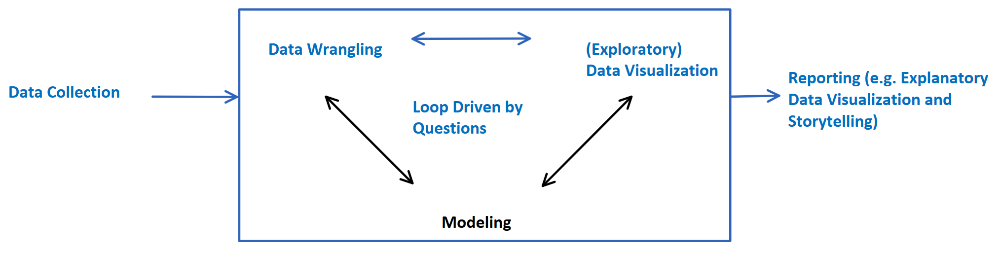
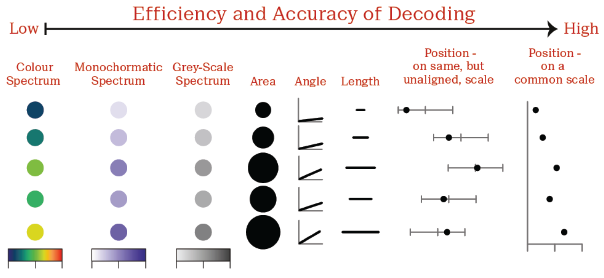
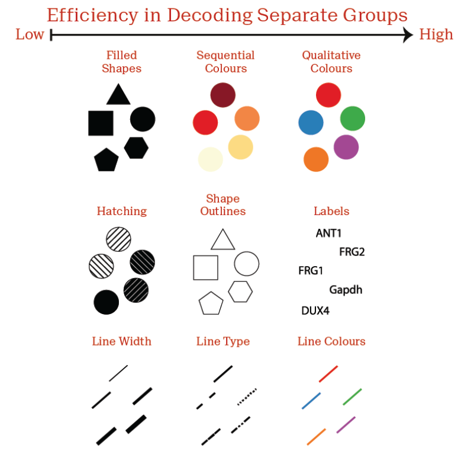
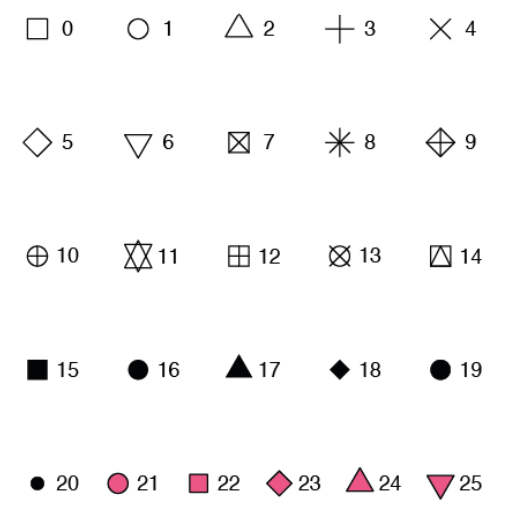

In this chapter, we discuss the basics in data visualization.
We mostly use the scatter plot as a running example to introduce different aspects of data visualization and discuss the logic behind it.
We also focus on using `ggplot()`, one of the most frequently used R functions for visualization.

The following R packages are needed for running the examples in this chapter.

```{r, warning=FALSE, message=FALSE}
library(tidyverse) # includes ggplot2, dplyr, tidyr, etc.
library(grid) # for plotting multiple figures together
library(gridExtra) # for plotting multiple figures together
library(RColorBrewer) # for color palette
library(viridis) # for color palette
library(viridisLite) # for color palette
library(ggthemes) # for additional themes
library(ggrepel) # for label data points
library(knitr) # for display tables
library(openxlsx) # for read xlsx files
library(GGally) # for pairs plot, i.e., scatter plot grid.
```

# Overview

Before we start, let us review the flowchart of data analysis in Figure \@ref(fig:flowchart) [@Wickham2017].
In a typical data analysis project, after data is collected, we first transform the data, i.e., data wrangling, to make it suitable for visualization.
We use exploratory data visualization to help us decide the modeling choices.
Visualization also helps us decide what additional transformations or data wrangling to do next.
Once the analysis is done, we will communicate with the audience to present our findings.
At this stage, we use explanatory data visualization to present our results in reports, presentation slides, or dashboards.
Obviously, data visualization plays important roles in this flowchart as it appears in two places.
In this chapter, we will begin diving into the details of data visualization by discussing its basics, such as grammar of graphics.

```{r flowchart, echo=FALSE, fig.cap = "Data analysis flowchart"}

```

# Grammar of Graphics and `ggplot()`

The first question we would like to discuss is what are the key components of a data visualization?
To answer this question, we need to introduce the concept of grammar of graphics.

The grammar of graphics is proposed by Leland Wilkinson in his visualization book (@Wilkinson2005).
It provides a foundation and framework for us to understand a wide range of visualizations.
Using such a grammar, we can decompose complex visualizations to basic building blocks and gain insights into the commonality, difference, and connections among various visualizations.
For a detailed introduction to the grammar of graphics, please see @Wickham2010 (<http://vita.had.co.nz/papers/layered-grammar.pdf>).

According to the grammar of graphics, there are in total seven components/layers in a data visualization, listed below.

| Layer/Component    | Layer Priority | Description                                                                                                                                                                                                                                      | Example                                                                                                                            |
|-----------|-----------|----------------------------------|----------------|
| Data               | Required       | Data set being plotted.                                                                                                                                                                                                                          | A n-by-p table, i.e., data frame, with variables in the columns and observations in the rows.                                      |
| Geometries         | Required       | Geometry layer specifies the visualization type or the visual elements used in the plot.                                                                                                                                                         | Scatter plot, bar plot, histogram, box plot, and etc.                                                                              |
| Aesthetic mappings | Required       | Aesthetic mapping specifies which the variables are mapped to which the aesthetic dimensions or visual elements onto. For example, height goes to x-axis, weight goes to y-axis, gender goes to symbol color, age goes to symbol size, and etc.  | x-axis, y-axis, symbol color, symbol size, symbol shape, transparency level, line width, line type, filled color, labels, and etc. |
| Statistics         | Optional       | Summary statistics to be visualized.                                                                                                                                                                                                             | Fitted linear/nonlinear regression regressions, confidence intervals, count, binning, etc.                                         |
| Scales/Coordinates | Optional       | The scale layer configures the properties of each aesthetics dimensions, e.g, axis range, transformations, tick positions. The coordinate layer specifies the properties of the space the data is plotted, e.g., which coordinate system to use. | Limits, transformation, range, tick, Cartesian/polar coordinate systems, aspect ratio, and etc.                                    |
| Facets             | Optional       | The facet layer plots small multiple visualizations together for comparison.                                                                                                                                                                     | Side by side, stacked, columns and rows.                                                                                           |
| Themes             | Optional       | The theme layer governs all non-essential formatting of the visualization.                                                                                                                                                                       | Background, foreground, grid, label, font, color, bold, rotated text.                                                              |

When creating a new visualization, we first need to specify the data set to be visualized, i.e., the data layer.
Then we specify the visualization type, i.e., scatter plot or bar plot.
This is called the geometry layer or the visual element.
Finally, we specify how each variable in the data set is mapped to different aesthetic dimensions of the visualization, i.e., aesthetic mappings.
For example, variable x1 is plotted on the x-axis and variable x2 on the y-axis and etc.

These three layers decide the most important aspects of the visualization, and therefore are **required** for any visualizations.
Once these three layers are specified, the analysts can work on the remaining \*\*optional\*\* layers, such as adding some summary statistics, selecting coordinate systems, setting scales, creating facets, and setting themes.
Basically, the grammar of graphics decomposes each plotting task into several distinct subtasks or layers.

Throughout this book, we mostly use `ggplot()` function to generate data visualizations, because the syntax in `ggplot()` function embodies the principles of grammar of graphics.
In fact, the "gg" in the function name is short for "the grammar of graphics." The `ggplot()` function is available in the R package `ggplot2` which is created by Hadley Wickham (@Wickham2016).
In addition to `ggplot()` function, many other visualization tools such as Tableau (<https://www.tableau.com/>) and Power BI (<https://powerbi.microsoft.com/>) also embody the same logic.

Now we look at an example of a `ggplot()` code and see how these layers are built together.
A typical `ggplot()` code is as follows.

```{r, eval=FALSE}
ggplot(data = name of the data set, # data layer
       aes(x = variable to be mapped on x axis, # aesthetic mapping layer
           y = variable to be mapped on y axis,
           color = variable to be mapped on color dimension,
           shape = variable to be mapped on shape dimension,
           size = variable to be mapped on size dimension,
           fill = variable to be mapped on filled color dimension,...)) +
  geom_xxx(...) + # geometry layer
  stat_xxx(...) + # statistics layer
  coord_xxx(...) + # coordinates layer
  scale_x_xxx(...) + # coordinates layer
  scale_y_xxx(...) + # coordinates layer
  scale_color_xxx(...) + # coordinates layer
  scale_fill_xxx(...) + # coordinates layer
  facet_xxx(...) + # facet layer
  theme_xxx(...) # theme layer
```

Each row is a function that governs one layer in the data visualization.
There are many more functions to control these layer.
A complete list of functions in ggplot can be found in its official website (<https://ggplot2.tidyverse.org/reference/index.html>)[^1].
In this book, we do not attempt to exhaustively go through every one of these functions.
Instead, we mostly focus on the high-level guidelines for building different layers using some key functions.
Below we start introducing each layer in details, starting from the required layers, e.g, data, geometry, aesthetic mapping layers.

[^1]: <https://ggplot2.tidyverse.org/reference/index.html>

# Data, Geometry, and Aesthetic Mapping Layers

## Creating Data Visualization using Data, Geometry, and Aesthetics Mapping Layers

Data, geometries, and aesthetics mappings are the three most important layers.
Data layer contains the variables to be visualized.
We use `ggplot(data = name of the data frame)` to set up.
Geometry layer specify what type of visualization to use, e.g., scatter plot, bar plot, and box plot.
We use `+ geom_xxx()` to set up the geometry layer where the function name `geom_xxx` specifies the visualization type.
For example `geom_point()` is the scatter plot and `geom_line()` is the line plot.
The `+` is used to add one layer on top of the previous layers.

Different visualization types come with different visual elements and hence have different lists of aesthetic dimensions.
For example, the scatter plot has x/y-axis position, symbol color, symbol size, symbol shape, etc.
The line plot has has x/y-axis position, line color, line type (solid, dash, or dotted), line width, etc.
We need to specify which variables in the data layer are mapped to which aesthetic dimensions in the geometry layer.
This mapping is called the aesthetic mapping layer.

The aesthetic mapping is the most important layer because it connects the data layer with the geometry layer.
It maps a subset of variables from the data layer to a subset of aesthetic dimensions from the geometry layer.
Note that each geometry layer comes with a different set of aesthetic dimensions.
For example, the scatter plot has the aesthetic dimensions such as x/y-axis position, symbol color, symbol size, symbol shape.
The line plot has some extra aesthetic dimensions such as line color, line type (solid, dash, or dotted), line width.
Therefore, the aesthetic mapping is customized to each geometry layer which are equipped with different sets of aesthetic dimensions.
Below is a list of the most commonly used aesthetic dimensions.

| Aesthetic Dimension | Description                                                         |
|------------------|------------------------------------------------------|
| `x=`                | x axis position                                                     |
| `y=`                | y axis position                                                     |
| `fill=`             | filled-in color                                                     |
| `color=`            | color of points, lines, outlines of box and other geometry elements |
| `size=`             | area or radius of points, thickness of lines                        |
| `shape=`            | shape of the points or other geometry elements                      |
| `alpha=`            | transparency level                                                  |
| `labels=`           | text on a plot or axes                                              |
| `linetype=`         | line dash pattern, dash, dotted, dash-dotted, and etc.              |
| `linewidth=`        | line width                                                          |

To understand how these three layers work together, let us look at an example.
Suppose we analyze a data set about the colleges/universities in US.
The data set contains various measurements of the universities such as admission rate, average SAT, location, and etc.
We first read the data into R and print its first a few rows.

```{r}
college = read.csv("data/college.csv", header = TRUE)
dim(college)
head(college)
```

The data set has 1269 rows and 17 variables.
Each row represents one university.
Each column represents a variable about the university.
Here is a list of variable descriptions.

| Variable             | Type      | Description                                  | Details                                        |
|--------------|--------------|----------------------|-----------------------|
| `id`                 | integer   | university ID                                | six digits ID                                  |
| `name`               | character | university name                              | there are in total 1260 universities.          |
| `city`               | character | the city where the university is located     | there are in total 834 cities.                 |
| `state`              | character | the state where the university is located    | there are 50 states and DC.                    |
| `region`             | character | the region where the university is located   | four regions: West, South, Northeast, Midwest. |
| `highest_degree`     | character | type of degree the university offers         | three levels: Graduate, Associate, Bachelor.   |
| `control`            | character | public or private university                 | two levels: public, private.                   |
| `gender`             | character | the gender education system                  | three levels: CoEd, Women, Men                 |
| `admission_rate`     | numeric   | university admission rate                    | range from 0 to 1.                             |
| `sat_avg`            | numeric   | average SAT score of the admitted students   | range from 720 to 1545.                        |
| `undergrads`         | numeric   | number of undergraduate students             | range from 47 to 52280                         |
| `tuition`            | numeric   | tuition of the university                    | range from 2732 to 51008 in dollar.            |
| `faculty_salary_avg` | numeric   | average monthly salary of the faculty        | range from 1451 to 20650 in dollar.            |
| `loan_default_rate`  | numeric   | average monthly salary of the faculty        | range from 0 to 0.334.                         |
| `median_debt`        | numeric   | median of the student debt in the university | range from 6056 to 41000.                      |
| `lon`                | numeric   | longitude of the university                  | range from -157.92255 to -68.58949.            |
| `lat`                | numeric   | latitude of the university                   | range from 19.70709 to 61.21806.               |

For this data set, suppose we are interested in the association between the average SAT score and the admission rate.
We can visualize the relationship using a scatter plot.

A **scatter plot** is a type of visualization in which observations are represented by points/markers/symbols on the Cartesian coordinate system.
A two dimensional Cartesian coordinate system is a two dimensional space indexed by two perpendicular axes, i.e., x-/y-axes.
The scatter plot usually displays a data frame of two variables by separate points on the Cartesian coordinate system.
Each point represents one row in the data frame, with each point's x-/y-coordinates representing the first and second variables in that row.
Additionally, the points can be plotted in different color/shape/size so that additional variables in the data frame can be displayed.

To generate the scatter plot, we need to specify these three layers.
First, we specify the data layer using `ggplot(data=college)` where `college` is the name of the data frame.
Next, we specify the geometry layer to be the scatter plot, using `+ geom_point()`.
Finally, we specify the aesthetics mapping with SAT on x-axis and admission rate on y-axis, using `mapping = aes(x=sat_avg, y=admission_rate)` inside `geom_point()` function.
Note that these arguments' names, `data =` and `mapping =`, can often be omitted.

```{r, fig.height=4, fig.width=5}
ggplot(data = college) +
  geom_point(mapping = aes(x = sat_avg, y = admission_rate))
```

As we can see, there is an upside down V or U shape relationship between average SAT score and admission rate.
When the average SAT is below 1000, the higher SAT corresponds to a slightly higher admission rate.
When the SAT is around 1000, the admission rate seems to be the highest.
As the SAT further increases above 1000, the admission rate drops and the lowest admission rate seems to be associated with the highest SAT.
We normally expect the higher SAT would correspond to the lower admission rate.
So this visualization presents a somewhat surprising pattern, which is mostly due to the universities with low average SAT scores.
So our next step is to understand the the upside down V shape relationship.

To solve this issue, we need to consider more variables in the visualization.
In other words, we need to utilize more aesthetic dimensions.
So far, we have used two aesthetic dimensions (x and y axes), and there are many other unused aesthetic dimensions, such as color, shape, size, and etc.

One variable that is particular of interest is the number of students (variable name is `undergrad`) in the data.
Different universities have different sizes, but the current scatter plot shows all universities as equal-sized points.
In addition, does the public and private universities (variable name is `control`) has different patterns in terms of the relationship between SAT and admission rate?
These are all good questions that we can easily answer.

Suppose we are interested in the association among SAT, admission rate, number of students, and whether this is a public or private university.
We could use the aesthetic dimensions as follows.
We map `undergrads` to the size of the symbol and `control` to the color of the symbol in the scatter plot.

```{r collegemapping, fig.height=4, fig.width=6, fig.cap="Relationship of SAT and admission rate for all public and privates schools with bubble size as the number of students"}
ggplot(data = college) +
  geom_point(aes(x = sat_avg,
                 y = admission_rate,
                 size = undergrads,
                 color = control))
```

This modified scatter plot is sometimes called a bubble plot because each point is a bubble of a different size.
The bubble plot shows that the negative relationship between SAT and admission rate is stronger than the positive relationship, because most of the large bubbles display the negative trend, whereas only a few small bubbles on the lower left corner show the positive trend.
This implies that for most of the large schools, the higher SAT is associated with the lower admission rate.
For some schools, the relationship is flipped, but these schools enroll a small portion of students.

In addition, since we plot the bubbles in colors according to the public and private universities, we observe that the universities with the lowest admission rate and the highest SAT score, i.e., bubbles in the lower right corner, are mostly private.

We also see one strange data point in the figure.
It is a private university that admits around 50000 students with SAT around 1000 and low admission rate around 0.25.
This university seems to be different from the rest of universities and it has a significant size.
We may later find out what that university is by adding a label, discussed in the later section.

These are all interesting insights that are only visible when we utilize more aesthetic dimensions.

In addition to the aesthetic dimensions we have used, we can utilize shape, transparency level, and label too and map them to other variables.
Try the following on your computer.

```{r, eval=FALSE}
library(ggrepel)
ggplot(data = college, aes(x = sat_avg, y = admission_rate, color = control)) + 
  geom_point(aes(size = undergrads))+
  geom_text_repel(aes(label = name), size=3)
```

## Choose Aesthetic Mappings

To visualize a data set with many variables, how do we choose which variables to map to which aesthetic dimensions?
There are potentially many choices for the mappings.
Here are some guidelines in selecting the aesthetic mappings.

-   Continuous variables can be mapped onto x, y, color, fill, size, alpha, and line width.
-   Discrete variables can be mapped onto all the aesthetics mappings for continuous variable, along with shape, labels, and line type.
-   If you have a dependent variable, it is usually mapped onto the the y-axis.
-   If you have a predictor, it is usually mapped onto the x-axis.

In addition, some aesthetic dimensions are more powerful at visualizing quantities than others.
Below are two figures comparing different aesthetic dimensions in terms of their expressive powers for visualizing continuous and discrete variables, Figures \@ref(fig:contvar) and \@ref(fig:discvar).

```{r contvar, echo=FALSE, fig.cap = "Efficiency in representing continuous variables"}

```

```{r discvar, echo=FALSE, fig.cap = "Efficiency in representing discrete variables"}

```

As we can see, the expressive power of aesthetic dimension gradually decreases as it moves from position to color, and to shape.
For continuous variables, the most powerful dimension is position, which is why x and y axes are the most important choices in your visualization.
This is because our vision system is the most efficient at processing lengths and positions.
Our brains are also better at interpolating and extrapolating values according to lengths and positions.
On the other hand, when using color to represent continuous variables, our vision is much less efficient and less accurate.
We may be able to identify the order of the numbers, but the accuracy in interpolating and extrapolating is much reduced.

Let us look at some quick tests to verify the conclusions above.
For example, in the upper left panel of Figure \@ref(fig:dimtest), if the position of the left and right dots represents 0 and 10, what does the middle dot represent?
Since the position is easy to measure, we can probably come up with the answer accurately.
For the other panels in the same figure, if the colors/areas of the left and right dots represents 0 (for color) / 1 (for area) and 10, would does the middle dot represent?
Note that color and area is much harder for our brain to process.
So we may not be able to come up with the correct answers.
The answers to these questions are 9/3+7/7 (position), 9/2+0.5 (area), 4/2+5/5 (sequential color), and 3/2+0.5+4/4 (diverging color).

```{r dimtest, echo=FALSE, fig.cap="A test of efficiency of different athestic dimenions."}
d=data.frame(x=c(0,4,10),y=c(1,1,1), lab = c("0","?","10"))
g1 = ggplot(d) + 
  geom_point(aes(x,y),size=10) + 
  xlim(-1,12) +
  geom_text(aes(x,y,label=lab),color="white") +
  theme_void()
d=data.frame(x=c(0,1,2),y=c(1,1,1),z=c(1,4,10), lab = c("1","?","10"))
g2=ggplot(d) + 
  geom_point(aes(x,y,size=z)) + 
  xlim(-1,3) +
  scale_size(range = c(1,sqrt(10))*8) + # note range is for radius, not area.
  geom_text(aes(x,y,label=lab),color="white") +
  theme_void() +
  theme(legend.position = "none")
library(RColorBrewer)
d=data.frame(x=c(0,1,2),y=c(1,1,1),z=c(0,3,10), lab = c("0","?","10"))
g3 = ggplot(d) + 
  geom_point(aes(x,y,color=z),size=20) + 
  xlim(-1,3) +
  geom_text(aes(x,y,label=lab),color="white") +
  theme_void() +
  theme(legend.text = element_blank(),
        legend.title = element_blank())
g4 = ggplot(d) + 
  geom_point(aes(x,y,color=z),size=20) + 
  xlim(-1,3) +
  scale_color_distiller(palette = "Spectral")+
  geom_text(aes(x,y,label=lab),color=c("white","black","white")) +
  theme_void() +
  theme(legend.text = element_blank(),
        legend.title = element_blank())
library(gridExtra)
grid.arrange(g1,g2,g3,g4, ncol=2)
```

In addition, position can be used to visualize both positive and negative values.
Area is mostly used to show the same sign values (all positive or all negative).
Diverging color can be used to visualize both positive and negative values.
Sequential color can be used to visualize the same sign values (all positive or all negative).
For discrete variables, the color are more effective than the shape.

When visualizing a few variables, we need to first decide which sets variables are more important in the visualization because they should be mapped to the more powerful aesthetic dimensions.
The remaining variables can be mapped to the remaining aesthetic mappings.
This choice depends on the research question.
For example, if we are mostly interested in the association between SAT and admission rate, and we are also interested in how the number of students and the type of school affect this relationship, then we would have the following mapping shown in Figure \@ref(fig:collegemapping).
Therefore, the purpose of your visualization should dictates the choice of aesthetic mappings.

One common mistakes in visualization is to try to use all the aesthetic dimensions, as the example below.
The complexity of the visualization often hurts its interpretability, making the visualization hard to understand.
It is also difficult for the audience to get what you are trying to say with the visualization.

```{r, fig.height=5, fig.width=6}
ggplot(data=college) + 
  geom_point(aes(x=sat_avg,y=admission_rate,color=control,size=undergrads,shape=region))
```

So far, we have mapped all aesthetic dimensions to the variables.
Alternatively, we can map certain aesthetic dimensions to constants to change the way visualization looks.
For the college example, in the previous bubble plot, the bubbles are a little hard to distinguish.
To solve that, we can use a ring around each bubble to represent the university with the interior filled with color, We achieve this by specifying the aesthetic dimension shape to `shape = 21`.
However, since `shape=` is an aesthetic dimension and it is not mapped to a variable but to a constant, we need to move `shape = 21` outside of the `aes()` function.
In addition to `shape = 21`, we have many choices of shape as listed below.

```{r, echo=FALSE}

```

As for color, there are two aesthetic dimensions for color, i.e., `fill=` and `color=`.
Usually, `fill=` is for the interior color and `color=` is for the exterior color.
We set `fill = control` inside the `aes()` function to specify the interior color of the bubble.
We set `color = "black"` outside the `aes()` to draw black rings around the bubble.
Lastly, we set the transparency level to 0.7 to allow the bubbles in the back to show.
Now the data visualization is much clearer.

```{r, fig.height=5, fig.width=6}
ggplot(data = college) +
  geom_point(aes(x = sat_avg,
                 y = admission_rate,
                 size = undergrads,
                 fill = control),
             color = "black",
             shape = 21,
             alpha=0.7)
```

```{=html}
<!---
Use your creative know-how, and
Follow some clear guidelines
Jacques Bertin
The Semiology of Graphics, 1967
William Cleveland
The Elements of Graphing Data, 1985
Visualizing Data, 1993

form follows function

Function
Primary:
Accurate and efficient representations

Secondary:
Visually appealing, beautiful plots


Guiding principles
Never:
Misrepresent or obscure data
Confuse viewers with complexity
Always:
Consider the audience and purpose of every
plot

Efficient and accuracy of decoding
color spectrum
--->
```
## Build Visualizations by Layers

In `ggplot`, there is a great deal of flexibility in the syntax for specifying the data layer and the aesthetic mappings.
For example, the following lines of code produce the same figure.
The differences among these codes are where the data layer and the aesthetic mapping appear, in the geometry layer `geom_point()` or in `ggplot()`.

```{r, eval=FALSE}
ggplot(data = college, 
       aes(x = sat_avg, y = admission_rate, 
           size = undergrads, color = control)) + geom_point()
ggplot() + 
  geom_point(data = college, 
             aes(x = sat_avg, y = admission_rate, 
                 size = undergrads, color = control))
ggplot(data = college) + 
  geom_point(aes(x = sat_avg, y = admission_rate, 
                 size = undergrads, color = control))
ggplot(data = college, 
       aes(x = sat_avg, y = admission_rate)) + 
  geom_point(aes(size = undergrads, color = control))
```

The reason why these codes all produce the same figure is that there is only one data set and one set of aesthetic mappings.
So it does not matter where the data layer and aesthetic mapping layer.
However, sometimes, we may need to plot multiple data sets and use separate aesthetic mappings for each data sets.
That is where the flexibility becomes handy.
Let us start from the simple case.

This flexibility becomes helpful when we gradually build data visualization.
In fact, the syntax of `ggplot` allows us to treat each layer as an object for easy modification.
Once a basic visualization is created, we can add more layers to the existing visualization using `+ xxx()`.
This trick allows us to first build a simple visualization, and gradually improve it and review the changes.
In addition, we can have different visualization types in the same figure by adding multiple geometries with `+`.
We can also visualize multiple data sets in the figure by specifying the data layer within each geometry layer.

Below is an example of building visualization by layers.
We start by setting only the data layer and part of the aesthetic mapping layer, i.e., only x-axis with `x = sat_avg`, and store it as an object `z`.
This part serves as an basic template on which we can add more layers.
For example, if we add the scatter plot geometry layer `+ geom_point()` on top of `z` and specify the rest of aesthetic mapping within this geometry layer, i.e., y-axis and color, then we have a complete visualization.
We could further add another different geometry layer which adds the x-axis markers of the data points, i.e., `geom_rug()`, to the visualization.

Meanwhile, we can easily plot two data sets in the same figure, for example, one data set of the state of California and another for Ohio, i.e., `filter(college, state == "CA")` and `filter(college, state == "OH")`.
Since we have two data sets, we need to move the data layer out of the `ggplot()` function and put them into each geometry layer.
Meanwhile, the aesthetic mapping layer also need be placed in the geometry layer.

Usually, the aesthetic mapping in the `ggplot()` function will be in effect for the rest of layers, until it is overwritten by another aesthetic mapping in a geometry function.

```{r, fig.height=8, fig.width=10}
z = ggplot(data=college, aes(x = sat_avg))
z_admission = z + 
  geom_point(aes(y = admission_rate, color = control))
z_admission_rug = z_admission + 
  geom_rug(alpha=0.2)
z_tuition = z + 
  geom_point(aes(y = tuition, color = control))
z_two_state = ggplot() + 
  geom_point(data=filter(college, state == "OH"), 
             aes(x = sat_avg, y = admission_rate), color="red") +
  geom_point(data=filter(college, state == "CA"), 
             aes(x = sat_avg, y = admission_rate), color="blue")
z_two_state = ggplot() + 
  geom_point(data=filter(college, state == "OH"), 
             aes(x = sat_avg, y = admission_rate), color="red") +
  geom_point(data=filter(college, state == "CA"), 
             aes(x = sat_avg, y = admission_rate), color="blue")
library(gridExtra)
grid.arrange(z_admission, z_admission_rug, z_tuition, z_two_state, ncol=2)
```

In the example above, we put multiple visualizations in the same canvas using `grid.arrange()` in the R package `grid` and `gridExtra`, this is a useful trick that we frequently use.
Meanwhile, note that when we create an object in R to contain visualization, the visualization does not get printed to the screen.
Instead, when typing the name of the object and hitting enter on the keyboard, the content of the object, i.e., the visualization, will be printed.

## Geometry Layer

The geometry layer specifies the type of visualization, such as scatter plot, histogram, bar plot, pie chart, and etc.
So far, we have used the scatter plot as a running example, but there are many other choices of geometries.
Depending on the number of variables (one or more) and the types of variables (continuous/discrete), we can plot different visualizations.
Below are a few examples.

```{r, message=FALSE, warning=FALSE, fig.width=10, fig.height=5}
g1 = ggplot(data=college, aes(x=sat_avg, y=admission_rate)) + geom_bin2d(bins=10)
g2 = ggplot(data=college, aes(x=sat_avg)) + geom_histogram()
g3 = ggplot(data=college, aes(x=sat_avg)) + geom_density() 
g4 = ggplot(data=college, aes(x=tuition, y=region)) + geom_boxplot()
g5 = ggplot(data=college, aes(x=tuition, y=region)) + geom_violin()
g6 = ggplot(data=filter(college, 
                        state=="OH", 
                        control == "Public",
                        undergrads >= 15000)) +
  geom_text(aes(x=sat_avg, y=admission_rate, label=name),
            size = 2)
library(gridExtra)
grid.arrange(g1, g2, g3, g4, g5, g6, ncol=3)
```

The complete list of all the geometries in `ggplot2` is available at its official website (<https://ggplot2.tidyverse.org/reference/index.html#section-geoms>)[^2].
Each function has its own requirements and generates a unique type of visualization.
We do not attempt to exhaustively go over all the visualization types, instead, in the next a few chapters, we will cover some of the most useful geometries/visualization types.
In the appendix, we have also provide a list of important geometry functions.

[^2]: <https://ggplot2.tidyverse.org/reference/index.html#section-geoms>

Recall that, in Figure \@ref(fig:collegemapping), we have seen a strange data point with low admission rate and medium SAT, which is contradicted to the rest of universities.
Now we are ready to reveal its identity.
We can first filter out the schools with admission rate lower than 0.25 and SAT between 1000 and 1100.

```{r}
college %>% filter(sat_avg > 1000,
                   sat_avg < 1100,
                   admission_rate < 0.25) %>%
  select(name, undergrads)
```

We find three schools.
Clearly, Liberty University is the one that we are looking for since the others have very few students.
Next we can add the label to this data point.
Adding label is another geometry layer using the function `geom_text_repel()`.

```{r, fig.width=6, fig.height=5, warning=FALSE, message=FALSE}
ggplot(data = college,
       aes(x = sat_avg,y = admission_rate)) +
  geom_point(aes(size = undergrads,
                 fill = control),
             shape = 21) +
  geom_text(data = college %>% 
                    filter(name == "Liberty University"), 
                  aes(label = name))
```

In the code above, note that aesthetic mappings for x-/y-axes are set up in `ggplot()` function which is in effective for the rest of the code.
The color and size aesthetic dimensions are set up in the first geometry layer since they are the scatter plot's aesthetic dimensions.
The label aesthetic dimension is setup only in the text geometry layer because that is where it is required.
Meanwhile, the data set college is specified in the data layer in `ggplot()` function, but later in `geom_text()`, the data layer is over-written to focus on a subset of data points.

Lastly, suppose we are interested in the total tuition defined as the number of students multiplied by the average tuition and its relationship to SAT score.
We can use the following code to generate the visualization.

```{r, fig.width=6, fig.height=6}
college %>%
  mutate(total_tuition = undergrads * tuition) %>%
  ggplot() +
  geom_point(aes(sat_avg, total_tuition, color=control, size = undergrads))+
  geom_text_repel(aes(sat_avg, total_tuition, label=name))
```

As we can see the schools with significant tuition revenue are marked on the top of the visualization.
The code above is a typical example of data wrangling followed by data visualization.
The first two lines represent the data wrangling where we create a new variable, the rest of lines represent the data visualization, which is consistent with Figure \@ref(fig:flowchart).

# Statistics Layer

For the college data, what is the best function that describes the relationship between SAT and admission rate for all universities?
To answer this question, we need to build more layers on the visualization, in particular, the statistics layer.

A statistics layer is very similar to the geometries layer, but it further adds some visuals to the visualization which are based on some statistical results obtained from the original data, e.g, estimated trend, confidence intervals, and etc.
Hence, it is called statistics.
Often times, statistics are the same as geometries in terms of usage.
For example, histogram is a geometry, but it is also based on the count numbers (i.e., statistics) calculated from the data.
Statistics is called by `stats_xxx()`.

For the college data set, suppose we are interested in the association between SAT and admission rate.
We can first add a scatter plot layer.
If we further want to obtain a functional relationship between these two variables, then we can add a nonparametric regression line which is a curve that mimics the trend in data.
Similarly, if we are interested in the function relationship between the SAT and tuition for private and public universities, respectively, then we can build the statistics layer and specify the `group=control` inside the `geom_smooth()`.

```{r, fig.width=10, fig.height=3, message=FALSE, warning=FALSE}
g1 = ggplot(data=college, aes(x=sat_avg,y=admission_rate)) + 
  geom_point() + 
  geom_smooth()
g2 = ggplot(data=college, aes(x=sat_avg,y=tuition)) + 
  geom_point(aes(fill=control, size = undergrads), 
             shape=21, color="black") +
  geom_smooth(aes(group=control, linetype = control), 
              color = "blue") +
  geom_smooth(aes(group=control, linetype = control, weight = undergrads),
              color = "green") +
  theme(legend.position = "none")
library(gridExtra)
grid.arrange(g1,g2,ncol=2)
```

# Scale and Coordinate Layer

Next we discuss the scale and coordinate layer.
This layer consists two parts: scale and coordinate, which we discuss separately below.

The scale layer sets up various properties of each aesthetic dimension, such as the range of x-axis, transformation on the y-axis, the color choices, and range of symbol size, etc.
In the college data set example, what if we would like make customized labels, text, and ticks, or transform certain variables?
What if we would like to focus on a certain area of the figure by setting the range of x- and y-axes?
This type of customization is done by the scale layer and corresponding scale functions.
On the other hand, the coordinate layer selects the coordination system of the figure, such as Cartesian or polar coordinate systems?
In the college data example, what if we would like to use a different coordinate system, say polar coordinate system?
This can be done using the coordinate functions.
In the next few sections, we will discuss scale and coordinate.
Let us start with the scale.

## Scale

Previously, we have introduced the concept of geometry, i.e., visualization type, and explain that each geometry layer corresponds to its own set of aesthetic dimensions.
For example, the scatter plot has x-/y-axes, color, size, shape of the symbol, etc.
Meanwhile, the line plot has x-/y-axes, color, line width, type of the line, etc.
Using the aesthetic mapping, we can decide which variables are mapped to which aesthetic dimensions.
After the mapping, we often need to configure these aesthetic dimensions.
This is the objective of the scale layer.
The scale layer is primarily used to set properties for each aesthetic dimension, such as the maximum and minimum values of the x-axis, whether the x-axis should be evenly spaced or under logarithmic transformation, etc.

Because different visualization types correspond to different aesthetic dimensions, we need to use different functions within the scale layer based on the specific circumstances.
To set properties for aesthetic dimensions, we mainly use functions with the name in the form of `scale_*_*()`, where `*` is filled in depending on the type of the aesthetic dimension and the type of variable mapped to it.
For instance, if we want to set properties for the x-axis and the variable mapped to the x-axis is continuous, we use `scale_x_continuous()`.
Similarly, if we want to set properties for color and the variable mapped to color is discrete, we use `scale_color_discrete()`.
There are many similar functions and we cannot list them all.
The complete list of scale layer functions can be found on the ggplot official website in the scale functions list (<https://ggplot2.tidyverse.org/reference/index.html#section-scales>) [^3].

[^3]: <https://ggplot2.tidyverse.org/reference/index.html#section-scales>

Once we have determined the scale layer functions to use, we can proceed to configure the aesthetic dimension.
Below, we will introduce a few commonly used configurations through examples.

**Axis Range, Text, Ticks, Labels, and Colors:** For the bubble chart depicting the relationship between SAT and admission rate that we discussed earlier, how can we convey more information through configuring these aesthetic dimensions?
In the example below, we enhance several aesthetic dimensions, including the x-axis, y-axis, color, and size.
Since both the x-axis and y-axis are mapped to continuous variables, we use `scale_x_continuous()` and `scale_y_continuous()`.
Within these functions, we can set labels for the x-axis and y-axis, as well as the positions of tick marks.
We can divide SAT scores into three levels (high, medium, low) and admission rates into five difficulty levels, and assign corresponding tick values.
The size aesthetic dimension is mapped to the number of students which is a continuous variable.
Therefore, we modify it using `scale_size_continuous()`.
We divide the number of students into three levels with corresponding tick values.
Note that the size dimension is reflected only in the legend.

Finally, we use the color aesthetic dimension to differentiate between public and private universities.
Since the color graphic dimension is mapped to the categorical variable of university type, we should technically use `scale_color_discrete()`.
However, due to the unique nature of the color aesthetic dimension, we use the `scale_color_manual()` function here.
We will address the configuration of the color aesthetic dimension separately in the nest section.

```{r, fig.height=4, fig.width=6}
ggplot(filter(college, state == "NY"), 
       aes(x = sat_avg, y = admission_rate, 
           color = control,
           size = undergrads)) +
  geom_point() +
  scale_x_continuous(name = "SAT",
                     limits = c(700, 1600),
                     expand = c(0, 0),
                     breaks = c(800, 1100, 1400), 
                     labels = c("800\nLow SAT","110\nMedium SAT","1400\nHigh SAT")) +
  scale_y_continuous(name = "Admission Rate",
                     limits = c(0, 1),
                     expand = c(0, 0),
                     breaks = c(0, 0.25, 0.5,0.75,1),
                     labels = c("Impossible, 0%", "Selective, 25%","Fifty-fifty, 50%", "In my favor, 75%", "Wide open, 100%")) +
  scale_size_continuous(name = "School Size",
                        breaks = c(5000, 10000, 20000), 
                        labels = c("Small 5k","Medium 10k","Large 20k")) +
  scale_color_manual(name = "Public/Private",
                     breaks = c("Public","Private"),
                     values = c("red", "blue"))
```

**Transformation:** Sometimes, original variables in the data set may not be suitable for direct visualization, such as when their distribution is highly skewed or concentrated.
In such cases, we need to transform the data before creating visualizations.
The scale layer provides a direct function for data transformation.

Let us consider visualizing a data set on brain weight and body weight of various animals.
Each row represents a type of animal, and each column represents a variable.
If we want to analyze the relationship between brain weight and body weight for different animals, a scatter plot is a natural choice.

In the code below, we first create a scatter plot.
However, it is challenging to see the data pattern from the scatter plot because most data points are concentrated in a small area.
One solution is to perform data transformation, such as a logarithmic transformation (log).
We can directly transform the original data or use the scale layer to set the transformation.
After the data is transformed with a logarithmic function, we can clearly observe a positive correlation between the log-transformed body weight and log-transformed brain weight.
Due to the skewness in the weight data distribution, this relationship might not be evident in the untransformed visualization.
Note that we use `scale_x_continuous(trans = "log10")` in this example.
Alternatively, `scale_y_log10()` and `scale_x_log10()` can be used interchangeably.
We can also use `coord_trans()` with parameters `x = "log10"` and/or `y = "log10"` to transform the data after computing statistical results.
They have slight differences, and readers are encouraged to figure them out.

```{r, fig.width=8, fig.height=4, warning=FALSE}
data(msleep)
head(msleep[,c("name", "bodywt", "brainwt")])
g1=ggplot(msleep, aes(bodywt, brainwt)) +
  geom_point() + ggtitle("Raw Values") +
  xlab("Body weight in pounds") + 
  ylab("Brain weight in pounds")
g2=ggplot(msleep, aes(bodywt, brainwt)) +
  geom_point() + 
  scale_x_continuous(name = "Body weight in pounds", 
                     breaks = c(0.01, 0.1, 1, 10, 100, 1000),
                     labels = c(0.01, 0.1, 1, 10, 100, 1000),
                     trans = "log10") +
  scale_y_continuous(name = "Brain weight in pounds",
                     trans ="log10",
                     breaks = c(0.0001, 0.001, 0.01, 0.1, 1, 10),
                     labels = c(0.0001, 0.001, 0.01, 0.1, 1, 10)) +
  annotation_logticks(sides = "b") +
  annotation_logticks(sides = "l") +
  ggtitle("After Transformation")
g3=ggplot(msleep, aes(bodywt, brainwt)) + geom_point() + coord_trans(x="log10",y="log10")
g4=ggplot(msleep, aes(x=log10(bodywt), y=log10(brainwt))) + geom_point()
grid.arrange(g1,g2,ncol=2)
```

Since the data is log transformed, it is better that we add labels to each data point for readers to understand the scale.
This is done by adding another geometry `geom_text_repel`, in the R package `ggrepel`, to the visualization.
In the following figure, we can see that on the lower left corner, we have mouse and bat.
On the upper right corner, we have elephant.

The interpretation of the transform data is a little bit harder because of the scale.
For example, in the following figure, we plot five red points whose body weight are 50, 100, 150, 200, 250, i.e., equally spaced.
However, in the visualization, these red points are no longer equally spaced, which is due to the transformed.
Just be careful when reading the visualization using transformed data.

```{r, fig.width=9, fig.height=6,  warning=FALSE}
g5=ggplot(msleep, aes(bodywt, brainwt)) +
  geom_point(color = "blue", size = 2) + 
  geom_text_repel(aes(label = name)) +
  scale_x_continuous(name = "Body weight in pounds", 
                     breaks = c(0.01, 0.1, 1, 10, 100, 1000),
                     labels = c(0.01, 0.1, 1, 10, 100, 1000),
                     trans = "log10") +
  scale_y_continuous(name = "Brain weight in pounds",
                     trans ="log10",
                     breaks = c(0.0001, 0.001, 0.01, 0.1, 1, 10),
                     labels = c(0.0001, 0.001, 0.01, 0.1, 1, 10)) +
  annotation_logticks(sides = "b") +
  annotation_logticks(sides = "l") +
  geom_point(data = data.frame(bodywt = c(50, 100, 150, 200, 250), brainwt = c(0.01,0.01,0.01,0.01,0.01)),
             color = "red", size=2) +
  ggtitle("After Transformation")
g5

```

In the scale layer, there are many other aspects we can customize.
One of the key components in the scale layer we have not covered is color.
In the next section, we exclusively focus color and discuss it thoroughly.

## Color

Color is an essential component of data visualization which can be specified using the scale layer.
In this section, we will discuss how to efficiently use colors to represent data.

Let us start with a few examples.
We begin by illustrating the relationship between SAT score and tuition for all private schools using a scatter plot.
We use the sizes of the points/symbols to represent the number of students in the school to create a bubble chart.
If we want to focus on comparing schools in California (CA), Tennessee (TN), and all other states, we can simply create a variable called "State" to indicate whether this school is located in California, Tennessee, or other states.
We can then map this new variable to the color dimension of the graph, achieving the goal of using color for comparison (left panel in the figure below).
We can observe that schools in California generally have higher tuition fees, likely due to the higher living cost on the West Coast.
In contrast, Tennessee, being in the central region, has relatively lower tuition.
Compared to all other states, California is a more expensive state to attend school, while Tennessee is among the states with lower tuition.

Alternatively, if we want to display the admission rates for all these private schools, we can directly map the admission rate variable to the color dimension of the visualization, accomplishing the goal of using color for comparison (right panel in the figure below).
We can see that as the SAT score increases, tuition also becomes more expensive, while admission rate gradually decreases.
This phenomenon is understandable.
As the school becomes more selective, the admitted students naturally have better academic performance.
At the same time, these schools may charge higher tuition to provide higher quality education.

```{r, fig.width=9, fig.height=4}
g1 = college %>%
  filter(control == "Private") %>%
  mutate(State = ifelse(state == "CA", "CA", ifelse(state == "TN", "TN", "Others"))) %>%
  arrange(factor(State, levels=c("Others", "TN", "CA"))) %>%
  ggplot() +
  geom_point(aes(x = sat_avg, y = tuition, color = State, size = undergrads))
g2 = college %>%
  filter(control == "Private") %>%
  arrange(state=="CA") %>%
  ggplot() +
  geom_point(aes(x = sat_avg, y = tuition, color = admission_rate, size = undergrads))
grid.arrange(g1,g2,ncol=2)
```

In the two examples above, we simply map a variable to the color dimension of the visualization.
The color selection is automatically handled by `ggplot`.
Even though these visualization are fine, the power of color goes far beyond these basics.
Let us delve into the specific application of colors.

### Color Coding

The colors in R can mainly be referenced/indexed in three ways: color names, RGB values, and hexadecimal strings.
Using these three methods, we can access thousands of colors.

First, we can use color names, such as "red," "orange," "yellow," "wheat," and "salmon", to represent colors.
By using color names, we can access 657 built-in colors in R.
The complete list of color names is provided by `colors()` function.
Due to space limit, we display only a small random sample of colors below.
The complete list of these color names and the corresponding colors are given at <http://www.stat.columbia.edu/~tzheng/files/Rcolor.pdf>[^4].

[^4]: <http://www.stat.columbia.edu/~tzheng/files/Rcolor.pdf>︎

```{r}
colors()[sample(1:length(colors()),20)]
```

Alternatively, we could refer each color by a three-dimensional numerical vector, called RGB value or RGB color.
Each element in the vector is an integer number between 0 and 255, representing the proportions of red, green, and blue, respectively, in the color.
For example, (255, 255, 255) represents white because it has highest possible proportions of red, green, and blue.
Meanwhile, (255, 0, 0) represents red because it has no green and blue.
To check the actual color for each RGB value, please use the website <https://www.rapidtables.com/web/color/RGB_Color.html>[^5].
Since each element in the RGB value is an integer between 0 and 255, there are in total `256*256*256=16,777,216` possible colors in the RGB color system.
Compared to the color names, using RGB value is more powerful since we can use much more colors, but it also requires deeper understanding of the color system.
Sometimes, the integer between 0 and 255 can be replaced by a numerical value between 0 and 1 where 1 corresponds to 255.
To reference colors using their RGB values, we use `rgb()` function.

[^5]: <https://www.rapidtables.com/web/color/RGB_Color.html>

```{r}
rgb(255, 165, 0, maxColorValue = 255)
rgb(1, 0.5, 0)
rgb(1, 0.5, 0, alpha = 0.5) # alpha represents the transparency level.
```

Lastly, we could refer colors by their hexadecimal strings, e.g., "#FF0000", "#FFA500", "#FFFF00".
The hexadecimal string starts with `#`, followed by six characters.
Each character represents a hexadecimal number taking values from 16 possible symbols: 0,1,2,3,4,5,6,7,8,9,A,B,C,D,E,F.
Therefore, two characters represent 16\^2=256 levels or integers.
Among these six characters, the first two, the second two, and the last two characters represent the portion of red, green, and blue, respectively.
For example, white's RGB value is `(255,255,255)` and its hexadecimal string is `#FFFFFF = 255*65536+255*256+255`.
Meanwhile, gray's RGB value is `(128,128,128)` and its hexadecimal string is `#808080 = 128*65536+128*256+128`.
Lastly, brow's RGB value is `(165,42,42)` or `#A52A2A`.
Note that R internally uses hexadecimal string to represent colors.

Using these three methods, we can reference almost all possible colors in R.
Now let us go back to the example at the beginning of this section.
Since we want to emphasize the comparison between schools in California and Tennessee, with all other states as a baseline, we should use more prominent colors for California and Tennessee, while assigning a relatively less bright color for other states.
As seen in the visualization below, blue and red are used to highlight California and Tennessee, while other states are uniformly represented in light gray.
Such color choices help us to emphasize the main message.
Note that when specifying these three colors, we used the three methods mentioned earlier, i.e., color names, RGB values, and hexadecimal strings.

```{r, fig.width=5,fig.height=4}
college %>%
  filter(control == "Private") %>%
  mutate(State = ifelse(state == "CA", "CA", ifelse(state == "TN", "TN", "Others"))) %>%
  arrange(factor(State, levels=c("Others", "TN", "CA"))) %>%
  ggplot() +
  geom_point(aes(x = sat_avg, y = tuition, color = State, size = undergrads)) + 
  scale_color_manual(breaks = c("CA","TN","Others"),
                     values = c("navyblue",
                                rgb(200, 50, 20, maxColorValue=255),
                                "#25BAAA"))
```

### Color Palette

In the previous example, we need to assign only a few colors.
In practice, we often need to assign many colors, which could be time consuming.
In this case, we can rely on the existing color palettes in R, which stores a sequence of pre-specified colors that are suitable for representing continuous and discrete data.

These color palettes can be broadly categorized into three types:

-   Sequential color palettes: Used for visualizing continuous variables.
    Colors in these schemes transition gradually and smoothly, making them suitable for representing the increase or decrease in continuous variables.

-   Diverging color palettes: Used for visualizing continuous variables with both positive and negative values, such as correlation coefficients or profit/loss.
    In these palettes, colors transition from one hue to another with a strong contrast, often passing through a neutral color.

-   Discrete color palettes: Used for visualizing discrete variables.
    Colors in these schemes are distinct and have a clear separation, making them suitable for visualizing discrete variables and aiding in the effective differentiation of discrete variable values.

In R, two main packages for color palettes are `RColorBrewer` and `viridis`.
They offer a variety of pre-designed color schemes for different purposes.
Let us start with `RColorBrewer` which is shown below.
The color palettes in `RColorBrewer` are clearly grouped into three categories: sequential/diverging/discrete color palettes.

```{r, fig.height=8, fig.width=10, echo=FALSE}
library(RColorBrewer)
display.brewer.all()
```

In addition to `RColorBrewer`, the `viridis` package also provides several color palettes that are friendly to readers with color vision deficiencies.
According to studies, approximately 7-8% of the population has color vision deficiency, with a prevalence of 7% in males and 0.5% in females.
Therefore, such color-blind friendly palettes are crucial.
Below are several commonly used color palettes from `viridis`.
It is worth noting that, due to the clever design of these palettes, they are effective not only for visualizing continuous variables but also for representing discrete variables.

```{r, out.width = "100%", echo=FALSE, warning=FALSE, message=FALSE}

```

In practice, how to choose among these color palette is an important topic.
The choice of color palettes depends on the nature of the data and the goals of the visualization.
Each type of color scheme serves a specific purpose in effectively conveying information.

Below, we demonstrate how to choose colors for **continuous variables** using the college data set as an example.
Suppose we want to visualize the relationship between SAT score and tuition and use color to represent admission rates, we can choose a sequential color palette because admission rate is a continuous variable ranging from 0 to 1.
If the variable's color is not specified, the default color will transition from dark blue to light blue.

To use colors from the `viridis` package, we can use the `scale_color_viridis_c(option = xxx)` function.
Note that the `_c` in the function name represents continuous variables.
If we prefer colors from the `RColorBrewer` package, we can use the `scale_colour_distiller(palette = xxx)` function.
For example, the `viridis` package includes continuous color palettes such as `viridis`, `magma`, `plasma`, `inferno`, and `cividis`.
`RColorBrewer` offers a range of palettes, such as `YlOrRd`, `YlOrBr`, and more.

If the pre-defined color palettes do not meet our needs, we can create our own palettes.
Setting a customized palette requires specifying the two endpoint colors, and the palette will automatically generate a series of colors transitioning from the first endpoint color to the second.
Specifically, we can use `scale_color_gradient(low = color1, high = color2)` to use a customized gradient palette, where `color1` and `color2` are the two endpoint colors.
Additionally, we can specify three or more colors to create a palette using the `scale_color_gradient2(low = color1, mid = color2, high = color3)` or `scale_color_gradientn(colors = c(color1,...,colorn))` functions.
Note that if we use three colors to define the palette, we can create our own diverging color palette.

```{r, fig.width=9, fig.height=8}
library(viridis)
library(viridisLite)
library(RColorBrewer)
library(gridExtra)
college = read.csv("data/college.csv", header = TRUE)
g = college %>%
  filter(control == "Private") %>%
  ggplot() +
  geom_point(aes(x = sat_avg, y = tuition, color = admission_rate, size = undergrads)) + 
  theme(legend.position = "top") +
  guides(size = "none")
g1 = g + scale_color_viridis_c(name = "Admission Rate", option = "magma", direction = -1) # try option = "plasma" "inferno" or "cividis"
g2 = g + scale_color_viridis_c(name = "Admission Rate", option = "inferno") # try option = "plasma" "inferno" or "cividis"
g3 = g + scale_color_distiller(name = "Admission Rate", palette = "PuRd")
g4 = g + scale_color_gradientn(name = "Admission Rate", colors = c("blue", "yellow", "red"))
grid.arrange(g1,g2,g3,g4,ncol=2)
```

For **discrete variables**, we can define our own color palettes using the following functions.
If we want to represent discrete variables with colors, we need to use a discrete color palette.
We can use the `scale_color_viridis_d()` function to invoke the discrete color palettes from the `viridis` package, where the `_d` in the function name stands for discrete variable.
Alternatively, we can use the `scale_color_distiller()` function to invoke the categorical color palettes from the `RColorBrewer` package, such as `Set1`, `Set2`, and so on.

If we want to create a set of colors and assign them to all possible values of a discrete variable, we need to use the `scale_color_manual()` function.
Returning to the example of the college data set, we are now visualizing the tuition and SAT score of universities in California and Tennessee using colors.
Since the state names represent a discrete variable, we need to use a discrete color palette.

```{r, fig.width=9, fig.height=4}
g = college %>%
  filter(control == "Private") %>%
  mutate(State = ifelse(state == "CA", "CA", ifelse(state == "TN", "TN", "Others"))) %>%
  arrange(factor(State, levels=c("Others", "TN", "CA"))) %>%
  ggplot() +
  geom_point(aes(x = sat_avg, y = tuition, color = State, size = undergrads)) +
  theme(legend.position = "top") + 
  guides(size = "none")
g1 = g + scale_color_viridis_d()
g2 = g + scale_color_brewer(palette = "Set1")
g3 = g + scale_color_manual(breaks = c("Others", "TN", "CA"),
                              values = c("lightgreen", "blue", "red"))
grid.arrange(g1,g2,g3,ncol=3)
```

So far, we have mostly used scatter plot for demonstrating the usage of colors.
The same practice can be used on other types of visualizations too.

```{r, fig.width=9, fig.height=8}
g1 = college %>%
  filter(state %in% c("CA", "TN", "OH", "NY")) %>%
  group_by(state) %>%
  summarize(ave_tui = mean(tuition)) %>%
  ggplot() +
  geom_col(aes(x = reorder(state, -ave_tui), y = ave_tui, fill=reorder(state,-ave_tui))) + 
  scale_fill_viridis_d(option = "magma", name = "State") +
  theme(legend.position = "top")
g2 = college %>%
  filter(control == "Private") %>%
  ggplot() +
  geom_bin2d(aes(x = sat_avg, y = tuition), bins = 15) +
  scale_fill_viridis_c() +
  theme(legend.position = "top")
data("faithfuld")
erupt <- ggplot(faithfuld, aes(waiting, eruptions, fill = density)) +
  geom_raster() + scale_x_continuous(NULL, expand = c(0, 0)) + scale_y_continuous(NULL, expand = c(0, 0))
g3 = erupt + scale_fill_viridis_c(option = "magma") +
  theme(legend.position = "top")
cor_mat = college %>%
  select(admission_rate, sat_avg, undergrads, tuition, 
         faculty_salary_avg, loan_default_rate, median_debt) %>%
  filter(complete.cases(loan_default_rate)) %>%
  cor()
g4 = cor_mat %>%
  as_tibble() %>%
  mutate( var1 = rownames(cor_mat)) %>%
  pivot_longer(cols = admission_rate:median_debt, 
               names_to = "var2",
               values_to = "corr") %>%
  ggplot() +
  geom_tile(aes(x=var1, y=var2, fill = corr)) +
  scale_fill_gradientn(name = "Correlation", 
                       colors = c("blue", "white", "red"),
                       limits = c(-1, 1) ) +
  theme(legend.position = "top", 
        axis.text.x = element_text(angle = 90)) 
grid.arrange(g1, g2, g3, g4, ncol=2)
```

The color is an incredibly complex topic.
We only scratch the surface of this issue.
There are many other functions to adjust the colors, which is provided in the appendix.
Meanwhile, some additional resources on colors are photopea for color coding (<https://www.photopea.com/>), Adobe color wheel (<https://color.adobe.com/create/color-wheel>), color palette (<http://medialab.github.io/iwanthue/>), colorbrewer (<https://colorbrewer2.org/>), colororacle (<http://colororacle.org/>), simulator for colorblind (<https://www.color-blindness.com/coblis-color-blindness-simulator/>).

## Coordinates

In the previous section, we have discussed how the scale layer configures each individual aesthetic dimension.
Among these aesthetic dimensions, x and y-axes are the most important ones.
We can further configure the relationship and interaction among x and y-axes, which requires the coordinate layer.
To illustrate the usage of coordinate layer, let us take a look at an example of temperature data set.

The data set provides the average daily temperature of four different cities in 2000.
Using the traditional line plot, we can see the temperature rises in the summer and drops in the winter.
However, it there a better choice of visualization?
Note that the current coordinate system is Cartesian coordinate system where x-axis and y-axis are perpendicular to each other.
If we can convert the Cartesian system to the polar coordinate system where each point on a plane is determined by a distance from a reference point and an angle from a reference direction, then we can compare the four cities more clearly.

To make such a conversion, we use the function `coord_polar(theta = "y")` to change the coordinate system to polar system.
The argument `theta = "y"` specifies the y-axis is converted to the angel dimension in the polar system, and x-axis is naturally converted to the distance dimension.
Currently, the variable `day_of_year` in the data set is mapped to the y-axis, and hence is mapped to the angel dimension in the polar coordinate system.
Note that, if we accidentally flip the mapping, i.e., angel dimension for temperature, and distance dimension for day_of_year, the visualization becomes much harder to interpret.
This visualization is motivated by the award-winning visualization of national park visitors (<https://jordan-vincent.com/night-under-the-stars/>)[^6].
These examples show the importance of the coordinate system selection, which is achieved using `coord_*()` function.

[^6]: <https://jordan-vincent.com/night-under-the-stars/>

```{r, fig.height=4,fig.width=12, warning=FALSE, message=FALSE}
temperatures<-read.csv("data/temperatures2000.csv")
head(temperatures)
g1 = ggplot(temperatures) +
  geom_line(aes(x = day_of_year, y = temperature, 
                color = location), size=1.5)+
  theme(legend.position = "top")+
  guides(color=guide_legend(nrow=2,byrow=TRUE))
g2 = ggplot(temperatures) +
  geom_line(aes(x = day_of_year, y = temperature, 
                color = location), size=1.5) +
  scale_x_continuous(breaks=seq(0,360,30)) +
  coord_polar() + 
  scale_y_continuous(limits = c(0, 105)) +
  theme(axis.title = element_blank(),
        legend.position = "top")+
  guides(color=guide_legend(nrow=2,byrow=TRUE))
g3 = ggplot(temperatures) +
  geom_line(aes(x = day_of_year, y = temperature, 
                color = location), size=1.5) +
  scale_x_continuous(breaks=seq(0,360,30)) +
  coord_polar(theta = "y") + 
  scale_y_continuous(limits = c(0, 105)) +
  theme(axis.title = element_blank(),
        legend.position = "top")+
  guides(color=guide_legend(nrow=2,byrow=TRUE))
library(gridExtra)
grid.arrange(g1,g2,g3,ncol=3)
```

Meanwhile, we can set the aspect ratio of the figure using `coord_fixed()`.
Different aspect ratios will lead the reader to focus on different patterns in the visualization.
To see this, let us look at another example of sunspots data set.

The data set (<https://www.kaggle.com/robervalt/sunspots>) contains monthly mean total sunspot number from 1749 to 2017.
Sunspots are temporary phenomena on the Sun's photosphere that appear as spots darker than the surrounding areas.
They are regions of reduced surface temperature caused by concentrations of magnetic field flux that inhibit convection.
Sunspots usually appear in pairs of opposite magnetic polarity.
Their number varies according to the approximately 11-year solar cycle and has important impact on earth's climate.
We first visualize the data using the line plot with different aspect ratios.
As we can see using the different aspect ratios will direct the audience's attention to different patterns.
When the visualization is tall and narrow, the levels of fluctuation becomes more apparent.
For example, the level of sunspots is low around 1800.
When the visualization is short and wide, the length of cycle becomes more apparent.
For example, the length of cycle is longer around 1800 and shorter around 1900-1950.

```{r, fig.width=12,fig.height=6}
sunspots = read.csv("data/sunspots.csv")
g1 = ggplot(sunspots, aes(x = year, y = value)) +
  geom_line() +
  coord_fixed(2) # default to 1:1 aspect ratio
g2 = ggplot(sunspots, aes(x = year, y = value)) +
  geom_line() +
  coord_fixed(0.1) # default to 0.1:1 aspect ratio
grid.arrange(g1,g2, ncol=2)
```

Lastly, similar to the scale functions, we can set limits/ranges of the x and y axes using `coord_cartesian()` too.
In fact, there are many ways to set up the limits/ranges.
For example, we have

-   `xlim(c(4, 6))` and `ylim(c(7, 8))`.
-   `scale_x_continuous(limits = c(4, 6))` and `scale_y_continuous(limits = c(7, 8))`.
-   `coord_cartesian(xlim = c(4, 6), ylim = c(7, 8))`.

However, some of these methods will delete observations outside of plotting region which creates some trouble when calculating some statistics, such as linear regression.
Overall, `coord_cartesian` is preferred when setting the limits/ranges, because it does not remove any observations.
Here are some examples.

```{r, eval=FALSE}
p1 <- ggplot(iris,aes(x = Sepal.Length,y = Sepal.Width,color = Species)) +
  geom_point(alpha = 0.7) + geom_smooth()
p2=p1 + scale_x_continuous(limits = c(4.5, 5.5))
p3=p1 + xlim(c(4.5, 5.5))
p4=p1 + coord_cartesian(xlim = c(4.5, 5.5))
grid.arrange(p1,p2,p3,p4,ncol=2)
```

# Facet Layer

For the college data set, suppose we would like to know the relationship between the SAT and admission rate conditional on a third variable, what should we do?
For example, is the relationship between SAT and admission rate different for private and public schools?
To address this, we need the facet layer.
Using the facet layer, we can generate multiple plots indexed by one variable or even multiple variables.
There are two commonly used functions.

-   `facet_wrap()` generates multiple plots in a row. The plots are indexed by one variable.
-   `facet_grid()` generates a table/grid of plots, indexed by two or more variables. For splitting the data by **two or more** discrete variables, `facet_grid()` is best.

Back to the college data set example, below is the code to visualize the relationship between SAT and admission rate for each type of school.
This is essentially visualizing three variables at the same time.

```{r, fig.height=4, fig.width=9}
ggplot(college,aes(x=sat_avg, y=admission_rate, fill=control, size = undergrads)) + 
  geom_point(shape = 21) +
  facet_wrap(~control,ncol=2)
```

We can generate the facet visualization by conditioning on two or more variables.
For example, in the college data set, we could visualization the relationship between the SAT and the tuition, conditional on two variables, the type of schools and highest degree offered by the school.
Since we use two variables to create the facets, we use `facet_grid()` below.
As we can see, the tuition is more expensive for private schools than public schools.
Meanwhile, for private schools, the relationship between tuition and SAT shows a stronger positive trend.
Such a trend is much less apparent for public schools.
Lastly, we can see that schools offering bachelor and graduate degrees as the highest degree are not much different in terms of SAT and tuition, but schools offering associate degrees have much lower SAT and tuition.
Such a visualization is an efficient way to present multiple variables.
Essentially, we have visualized four variables at the same time.

```{r, fig.height=4, fig.width=8}
ggplot(data=college,aes(x=sat_avg, y=tuition)) + 
  geom_point() +
  facet_grid(control~highest_degree)
```

**Examining Simpson's Paradox using Facet Layer:** Faceting (or stratification) is an important tool for investigating the Simpson's paradox phenomenon in the data set.
It is called a paradox because we see the sign of the correlation between two variables flips when comparing the entire publication and specific subgroup (or facets/strata).

Let us take a look at an example.
We have collected the statistics of each baseball teams in each season from 1871 to 1900 in the National Association of Professional Base Ball Players, which has now evolved to Major League Baseball (MLB).
The complete data is provided in the R `lahman` package available at <https://cran.r-project.org/web/packages/Lahman/>.
For each team, we have recorded its number of runs, home runs, losses, wins and many others.
Suppose we are interested in the relationship between the number of runs and the number of lost games.
We can easily generate a scatter plot to show that.
Usually, more runs lead to more wins and hence fewer losses.
However, when we visualize the data, we actually get a positive slope, which is puzzling.

```{r, message=FALSE, warning=FALSE, fig.height=4, fig.width=4}
#library(Lahman)
baseball = read.csv("data/baseballgame_bf1900.csv")
baseball %>% 
  select(yearID, name, Rank, G, Ghome, W, L, R, AB, H, X2B, X3B, HR, BB) %>%
  head()
baseball %>% 
  ggplot(aes(R, L)) +  
  geom_point(alpha = 0.5) + 
  geom_smooth(method = "lm")
```

In order to understand this puzzle, we recall that the data we have is the yearly statistics of each team.
However, these statistics depend on how many games you play during that season.
Some season hold more games and some hold less.
If we plot the runs vs the number of games, and losses vs the number of games, below is what we found.
As the years go by, there are more games in each season, hence, more runs and more losses.
In other words, the number of games in the season is the confounder, which leads to a positive correlation between run and loss.

```{r, fig.width=8, fig.height=3}
plot1 <- baseball %>% 
  ggplot(aes(yearID, G)) + geom_jitter(alpha = 0.5)
plot2 <- baseball %>%
  ggplot(aes(G, R)) + geom_jitter(alpha = 0.5)
plot3 <- baseball %>%
  ggplot(aes(G, L)) + geom_jitter(alpha = 0.5)
grid.arrange(plot1, plot2, plot3, ncol=3)
```

To correctly evaluate the correlation between run and loss, we need to do **stratification or faceting**.
Below we separate the data into different groups according to the number of games.
We divide the number of games into 9 bins (0-20, 21-40, ..., 140+), and fit separate regression within each **stratum or facets**.
Below are the results.
We mostly observe negative estimated slopes in each strata, except the first stratum where the sample size is small.

```{r, fig.height=5, fig.width=6, message=FALSE, warning=FALSE}
baseball %>%
  mutate(G_strata = cut(G, seq(0,180,20))) %>% 
  ggplot(aes(R, L)) +  
  geom_point(alpha = 0.5) +
  geom_smooth(method = "lm") +
  facet_wrap( ~ G_strata)
```

If we combine all the data points from each facet together and visualize them in one figure, we can see two conflicting phenomenon.
That is, the relationship between the two variables over the entire data sets is opposite to the relationship within each subgroup of the data set.
When we use facet visualization to condition on the confounder, we can reveal the true relationship.

```{r, fig.height=4, fig.width=5, message=FALSE, warning=FALSE}
baseball %>% 
  mutate(G_strata = floor(G/20)*20) %>% 
  ggplot(aes(R, L, color=G_strata)) +  
  geom_point(alpha = 0.5) + 
  geom_smooth(method = "lm")+
  geom_smooth(method = "lm", aes(group=G_strata, color=G_strata))+
  scale_color_viridis_c()
```

# Theme Layer

For the scatter plot of SAT score and admission rate, suppose we would like to make the plot prettier by customizing a few things such as color, text, and labels, what should we do?
In this case, we need the theme layer.
The theme layer handles all non-data ink, i.e., visual elements that are not part of the data.
It includes labels, text, background/foreground colors, legend, grid lines, and etc.
Everything single detail in the visualization can be customized.

There are many existing pre-specified theme templates we can choose from.
For example, Here is a list of templates for the theme layer.

-   `theme_bw()`: a theme with a white background and thin grey grid lines, variation on `theme_grey()`.
-   `theme_linedraw()`: A theme with only black lines of various widths on white backgrounds, reminiscent of a line drawing.
-   `theme_light()`: similar to `theme_linedraw()` but with light grey lines and axes, to direct more attention towards the data.
-   `theme_dark()`: the dark cousin of `theme_light()`, with similar line sizes but a dark background. Useful to make thin coloured lines pop out.
-   `theme_minimal()`: A minimalistic theme with no background annotations.
-   `theme_classic()`: A classic-looking theme, with x and y axis lines and no gridlines.
-   `theme_void()`: A completely empty theme.

There are many additional themes to use from R package `ggthemes`.
For example, we can mimic the figure styles in Wall Street Journal, Economist, MS Excel, and etc.

```{r}
z = ggplot(data=college,aes(x=sat_avg,y=admission_rate)) + geom_point()
library(gridExtra)
library(ggthemes)
g1 = z + theme_economist() + ggtitle("Economist")
g2 = z + theme_wsj() + ggtitle("WSJ")
g3 = z + theme_excel() + ggtitle("MS Excel")
g4 = z + theme_void() + ggtitle("Void")
grid.arrange(g1,g2,g3,g4, ncol=2)
```

We can customize each element of the theme of the visualization.
Unfortunately, it is impractical to remember all the detailed usage of each element.
A list of all elements in the theme is provided in the appendix.
Here is an example where we customize most of the elements of the theme of the visualization.

```{r, warning=FALSE, message=FALSE, fig.width=8, fig.height=6}
ggplot(college)+
  geom_point(aes(x=sat_avg, y=admission_rate, fill = control, size = undergrads), shape = 21, alpha = 0.8)+
  labs(x = "SAT score",
       y = "Admission Rate in Percentage",
       color = "Public/Private",
       title = "SAT versus Admission Rate",
       subtitle = "Data for USA Universities") +
  scale_fill_discrete(name = "School Type") +
  scale_size_continuous(name = "Number of Students") +
  theme(plot.title = element_text(face = "bold",
                                  color = "black",
                                  family = "serif",
                                  size = 15,
                                  hjust = 0.5,
                                  margin = margin(t = 10, 
                                                  b = 10,
                                                  r = 30)),
        plot.background = element_rect(fill = "lightblue3", color = "red", size = 2),
        plot.margin = unit(c(1,1,1,1), "cm"),
        panel.grid.major = element_line(color = "blue",
                                        size = 0.7,
                                        linetype = "dotted"),
        panel.grid.minor = element_blank(),
        panel.grid.major.x = element_line(color = "gray60", size = 0.8),
        panel.background = element_rect(fill = "linen"),
        axis.line = element_line(color = "black", size = 1),
        axis.text = element_text(color = "black", size = 10),
        axis.text.x = element_text(angle = 45, vjust = 0.5, hjust = 0.5),
        axis.title = element_text(color = "black", size = 10),
        axis.ticks = element_line(color = "black", size = 1),
        #legend.position = c(0.8, 0.8), 
        #legend.justification = c(0.8, 0.8),
        legend.position="right",#"top",#"bottom", "left", "right","none"
        legend.background = element_rect(fill = "lightblue3"),
        #legend.key = element_rect(color = "grey50"),
        #legend.key.width = unit(1, "cm"),
        #legend.key.height = unit(0.5, "cm"),
        legend.text = element_text(size = 10, face = "italic"),
        legend.title = element_text(size = 15, face = "italic"),
        aspect.ratio = 9 / 16
  )
```

```{r, eval=FALSE, echo=FALSE}
ggplot(mpg)+
  geom_point(aes(x=displ, y=hwy, fill = drv))+
  facet_wrap(~year)+
  labs(x = "City mileage/gallon",
       y = "Highway mileage/gallon",
       color = "Cylinders",
       title = "Highway and city mileage are highly correlated")+
  theme(
    panel.spacing = unit(0.75, "in"), #panel.margin = unit(0.75, "in")
    strip.background = element_rect(fill = "grey20", color = "grey80", size = 1),
    strip.text = element_text(colour = "white")
  )
```

# Scatter Plot and Overplotting

We have used the scatter plot to demonstrate the usage of grammar of graphics.
In this section, we further discuss some of the additional topics in the scatter plot.
One of frequently encountered issues in scatter plot is overplotting.
It occurs when multiple data points are plotted in the same location or very close to each other, making them hard to distinguish.
Below are some of common reasons and solutions to overplotting.

| Reason of overplotting                     | Solution                                                                          |
|-------------------------|-----------------------------------------------|
| Large data set, or too many observations   | Alpha-blending/transparency, hollow circles, small point size, histogram, heatmap |
| Aligned values on a single axis            | As above, plus change position                                                    |
| Low-precision data, limited decimal points | jittering, i.e., add random noise to the data                                     |
| Integer data                               | jittering, i.e., add random noise to the data                                     |

For the college data set, we clearly have the overplotting issue espeically when we use large symbols for observations.
To alleviate the overplotting, we could use the transparent data points.
We can set the points to transparent using the aesthetic dimension `alpha=`.
Note that `alpha` is between 0 and 1.
The smaller `alpha`, the more transparent the point.
After we set the point color to transparent, the overlapping data points would appear darker than the rest of the points.

```{r, fig.width=6, fig.height=3}
g1 = ggplot(data=college) + 
  geom_point(aes(x=sat_avg,y=admission_rate),
             size = 2.5)
g2 = ggplot(data=college) + 
  geom_point(aes(x=sat_avg,y=admission_rate), 
             size = 2.5, alpha = 0.1)
grid.arrange(g1,g2,ncol=2)
```

If there are too many data points, we can also use 2d histogram or hexbin histgram.
They divides the plotting region into small grids/rectangles and use the color to represent the number of data points falling into that rectangle.
Both 2d and hexbin histograms are essentially heatmaps.
Sometimes, the value within each grid of the histogram is computed by applying an aggregation function such as count or sum (if z is provided).
We will see these examples in the spatial data visualization chapter.
2D and hexbin histograms are effective tools to solve the overplotting issue where showing large data sets in a scatter plots would result in observations overlapping each other, making it hard to interpret the patterns in the data.

```{r, fig.width=7, fig.height=3}
college = read.csv("data/college.csv")
g3 = ggplot(data=college, aes(x=sat_avg,y=admission_rate)) + 
  geom_bin2d(bins = 10)
g4 = ggplot(data=college, aes(x=sat_avg,y=admission_rate)) + 
  geom_bin2d(binwidth = c(50,0.025))
#g4 = ggplot(data=college, aes(x=sat_avg,y=admission_rate)) + 
#  geom_hex(bins=10)
grid.arrange(g3,g4,ncol=2)
```

In addition, we could use density contour plot.
The density plot is essentially a 2D kernel density estimation.
The mathematics is omitted for brevity.
The density contour generates a nonparametric estimate of the two dimensional density function and use the contour plot to visualize such a distribution.
The density contour is also helpful in visualizing the difference in distributions for different subpopulations within a overall population.
For example, we can check the distribution for public and private universities.
The subtle difference between the two distributions can be identified in the lower right corner.

```{r, fig.width=6, fig.height=3}
g5 = ggplot(data=college, aes(x=sat_avg,y=admission_rate)) + 
  geom_point(size = 2.5, alpha = 0.1) +
  geom_density_2d_filled(bins = 10, alpha = 0.4) +
  geom_density_2d(bins = 10, color = "black", linewidth = 0.5) + 
  theme(legend.position = "none")
g6 = ggplot(data=college, aes(x=sat_avg,y=admission_rate)) + 
  geom_point(size = 2.5, alpha = 0.1) +
  geom_density_2d(aes(group = control, color = control), bins = 10, linewidth = 0.5) + 
  scale_color_manual(breaks = c("Public", "Private"), values = c("blue", "red")) +
  theme(legend.position = "none")
library(gridExtra)
grid.arrange(g5,g6,ncol=2)
```

To compare these two distributions, we often use faceted density contour plot as follow.
The lower right part of the distribution for the private universities now becomes apparent.

```{r, fig.width=6, fig.height=3}
g7 = ggplot(data=college, aes(x=sat_avg,y=admission_rate)) + 
  geom_point(size = 2.5, aes(color = control)) +
  geom_density_2d(aes(group = control), bins = 10, color = "black", linewidth = 0.5) + 
  facet_wrap(~control) +
  theme(legend.position = "none")
g7
```

In addition to 2D histogram and density contour plot, jittering is another common way to deal with overplotting.
It is especially effective when the data are integer values or data are rounded to a certain decimal point.
Let us take a look at an example.
We analyze a data containing the fuel efficiency information of various cars.
The data is provided in `ggplot2` package.
It is a data frame with 234 rows and 11 variables.
Each row represents a particular car.
Each column represents a variable describing the cars.

```{=html}
<!---
Here is a list of variable explanations.


Variable | Type | Description | Details  
--|--|--|--
`manufacturer` | char | manufacturer name | 15 manufacturers
`model` | char | model name | 38 models
`displ` | numeric | engine displacement in liters, i.e., cylinder volume swept by pistons | range from 1.6 to 7.0 liter
`year` | integer | year of manufacture | two levels: 1999 and 2008 
`cyl` | integer | number of cylinders | four levels: 4, 5, 6, 8 cylinders
`trans` | char | type of transmission | two levels: automatic, manual(int)
`drv` | char | type of drive train | three levels: f,r,4. f = front-wheel drive, r = rear wheel drive, 4 = 4wd
`cty` | integer | city miles per gallon | range from 9 to 35
`hwy` | integer | highway miles per gallon | range from 12 to 44
`fl` | char | fuel type | five levels: p,r,e,d,c. d=diesel, p=petrol, e=electric, etc.
`class` | char | vehicle class | seven levels: compact, midsize, suv, 2seater, minivan, pickup, subcompact

--->
```
For this data set, suppose we are interested in the association between the highway fuel efficiency `hwy` and local road fuel efficiency `cty`.
We can visualize them using a scatter plot.
As we can see, all the points are aligned and located on a grid, suggesting that the visualization suffers from the overplotting issue.
If you check the data set carefully, we can see that fuel efficiency and enginer size are reported with only one demical point, which is the reason for overplotting.
Alternatively, we can jitter the data points using `position="jitter"` in the `geom_point()` function.
Jittering essentially gives each data point a random shift, so that all data points display well.
Either transparency or jittering are good solutions to overplotting, we can also combine two techniques.
Here are the examples.

```{r,fig.width=6, fig.height=6}
data(mpg)
g1=ggplot(data=mpg, aes(x=hwy,y=cty)) + 
  geom_point()
g2=ggplot(data=mpg, aes(x=hwy,y=cty)) + 
  geom_point(alpha=0.2)
g3=ggplot(data=mpg, aes(x=hwy,y=cty)) + 
  geom_point(position="jitter",alpha=0.2)
g4=ggplot(data=mpg, aes(x=hwy,y=cty)) +
  geom_count() +
  scale_size_continuous(range = c(0.4,2)) +
  theme(legend.position = "none")
library(gridExtra)
grid.arrange(g1,g2,g3,g4,ncol=2)
```

# Bar Plot

So far we have mostly focused on visualizing continuous variables through the example of scatter plots.
In addition to continuous variables, discrete variables are also common in data analysis.
In this section, we focus on visualizing discrete variables.
In this case, a bar plot is the most frequently used tool.

For example, we could use the bar plot to show the frequency/distribution of different categories and the composition of the discrete variable.
In the college data set, suppose we are interested in the number of universities in different regions in US, such as northeast, midwest, west, and south.
Then we could use the bar plot to visualize this information.
The code below consists two parts.
The first part transforms the original data to the counts of universities in each region using `group_by()` and `summarize()` functions.
This is essentially the data wrangling step.
The second part take the count data and plot it in the bar plot using the geometry function `geom_col()`, which is the data visualization step.
Note that it is always better to have meaningful x or y axis in the bar plot.
For example, we could sort all the bars according to the frequencies.

```{r,fig.width=6, fig.height=3}
college = read.csv("data/college.csv", header = TRUE)
region_freq = college %>% 
  group_by(region) %>% 
  summarise(count=n())
region_freq
g1 = ggplot(region_freq) + 
  geom_col(aes(x = region, y = count))
g2 = college %>% 
  group_by(region) %>% 
  summarize(count=n()) %>%
  ggplot() + 
  geom_col(aes(x = reorder(region, count), 
               y = count)) +
  xlab("Region")
grid.arrange(g1, g2, ncol=2)
```

Meanwhile, in addition to `geom_col()`, `geom_bar()` is another option for generating the bar plot.
To directly plot the counts in `region_freq`, we could use `geom_bar(aes(xxx, yyy), stat="identity")`.
In addition, `geom_bar()` can combines the data wrangling step with the data visualization step.
To achieve this, we remove `stat="identity"` and directly plug the college data set into `ggplot()`.
For details, please refer to the following code.
Note that the code below all produce the same results.

```{r, fig.width=10, fig.height=3, eval=FALSE}
g1 = ggplot(region_freq) + 
  geom_col(aes(y=region, x = count))
g2 = ggplot(region_freq) + 
  geom_bar(aes(y=region, x = count), stat="identity")
g3 = ggplot(college) + 
  geom_bar(aes(y=region)) + ylab("region")
grid.arrange(g1,g2,g3, ncol=3)
```

The bar plot not only can visualize the distribution of one discrete variable, but also the relationship between two or more discrete variables through its variations.
For example, the argument `position` in `geom_bar()` function can adjust the position to show different graphical properties which includes "identity", "dodge", "fill",and "stack".

-   "identity": No adjustment. So it generates the traditional bar plot.
-   "dodge": It splits each bar into multiple pieces and generates side-by-side bars.
-   "fill": It fills different colors within each bar and use bar lengths to represent proportions.
-   "stack": It adds different colors to one bar and generate stacked bars.

For the college data set example, suppose we want to visualize the association between the region of the university and the funding type of the university, we can use the following bar plots.

```{r, fig.width=9, fig.height=3}
g1=ggplot(data=college) +
  geom_bar(aes(x=fct_relevel(region, "South", "Midwest", "Northeast", "West"), fill = control), 
           width=0.75) + 
  scale_x_discrete(name = "Region") +
  scale_fill_discrete(name = "")+
  theme(legend.position = "top")
g2=ggplot(data=college) +
  geom_bar(aes(x=region, fill = control), 
           position="fill", 
           width = 0.75) + 
  scale_x_discrete(name = "Region") +
  scale_fill_discrete("")+
  scale_y_continuous(name="precent", labels = scales::percent)+
  theme(legend.position = "top")
g3=ggplot(data=college) +
  geom_bar(aes(x=fct_relevel(region, "South", "Midwest", "Northeast", "West"), fill = control), 
           position="dodge", 
           width=0.75) +
  scale_x_discrete(name = "Region") +
  scale_fill_discrete("") +
  theme(legend.position = "top")
grid.arrange(g1,g2,g3,ncol=3)
```

If we want to avoid using dodge or stacked bar plot, we could use facet visualization and plot bar plots side by side.

```{r, fig.width=6, fig.height=3}
ggplot(data=college) +
  geom_bar(aes(x=fct_relevel(region, "South", "Midwest", "Northeast", "West"),
               fill = control), 
           width=0.75) +
  scale_x_discrete(name = "Region") +
  scale_y_continuous(limits = c(0, 250)) +
  facet_wrap(~control)
```

The bar plot can also visualize discrete variables.
However, when visualizing the amount across different categories, bar plot may not be the most suitable tool.
Take a look at the following example.
We plot the average SAT score in each state in US using a bar plot.
Note that we have sort the bars according to the SAT scores.
The SAT score are mostly between 800 and 1600 (You get 400 by just putting your name down).
When we take the average across all universities in each state, the variation in the SAT score for each state becomes even less apparent (left panel in the figure below).
Therefore, we mostly see many long bars of similar lengths.
The visualization is accurate, but not informative.
We can emphasize on the difference of SAT score by changing the range of y-axis, which is the middle panel.
However, the length of the bar is not proportional to SAT which violates one of the most important principal in data visualization.
We will discuss this principal in details in the following chapter.
For example, it seems that the SAT of North Carolina (NC) is about twice the SAT of West Virginia (WV) since the bar of the former is twice as long as the bar of latter.
In this case, we can alternatively use dot plot, which is just scatter plot, but with one axis being discrete data.
The dot only indicates the location of the data point.

```{r, fig.width=10, fig.height=6}
state_sat_df = college %>% 
  group_by(state) %>%
  summarize(state_sat = mean(sat_avg))
g1 = state_sat_df %>%
  ggplot() + 
  geom_col(aes(y=fct_reorder(state, state_sat), x = state_sat), width = 0.7) + 
  scale_y_discrete(name = "State") +
  xlab("Average SAT")
g2 = state_sat_df %>%
  ggplot() + 
  geom_col(aes(y=fct_reorder(state, state_sat), x = state_sat), width = 0.7) + 
  scale_y_discrete(name = "State") +
  coord_cartesian(xlim = c(950,1200) ) +
  scale_x_continuous(expand = c(0,0)) +
  xlab("Average SAT") +
  theme(axis.ticks.y = element_blank())
g3 = state_sat_df %>%
  ggplot() + 
  geom_point(aes(y=fct_reorder(state, state_sat), x = state_sat), size = 2) + 
  scale_y_discrete(name = "State") +
  coord_cartesian(xlim = c(950,1200) ) +
  scale_x_continuous(expand = c(0,0)) +
  xlab("Average SAT") +
  geom_vline(xintercept = mean(college$sat_avg), 
             color = "blue",
             linetype = "dotted")+
  theme(axis.ticks.y = element_blank(),
        panel.grid.major.y = element_line(color = "grey",
                                          linetype = "dashed"))
grid.arrange(g1,g2,g3,ncol=3)
```

There are many variations of the bar plot, for example, **population pyramid**.
We use Saudi Arabia's population data to generate the population pyramid as follows.
As we can see, there are much more working age men in Saudi Arabia than women.
This is because there are many immigrants coming to Saudi Arabia for work.

```{r, message=FALSE, warning=FALSE}
saudi = read_csv("data/saudi_arabia.csv")
saudi
saudi %>%
  select(GROUP, `Male Population`, `Female Population`) %>%
  rename(age = GROUP,
         male = `Male Population`,
         female = `Female Population`) %>%
  filter(age != c("TOTAL", "100+")) %>%
  mutate_at(c("age"), as.numeric) %>%
  mutate(age_group = cut(age, breaks = seq(0, 100, 5), right = FALSE)) %>%
  pivot_longer(cols = c("male", "female"), 
               names_to = "gender", 
               values_to = "pop") %>%
  ggplot() +
  geom_col(aes(y = age_group, 
               x = ifelse(gender == "male", pop, -pop),
               fill = gender)) +
  scale_x_continuous(labels = abs) +
  xlab("Population") +
  ylab("Age")
```

The bar plot can sometimes be confused with the histogram.
However, they have different purposes and should be applied to different scenarios.
The bar plot visualizes the distribution of the discrete data, whereas the histogram visualizes the distribution of the continuous data.
In the college data set, suppose we are interested in the distribution of the continuous variable SAT, then we could use histogram.
Compared the histogram with the bar plot at the beginning of this section, we can see that the bars are separated and the order of the bars can be customized since it is the discrete data.
On the other hand, the bars in the histogram are adjacent to each other because each bar represents the frequency of the observations falling into the consecutive intervals.

```{r}
ggplot(data = college, aes(x = sat_avg)) +
       geom_histogram(bins=15)
```

# Pie/Donut Chart

Let us briefly discuss the pie chart, which is used to visualize the composition of a discrete variable.
There are two forms for pie charts, the filled circle or colored ring.
The pie chart uses the angel or the length of the curve to represent the proportion of each category or an unique value.
Since these angels or curves are often in different orientations, the comparison across different categories are often difficult.
This is also why we do not recommend pie chart.
Instead, we should use the bar plot which is more efficient.

Let us take a look at the example.
Suppose we would like to compare on the number of universities in the five states in the midwest area, including Ohio (OH), Michigan (MI), Indiana (IN), Illinois (IL), and Wisconsin (WI).
We generate the pie chart, the ring chart, and the bar plot for comparison.
As we can see, other than OH which has the most of the universities, it is hard to compare the rest of the states as they angels and ring segments are almost the same.
When looking the bar plot, it is apparent that WI has the lowest number, while IL is higher than IN and IN is higher than MI.
This insight cannot be easily obtained in the pie chart and donute chart, which is why we should avoid using them.
There are some remedies for these charts, such as adding the percentage numbers next to the pie.
But the visualization is meant to be self-explanatory, efficient and faithfully, adding the text is conflicting to these goals.

```{r, fig.width=10, fig.height=4}
g1 = ggplot(filter(college, state %in% c("OH", "MI", "IN", "IL", "WI")), 
            aes(x = 1, fill = state)) + 
  geom_bar() + 
  scale_fill_discrete("State")+
  coord_polar(theta = "y") + 
  theme(panel.background = element_blank(),
        axis.ticks = element_blank(),
        axis.text = element_blank(),
        axis.title = element_blank(),
        legend.position = "top")
g2=ggplot(filter(college, state %in% c("OH", "MI", "IN", "IL", "WI")), 
          aes(x = 1, fill = state)) + 
  geom_bar(width = 0.8) +
  scale_fill_discrete("State")+
  coord_polar(theta = "y") + 
  scale_x_continuous(limits=c(0,1.5)) + # Add a continuous x scale from 0.5 to 1.5
  theme(panel.background = element_blank(),
        axis.ticks = element_blank(),
        axis.text = element_blank(),
        axis.title = element_blank(),
        legend.position = "top")
g3=ggplot(filter(college, state %in% c("OH", "MI", "IN", "IL", "WI")), 
          aes(x = state, fill=state)) + 
  scale_fill_discrete("State")+
  geom_bar() + 
  theme(legend.position = "top")
grid.arrange(g1,g2,g3,ncol=3)
```

# Layout and Dashboard

To enhance the visualization, we often display multiple figures side by side or in a grid for better comparison.
Such a dashboard often provides the reader with a holistic view of the situation.
In order to set up the layout, we use the `R` packages `grid` and `gridExtra`.

The `grid` package provides a low-level graphics system to access the graphics facilities in R.
The `gridExtra` package provides a number of user-level functions to work with `grid` package and to arrange multiple figures on a page.
More specifically, we use `grid.arrange()` functions to set up the layout.
Below is an example where we put different types of visualization together into one dashboard.

```{r, warning=FALSE, message=FALSE}
p1 = ggplot(college, aes(x=tuition)) + geom_histogram() +
  labs(title="Histogram of tuition")
p2 = ggplot(college, aes(x=tuition, y=..density.., fill=control)) + 
  geom_density(position="stack")+
  labs(title="PDF of tuition",x="Tuition")
p3 = ggplot(college, aes(y=tuition, x=control,fill=control))+
  geom_boxplot(outlier.size=.3)+
  labs(title="Boxplot of tuition")
lay1 = rbind(c(1, 1),
            c(2, 3)) #matrix of layout
library(knitr)
knitr::kable(lay1)
plots1=list(p1,p2,p3)
grid.arrange(grobs = plots1,
             layout_matrix = lay1, # matrix of layout is lay1
             widths = c(2, 1),heights = c(0.5,1), 
             # widths 2:1, heights 1:2 
             # try delete this row and see what happens
             top="Distribution of tuition")
```

Finally, to save the plot or dashboard, we use the `ggsave` and `arrangeGrob` functions.

```{r,eval=FALSE}
m<-arrangeGrob(grobs = plots1, layout_matrix = lay1,
               widths = c(2, 1),  heights = c(1, 0.5),
               top="Distribution of Tuition")
ggsave(file="my_fig.png", m, width = 25, height = 20)
```

# Exercises and Solutions

1.  In the college data set, suppose we are interested in the relationship between tuition and loan default rate, please use the scatter plot to visualize such a relationship and interpret the results.

**Solution:**

```{r, fig.height=4, fig.width=4, warning=FALSE, message=FALSE}
ggplot(college)+
  geom_point(aes(x=tuition,y=loan_default_rate))
```

2.  Based on the scatter plot above, please try following

-   Use black rings for the symbol with the red filled inside.
-   Use triangles for the symbol.
-   Create a bubble plot by mapping the number of undergraduate student to the size of the bubble.
-   Use the color to represent private or public universities.
-   Set the transparency level to 50%.

**Solution:**

```{r, fig.height=6, fig.width=10, warning=FALSE, message=FALSE}
g1 = ggplot(college)+
  geom_point(aes(x=tuition,y=loan_default_rate),
             shape = 21,
             color="black",
             fill="red")
g2 = ggplot(college)+
  geom_point(aes(x=tuition,y=loan_default_rate),
             shape=17)
g3 = ggplot(college)+
  geom_point(aes(x=tuition,
                 y=loan_default_rate,
                 size = undergrads),
             alpha = 0.5)
g4 = ggplot(data=college)+
  geom_point(aes(x=tuition,
                 y=loan_default_rate,
                 fill=control),
             shape = 21)
g5 = ggplot(data=college)+
  geom_point(aes(x=tuition,
                 y=loan_default_rate),
             alpha=0.7)
grid.arrange(g1, g2, g3, g4, g5, ncol=3)
```

3.  The data set `StudentsPerformance.csv` contains information on different students' gender, education background of parents, scores of different subjects such as math, reading, writing. Please map the writing score to x-axis, reading score to y-axis, and add a trend using statistics layer to find the relationship between these two variables.

**Solution:**

```{r, fig.height=4, fig.width=4, warning=FALSE, message=FALSE}
StudentsPerf <- read.csv("./data/exercise/StudentsPerformance.csv")
ggplot(StudentsPerf,aes(x=reading.score,y=writing.score)) +
  geom_point(position="jitter",alpha=0.2) + 
  geom_smooth()
```

4.  The data set `ceosal2.xls` (@Wooldridge2016) contains the information on 177 CEOs, such as their salary and etc. Suppose we are interested in the relationship between CEO's salary and the company's sales. One of the data analyst has generated the following scatter plot to answer this question. What are some of the issues with this visualization? How should we fix them?

```{r, echo=FALSE, fig.height=4, fig.width=4, warning=FALSE}
library(openxlsx)
ceosal <- read.xlsx("./data/exercise/ceosal2.xlsx")
ggplot(data = ceosal) +
  geom_point(aes(x=sales, y=salary))
```

**Solution:**

```{r, fig.height=4, fig.width=4}
library(openxlsx)
ceosal <- read.xlsx("./data/exercise/ceosal2.xlsx")
ggplot(data = ceosal) +
  geom_point(aes(x=sales, y=salary))+
  scale_x_continuous(name = "log(sales)", trans = "log10") +
  scale_y_continuous(name = "log(salary)", trans ="log10")
```

5.  The data set `beijingweather.xlsx` contains the weather information of Beijing from 5/18/2022 to 5/19/2023, including the temperatures, wind speed and directions. Suppose we would like to clearly show the lowest temperature, what coordinate system would you choose and why?

**Solution:**

```{r, fig.height=4, fig.width=4, warning=FALSE, message=FALSE}
library(openxlsx)
weather <- read.xlsx("./data/exercise/beijingweather_en.xlsx")
ggplot(data = weather) +
  geom_line(aes(x=day, y=low_temperature),size=1,color="red")+
  geom_hline(yintercept=0,size=0.5,col="blue",linetype="dashed")+
  scale_x_continuous(breaks=seq(0,360,30)) +
  coord_polar() +
  scale_y_continuous(limits = c(-20, 30)) +
  theme(axis.title = element_blank())
```

6.  The data set penguin.csv provides some measurements on Palmer Penguins. The data set is also available in R package `palmerpenguins`. Please visualize the relationship between bill length and bill depth, what pattern do you see. Try condition on species, do you see Simpson's paradox in this data set?

**Solution:**

```{r, fig.height=4, fig.width=10, warning=FALSE, message=FALSE}
penguins<-palmerpenguins::penguins
g1 = ggplot(data=penguins,aes(x=bill_depth_mm, y=bill_length_mm)) + 
  geom_point() +
  geom_smooth(method = "lm")
g2 = ggplot(data=penguins,aes(x=bill_depth_mm, y=bill_length_mm)) + 
  geom_point() +
  geom_smooth(method = "lm")+
  facet_grid(~species)
grid.arrange(g1, g2, ncol = 2, widths=c(1,2))
```

7.  For the various visualizations in the previous questions, consider using theme layer to customize them and make them prettier.

8.  The data set `StudentsPerformance.xlsx` contains the scores for mathematics, writing, reading for 1000 students.
    Please use the `ggpairs()` function in the R package `GGally` to generate scatter plots to show the relationships among these scores.

**Solution:**

```{r, fig.width=5, fig.height=4}
library(GGally)
library(openxlsx)
data <- read.xlsx("./data/exercise/StudentsPerformance.xlsx")
ggpairs(data[,6:8])
```

9.  The data set `Sailboatsmodel.xlsx` contains the information of 224 different types of sailboats, including the make, model, specs, year, etc. Suppose we would like to visualize the relationship between the length of the sailboat and the width of the boat, i.e., beam. Please use scatter plot to generate such a relationship. Note that the visualization may suffer from overplotting, so consider using jittering or transparant colors to better display the data.

**Solution:**

```{r, fig.width=9, fig.height=3}
library(openxlsx)
data <- read.xlsx("./data/exercise/Sailboatsmodel.xlsx")
g1 = ggplot(data = data) +
  geom_point(aes(x=length, y=beam))
g2 = ggplot(data = data) +
  geom_point(aes(x=length, y=beam),alpha=0.5)
g3 = ggplot(data = data) +
  geom_point(aes(x=length, y=beam),position="jitter",alpha=0.5)
grid.arrange(g1, g2, g3, ncol = 3)
```

10. The data set `SailboatExtra.xlsx` contains purchase order information about 3409 second handed sailboats, including the style of the sailboat (monohull or catamaran sailboats), make and model, region and country, price, etc. Suppose we are interested in showing the number of boats sold in different regions and also consider the styles of the boats, please use bar plots to show this information. Note that please consider use `position = "identity"/"fill"/"dodge"` for such a visualization.

**Solution:**

```{r, fig.width=9, fig.height=10, message=FALSE, warning=FALSE}
data <- read.xlsx("./data/exercise/SailboatExtra.xlsx")
g1=ggplot(data=data) +
  geom_bar(aes(x=fct_infreq(region), fill = category), position="identity",width=0.75)+
  scale_fill_discrete(name = "category")+
  theme(axis.text.x = element_text(angle = 90, hjust = 1, vjust = 0.5))
g2=ggplot(data=data) +
  geom_bar(aes(x=fct_infreq(region), fill = category), position="fill") + 
  scale_fill_discrete("category")+
  scale_y_continuous(name="precent", labels = scales::percent)+
  theme(axis.text.x = element_text(angle = 90, hjust = 1, vjust = 0.5))
g3=ggplot(data=data) +
  geom_bar(aes(x=fct_infreq(region), fill = category), position="dodge", width=0.75) +
  scale_fill_discrete("category")+
  theme(axis.text.x = element_text(angle = 90, hjust = 1, vjust = 0.5))
grid.arrange(g1,g2,g3,ncol=1)
```

11. For the data set `StudentsPerformance.xlsx`, suppose we are interested the distribution of the the students' parents education background, and compare the number of students with different parent education background. Please consider use pie chart and bar plot. Which one do you prefer and why?

**Solution:**

```{r, fig.width=8, fig.height=6}
data <- read.xlsx("./data/exercise/StudentsPerformance.xlsx")
g4 = ggplot(data, 
            aes(x = 1, fill = parental.level.of.education)) + 
  geom_bar() + 
  scale_fill_discrete("edu")+
  coord_polar(theta = "y") + 
  theme(panel.background = element_blank(),
        axis.ticks = element_blank(),
        axis.text = element_blank(),
        axis.title = element_blank(),
        legend.position = "right")
g5=ggplot(data, 
          aes(x = 1, fill =parental.level.of.education)) + 
  geom_bar(width = 0.8) +
  scale_fill_discrete("edu")+
  coord_polar(theta = "y") + 
  scale_x_continuous(limits=c(0,1.5)) + # Add a continuous x scale from 0.5 to 1.5
  theme(panel.background = element_blank(),
        axis.ticks = element_blank(),
        axis.text = element_blank(),
        axis.title = element_blank(),
        legend.position = "right")
g6=ggplot(data, 
          aes(x = parental.level.of.education, fill=parental.level.of.education)) + 
  scale_fill_discrete("edu")+
  geom_bar() + 
  theme(legend.position = "right",
        axis.text.x = element_text(angle = 90, hjust = 1, vjust = 0.5))
lay1 = rbind(c(1, 2),
             c(3, 3)) #matrix of layout
plots1=list(g4,g5,g6)
grid.arrange(grobs = plots1,
             layout_matrix = lay1,
             widths = c(1, 1),heights = c(1,1))
```

12. Please use the color palettes in `virids` and `RColorBrewer` packages, or create a color palette using two of your preferred colors for the width of the boat in question 9.

**Solution:**

```{r, fig.width=8, fig.height=4}
library(viridis)
library(RColorBrewer)
data <- read.xlsx("./data/exercise/Sailboatsmodel.xlsx")
g11 <- ggplot(data = data) +
  geom_point(aes(x=length, y=beam,color=beam),
             position = "jitter", alpha = 0.8) +
   scale_color_viridis_c()
g22 <- ggplot(data = data) +
  geom_point(aes(x=length, y=beam,color=beam),
             position = "jitter", alpha = 0.8) +
  scale_color_distiller(palette = "Reds")
grid.arrange(g11,g22,ncol=2)
```

13. Please use the color palettes in `virids` and `RColorBrewer` packages, or create a color palette for the different education background in question 11.

**Solution:**

```{r, warning=FALSE, message=FALSE, fig.width=8, fig.height=4}
g41 <-g4 + scale_fill_viridis_d() + 
  theme(legend.position = "right")
g42 <-g4 + scale_fill_brewer(palette = "Set3") + 
  theme(legend.position = "right")
grid.arrange(g41,g42,ncol=2)
```

14. Similar to Section of Layout, use the data set `SailboatExtra.xlsx` to generate the histogram of the price, the density plot of prices for different categories, and the boxplot of prices for different categories, and put all visualizations in one dashboard.

**Solution:**

```{r, warning=FALSE, message=FALSE}
data<- read.xlsx("./data/exercise/SailboatExtra.xlsx")
p1 = ggplot(data, aes(x=price)) + geom_histogram() +
  labs(title="Histogram of price")
p2 = ggplot(data, aes(x=price, y=..density.., fill=category)) + 
  geom_density(position="stack")+
  labs(title="PDF of price",x="price")
p3 = ggplot(data, aes(y=price, x=category,fill=category))+
  geom_boxplot(outlier.size=.3)+
  labs(title="Boxplot of price")+
  guides(fill=FALSE)
lay1 = rbind(c(1, 1),
            c(2, 3)) #matrix of layout
plots1=list(p1,p2,p3)
grid.arrange(grobs = plots1,
             layout_matrix = lay1, # matrix of layout is lay1
             widths = c(2, 1),heights = c(0.5,1), 
             # widths 2:1, heights 1:2 
             # try delete this row and see what happens
             top="Distribution of price")
```

# References {.unnumbered}
