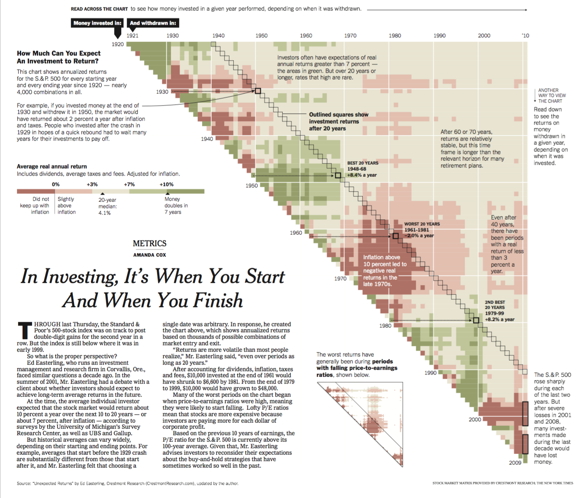

# Visualization Types - Part I {-}

In this chapter, we discuss a few commonly used visualization types.
The following R packages are required to run the examples in this chapter.

```{r, message=FALSE, warning=FALSE}
#library(plyr) # plyr needs to be loaded before dplyr and tidyverse
library(tidyverse)
library(RColorBrewer)
library(viridis)
library(viridisLite)
library(ggsci)
library(grid)
library(gridExtra)
library(ggbeeswarm)
library(ggrepel)
library(plotly)
library(ggforce)
library(corrplot)
library(ggcorrplot)
#library(ggridges) # for ridge plot
#library(GGally)
#library(hrbrthemes)
#library(highcharter)
#library(reshape)
#library(reshape2)
#library(Hmisc)
```

# Visualization of Distribution

## Overivew

As an overview, we plot the distributions of tuition for public and private universities using various visualization types below.
Each visualization type will be discussed in detail including the advantages and disadvantages, and common traps, in the following section.
As we can see, all visualization types are capable to show the difference in these distributions, but they focus on different aspects of the data.
Note that there are a few additional visualization types that are omitted in this chapter.

```{r, fig.width=10, fig.height=8, warning=FALSE, message=FALSE}
college = read.csv("data/college.csv", header = TRUE)

# boxplot
g1 = ggplot(college)+
  geom_boxplot(aes(x = tuition, 
                   y = control,
                   color = control)) +
  ggtitle("Boxplot") +
  theme(legend.position = "none")

# histogram stacked
g2 = ggplot(college)+
  geom_histogram(aes(x = tuition, 
                     fill = control))+
  theme(legend.position = "none")+
  ggtitle("Stacked Histogram")

# histogram overlapped
g3 = ggplot(college)+
  geom_histogram(aes(x = tuition, 
                     fill = control), 
                 position="identity", 
                 alpha = 0.5)+
  theme(legend.position = "none")+
  ggtitle("Overlapping Histogram")

# histogram dodged
g4 = ggplot(college)+
  geom_histogram(aes(x = tuition, 
                     fill = control), 
                 position = "dodge")+
  theme(legend.position = "none")+
  ggtitle("Dodged histogram")

# density overlapped
g5 = ggplot(college)+
  geom_density(aes(x = tuition, 
                   fill = control),
               alpha =0.5)+
  theme(legend.position = "none")+
  ggtitle("Overlapping Density Plot")

# density stacked
g6 = ggplot(college)+
  geom_density(aes(x = tuition, 
                   fill = control,
                   y = ..count../sum(..count..)), 
               position="stack")+
  theme(legend.position = "none")+
  ggtitle("Stacked Density Plot")

# violin
g7 = ggplot(college)+
  geom_violin(aes(x = tuition, 
                  y = control,
                  color = control),
              draw_quantiles = c(0.25, 0.5, 0.75))+
  ggtitle("Violin Plot") +
  theme(legend.position = "none")

# sina plot
library(ggforce)
g8 = ggplot(college)+
  geom_violin(aes(x = control, 
                  y = tuition,
                  color = control))+
  geom_sina(aes(x = control, 
                y = tuition,
                color = control), 
            size =0.3) +
  coord_flip() +
  ggtitle("Sina Plot") +
  theme(legend.position = "none")

# beeswarm
library(ggbeeswarm)
g9 = ggplot(college) +
  geom_beeswarm(aes(x = control, 
                    y = tuition,
                    color = control),
                size=0.3) +
  coord_flip()+
  ggtitle("Beeswarm Plot") +
  theme(legend.position = "none")

# strip plot
g10 = ggplot(college)+
  geom_boxplot(aes(x = tuition, y = control,
                   color = control),
               outlier.color = NA) +
  geom_jitter(aes(x = tuition, y = control,
                  color = control), 
              position = position_jitter(0.1),
              size =0.7)+
  ggtitle("Strip Plot") +
  theme(legend.position = "none")

# CDF plot
g11 = ggplot(college)+
  stat_ecdf(aes(x = tuition, color=control)) +
  theme(legend.position = "none")+
  ggtitle("CDF Plot")

# QQ plot
g12 = ggplot(college)+
  stat_qq(aes(sample = tuition, color = control)) +
  geom_qq_line(aes(sample = tuition, color = control))+
  theme(legend.position = "none")+
  ggtitle("QQ Plot")

# Dotplot
g13 = ggplot(college)+
  geom_dotplot(aes(x = tuition, y = control), binaxis='x', stackdir='center', dotsize=0.1)+
  theme(legend.position = "none")+
  ggtitle("Dotplot")
library(gridExtra)
grid.arrange(g1, g2, g3, g4, g5, g6, g7, g8, g9, g10, g11, g12, ncol = 3)
```


## Density, Overlapping Density, Stacked Density, Ridgeline Plots

A density plot is one of the most common approach to visualize distribution and is based on the kernel density estimation.
Given the observations $x_1, ..., x_n$, the estimated density can be written as

$$
{\widehat{f}}_{h}(x)= \sum _{i=1}^{n}{\frac {1}{nh}}K{\Big (}{\frac {x-x_{i}}{h}}{\Big )},
$$

where $K(\cdot)$ is the kernel function which is often chosen as the probability density function (pdf) of a standard normal distribution and $h$ is the bandwidth, i.e., tuning parameter.
It is easy to see that $1/h*K((x-x_{i})/h)$ represents the pdf of the normal distribution with mean of $x_i$ and standard deviation of $h$.
Therefore, the estimated density is the sum of the pdfs of many normal distributions with weights of $1/n$.
Let us use the following example to illustrate how estimated density is generated.
Suppose we only have three observations, $x_1 = 2, x_2 = 2.5, x_3 = 4$.
For each observation, we generate the pdf of the normal distribution with the mean equal to that observation and the standard deviation of $h$, 
and then multiply each pdf by $1/n$ and sum them up to get the estimated density.
The estimated density and the original data are shown in the following Figure.
Note that we use different values for the bandwidth.
The larger the bandwidth $h$ is, the smoother the density plot becomes.

```{r, fig.height=3, fig.width=6}
x = c(2, 2.5, 4)
n = length(x)
grid = seq(0,10,0.01)
bw = 0.5
kernel1 = 1/n * dnorm(grid, x[1], sd = bw)
kernel2 = 1/n * dnorm(grid, x[2], sd = bw)
kernel3 = 1/n * dnorm(grid, x[3], sd = bw)
density = kernel1 + kernel2 + kernel3
density_df = data.frame(grid, kernel1, kernel2, kernel3, density)
g1 = ggplot(data = density_df, aes(x = grid)) + 
  geom_line(aes(y = kernel1)) +
  geom_line(aes(y = kernel2)) +
  geom_line(aes(y = kernel3)) +
  geom_line(aes(y = density), color = "blue") +
  geom_rug(data = data.frame(x), aes(x = x), sides = "b", linewidth = 2) +
  scale_y_continuous(name = "Density", limits = c(0,0.5)) +
  scale_x_continuous(name = "Data")
bw = 1
kernel1 = 1/n * dnorm(grid, x[1], sd = bw)
kernel2 = 1/n * dnorm(grid, x[2], sd = bw)
kernel3 = 1/n * dnorm(grid, x[3], sd = bw)
density = kernel1 + kernel2 + kernel3
density_df = data.frame(grid, kernel1, kernel2, kernel3, density)
g2 = ggplot(data = density_df, aes(x = grid)) + 
  geom_line(aes(y = kernel1)) +
  geom_line(aes(y = kernel2)) +
  geom_line(aes(y = kernel3)) +
  geom_line(aes(y = density), color = "blue") +
  geom_rug(data = data.frame(x), aes(x = x), sides = "b", linewidth = 2) +
  scale_y_continuous(name = "Density", limits = c(0,0.5)) +
  scale_x_continuous(name = "Data")
grid.arrange(g1, g2, ncol = 2)
```


To visualize the distribution of tuition, We use different bandwidths, including the default value (green), as follows. 
As we can see, a good bandwidth is able to capture the main pattern of the data, but not get detracted by the details of each observation.

```{r, fig.width=4, fig.height=3}
ggplot(college, aes(x = tuition))+
  geom_density(color = "red",   bw = 500, ) +
  geom_density(color = "blue") +
  geom_density(color = "green", bw = 10000) +
  xlim(c(0,60000))
```


In addition to the traditional density plot, **overlapping density plot**, **stacked density plot** are often used.
However, their objectives are different.

- **Density plot** focuses on the overall **distribution**. 
- **Overlapping density plot** focuses on the **comparison** of distributions across each category.
- **Stacked density plot** shows the **composition** of distribution.

Below is an example of the density plot of the distribution of the faculty salary for different type of schools, i.e. schools offering associate, Bachelor, and graduate degrees.
For overlapping density plot, we can overlay multiple density plots to compare their distributions.
As we can see, the faculty salary is higher for schools with graduate degrees than for schools with only associate or bachelor degrees. 
For stacked density plot, we put one estimated density on top of the other estimated density.
In this case, the comparison acorss different distribution is harder, because they are not aligned.
In fact, the stacked density plot is mostly for visualizing the composition of the overall distribution.
When generating stacked density plot, we need to be extra careful about the proportion of each subpopulation.
The stacked density plot be default use equal proportion for each subpopulation.
In the case of faculty salary, the schools offering associate and Bechelor degrees are minorities.
In order to reflect such a proportion, we need to set `y = ..count../sum(..count..)` in the code.
In the second row of the figure below, we can see that the schools with associate and bachelor degrees are actually the minorities in the data.

```{r, fig.width=8,fig.height=6}
library(RColorBrewer)
g1 = ggplot(data=college) +
  geom_density(aes(x = faculty_salary_avg, 
                   color = highest_degree, 
                   fill = highest_degree),
               alpha = 0.2, linetype="solid") + 
  scale_color_viridis_d() + scale_fill_viridis_d() +
  ggtitle("Overlapping density of faculty salary\nEqual proportion") + 
  theme(legend.position="top")
g2 = ggplot(data=college) + 
  geom_density(aes(x = faculty_salary_avg,
                   color=highest_degree, 
                   fill=highest_degree),
               position="stack",alpha = 0.2,linetype="solid") +
  scale_color_viridis_d() + scale_fill_viridis_d() +
  ggtitle("Stacked density of faculty salary\nEqual proportion") + 
  theme(legend.position="none")
g3 = ggplot(data=college) + 
  geom_density(aes(x = faculty_salary_avg, 
                   color=highest_degree, 
                   fill=highest_degree,
                   y = ..count../sum(..count..)),
               alpha = 0.2,linetype="solid") +
  scale_color_viridis_d() + scale_fill_viridis_d() +
  ggtitle("Overlapping density of faculty salary\nCorrect proportions") + 
  theme(legend.position="none")
g4 = ggplot(data=college) + 
  geom_density(aes(x = faculty_salary_avg, 
                   color=highest_degree, 
                   fill=highest_degree,
                   y = ..count../sum(..count..)),
               position="stack",alpha = 0.2,linetype="solid") +
  scale_color_viridis_d() + scale_fill_viridis_d() +
  ggtitle("Stacked density of faculty salary\nCorrect proportions") + 
  theme(legend.position="none")
grid.arrange(g1,g2,g3,g4,ncol=2)
```

It is often useful when visualizing densities many subpopulations. 
For example, suppose we would like to show the distribution of the temperature in the city of Guilin, one of China's most popular tourist destinations and is famous for its scenery of karst topography.
The data contains the daily temperatures of Guilin in 2015.
Suppose we would like to show the distribution of temperature in each month.
When using overlapping or stacked density plots, the visualization becomes crowded and hard to read.
Instead, we use the faceted visualization which shows the distribution clearly.

```{r, fig.height=3, fig.width=10}
gui<-read.csv("data/2015.csv")
ggplot(gui, aes(y=tm))+
  geom_density()+
  scale_y_continuous(name = "Temperature") +
  facet_wrap(~as.factor(month), ncol = 12) +
  theme(axis.text.x = element_blank(),
        axis.ticks.x = element_blank())
```

The above visualization is clear, but the comparison across different month is hard because the density is within each facet.
Alternatively, we could use violin plots or boxplots to bring them closer for comparison.

```{r, fig.height=3, fig.width=10}
ggplot(gui)+
  geom_violin(aes(x = as.factor(month), y = tm)) +
  geom_sina(aes(x = as.factor(month), y = tm)) +
  scale_y_continuous(name = "Temperature") +
  scale_x_discrete(name = "Month")
ggplot(gui)+
  geom_boxplot(aes(x = as.factor(month), y = tm), width = 0.5, outlier.color = NA) +
  geom_jitter( aes(x = as.factor(month), y = tm), width = 0.1) +
  scale_y_continuous(name = "Temperature") +
  scale_x_discrete(name = "Month")

```

## Ridgeline Plot
For the temperature data of Guilin, a ridgeline plot becomes very useful.
The ridgeline plot arranges many density plots side by side with a common axis.
We use `geom_density_ridges` function to draw ridgeline plot with density and geom_density_ridges_gradient function to fill colors by density.
The visualization is shown below.
As we can see, the visualization is compact, making comparison easy.
The color of the density plot also changes, indicating the distribution has shifted.

```{r, message=FALSE, warning=FALSE}
#library(ggridges)
library(viridis)
gui<-read.csv("data/2015.csv")
ggplot(gui, aes(x=tm,y=as.factor(month),fill=after_stat(x)))+
  ggridges::geom_density_ridges_gradient(rel_min_height=0.001)+
  scale_fill_viridis_c(option = "magma", name="Temp. [C]")+
  labs(title = "Ridgeline Plot of 2015 Daily Temperature in Guilin, China",
       x="Daily temperature (C)",
       y="Month")+
  ggridges::theme_ridges()
```


## Violin Plot

A violin plot is similar to density plot.
It is essentially two density plots facing each other on each side. 
Therefore, the violin plot carries the same information as the density plot.
There are still a few additional setting in violin plot.

- The two ends of the violin plot are the maximum value and minimum value. We can change it by `geom_violin(trim=FALSE)`.
- The areas of the violin plots are the same. We can change it by `geom_violin(scale="count")` to have the areas proportional to sample size.
- The smoothness of violin plot can be adjusted by `geom_violin(adjust=1)`. The larger `adjust`, the more smooth the density curve.
- The violin plot can show the skewness, kurtosis, and heavy tails, outliers, of the data.

As an example, we use the IMDB movie score data set to draw the violin plot to compare the scores of movies from different countries. 
Sometimes, we combine violin plot and box plot to show more information of the data. 
The violin plot shows the density of the data set and the box plot shows quantile of the data set.

```{r setup,include=TRUE, fig.width=10}
score<-read.csv("data/score.csv",nrows = 20000)
g1=ggplot(score) + geom_violin(aes(x=1,y=imdb_score)) + 
  scale_y_continuous(name="IMDB score") +
  theme(axis.text.x = element_blank(), 
        axis.title.x = element_blank(),
        axis.ticks.x = element_blank())
g2=ggplot(score, aes(country,imdb_score,fill=country)) + 
  geom_violin() +
  geom_boxplot(width=0.05, fill="black", outlier.color = NA) + # In geom_boxplot(), outlier.color=NA hide the outliers.
  stat_summary(fun = median,geom = "point",fill="white",size=2.5,shape=21) +  # stat_summary() to add the median.
  scale_y_continuous(name="IMDB score")
grid.arrange(g1,g2,ncol=2,widths = c(2, 8))
```


When plotting multiple violin plots for comparing subpopulations, it can be misleading sometimes.
This is because the subpopulations may have very different sample sizes.
The default setting in violin plot has the same area for each subpopulation, indicating that each subpopulation has the same sample size.
We can turn this off by setting `scale = "count"` so that the areas of the violins are proportional to the sample sizes.
As we can see in the following example, the west region has much fewer universities than the rest of regions.
Such a fact is reflected in the second figure, but not in the first figure.

```{r, fig.width=10, fig.height=3}
g1 = ggplot(college)+
  geom_violin(aes(x = tuition, y = region)) +
  theme(axis.text.x = element_text(angle = 45))
g2 = ggplot(college)+
  geom_violin(aes(x = tuition, y = region), scale = "count") +
  theme(axis.text.x = element_text(angle = 45))
grid.arrange(g1,g2,ncol=3)
```

## Histogram

Histogram first divides the the data into bins and use barplot to represents the number of observations in each bin.
It is an effective tool in visualizing the distribution.
It is similar to the density plot in that it is also controlled by a tuning parameter, binwidth.
The smaller the binwidth is, the more details of the data are shown in the histogram.
Below, we generate the histograms using different binwidths and reveal different levels of details of the data.

```{r, fig.width=8, fig.height=3, warning=FALSE, message=FALSE}
g1 = ggplot(college)+
  geom_histogram(aes(x = tuition), binwidth = 500) +
  xlim(c(0,60000))
g2 = ggplot(college)+
  geom_histogram(aes(x = tuition)) +
  xlim(c(0,60000))
g3 = ggplot(college)+
  geom_histogram(aes(x = tuition), binwidth = 10000) +
  xlim(c(0,60000))
grid.arrange(g1, g2, g3, ncol = 3)
```

Similar to stacked/overlapping density plots, we also have stacked/overlapping histograms to show the comparison and composition of the distributions of subpopulations.
Again, if the number of subpopulations is more than three, they become less effective in comparing the distributions.
In addition, we can also generate dodge histogram which is similar to overlapping histogram in terms of visualization purpose.
Below, we use 

```{r, fig.width=6, fig.height=6}
g1 = ggplot(iris,aes(x=Sepal.Width)) +
  geom_histogram(binwidth = 0.2)
g2 = ggplot(iris,aes(x=Sepal.Width, fill = Species)) +
  geom_histogram(binwidth = 0.2, position = "stack") + 
  scale_fill_discrete(name = "") +
  theme(legend.position="top")
g3 = ggplot(iris,aes(x=Sepal.Width, fill = Species)) +
  geom_histogram(binwidth = 0.2, position = "identity", alpha = 0.5) + 
  theme(legend.position="none")
g4 = ggplot(iris,aes(x=Sepal.Width, fill = Species)) +
  geom_histogram(binwidth = 0.2, position = "dodge") + 
  theme(legend.position="none")
grid.arrange(g1,g2,g3,g4, ncol=2)
```

## Boxplot

A boxplot visualizes a few summary statistics of the data to demonstrate the distribution.
It consists of a box and two whiskers.
The line in the middle of the box represents the median (the 50th percentiles).
The lower and upper bounds of the box correspond to the first and third quartiles (the 25th and 75th percentiles). 
Hence, the length of the box is just the interquartile range (IQR) and the box represents the location of middle 50% of the data.

Two whiskers extends from the box to two sides.
The upper whisker extends to the largest observation at most 1.5\*IQR above the third quartile (upper bound of the box).
The lower whisker extends to the smallest observation at most 1.5\*IQR below the first quartile (lower bound of the box).
Therefore, the length of the whisker is at most 1.5*IQR.
Observations beyond the end of the whiskers are considered outliers and are plotted separately.

It is often helpful to overlay jittered observations on top of the boxplot to demonstrate the actual data and its statistics such as median, first, and third quartiles.
Note that when you overlay the actual observations on the boxplot, it is natural to remove the outliers identified by boxplot.
Otherwise, we will have double amount of the outliters.
In addition, it is often useful to sort the boxplot according to the median so that the distributions are easy to compare.
Below, we use the mpg data set in ggplot R package and demonstrate the fuel efficiencies of different types of cars.
Note that we sort the boxplots in the last figure.

```{r, fig.width=6, fig.height=3}
g1 = ggplot(mpg) + 
  geom_boxplot(aes(x=class, y=hwy),
               outlier.color = "red") + 
  theme(axis.text.x = element_text(angle = 90, vjust = 0.5, hjust=1))
g2 = ggplot(mpg, aes(x=reorder(class, hwy, median), y=hwy)) + 
  geom_boxplot(outlier.color = NA) + 
  geom_jitter(width=0.3, alpha =0.2, color="blue") + 
  theme(axis.text.x = element_text(angle = 90, vjust = 0.5, hjust=1)) +
  scale_x_discrete(name = "class")
grid.arrange(g1,g2, ncol=2)
```

## Strip Plot

It can be used to compare the distribution of each variables, mainly used when the number of observation is not too large.

We are using the rate1.csv dataset. It is about admission rate of the college. It contains the categorical variables region and control. The region variable indicates the region of the college and the control variable denotes the whether the college is private or public.

Notes on strip plot:

- It is suitable for data with a small or moderate sample size. If there are too many observations, strip plot may be hard to see.
- It is used to study the association between a continuous variable and a discrete variable.

We use `geom_jitter()` function to draw the strip plot. x-axis is the categorical variable. We can further add the mean and error bar on the plot.
We can combine strip plot with box plot, violin plot, and etc.

```{r}
#library(Hmisc)
g1=ggplot(college,aes(region,admission_rate))+
  geom_jitter(aes(color=region),
              position = position_jitter(0.1), 
              size=1.2) +
  stat_summary(fun.data = "mean_sdl",#(mean+-constant)*sd
               fun.args = list(mult=1),#mult indicates the constant
               geom = "pointrange",size=0.5,color="black")
g2=ggplot(college,aes(region,admission_rate))+
  geom_jitter(aes(color=region),
              position = position_jitter(0.1), 
              size=1.2) +
  geom_boxplot(aes(color=region), color="black", width=0.1, alpha=0.2, outlier.color = NA)
grid.arrange(g1,g2,ncol=1)
```

## Sina Plot

The sina plot is a data visualization chart suitable for plotting any single variable in a multiclass dataset. 
It is an enhanced jitter strip chart, where the width of the jitter is controlled by the density distribution of the data within each class.

We use the sina plot function in `sinaplot` package or geom_sina function in "ggforece" package to draw the sinaplot. 
Here is the code to generate sina plot and side-by-side sina plot.

```{r,fig.width=10,message=FALSE,warning=FALSE}
#library(sinaplot)
#data <- read.csv("data/histogram-movie.csv")
#x<-data$imdb_score
#groups<-data$release_date
#par(mfrow=c(1,2))
#sinaplot(x,pch = 20)
#sinaplot(x,groups,pch=20,cex=0.5,col=2:4,xlab="Released date",ylab="imdb score")
library(ggforce)
ggplot(college)+
  geom_sina(aes(x = highest_degree, 
                y = tuition,
                color = highest_degree)) +
  ggtitle("Sina Plot") +
  theme(legend.position = "none")
```


## Beeswarm

A beeswarm plot is a one-dimensional scatter plot similar to strip plot, except that would-be overlapping points are separated such that each is visible.
We still use the average salary of faculty in the college.csv data set.
The function `beeswarm` in default or expansion package `ggbeeswarm` can be used to obtain the beeswarm plot. 
We are using `ggbeewarm` as an example.

```{r}
library(ggbeeswarm)
library(RColorBrewer)
df=read.csv("data/college.csv",header = T)
g1 = ggplot(df, aes(x=1,y=faculty_salary_avg)) + 
  geom_beeswarm(size=1) + #cex can be used to adjust the diameter of point
  theme(panel.grid = element_blank(), panel.background = element_blank(),
        axis.line = element_line(color = 'black')) + #adjust the color of background
  labs(x = '', y = 'Average salary of faculty (dollar)') #name the x-axis and y-axis
g2 = ggplot(df, aes(region, faculty_salary_avg, color = region)) + 
  geom_beeswarm(size=1) + #cex can be used to adjust the diameter of point
  geom_boxplot(alpha=0.05,color="black",width=0.1) +
  scale_color_viridis_d() +
  theme(panel.grid = element_blank(), panel.background = element_blank(),
        axis.line = element_line(color = 'black')) + #adjust the color of background
  labs(x = '', y = 'Average salary of faculty (dollar)') #name the x-axis and y-axis
grid.arrange(g1,g2,ncol=2,widths=c(3,6))
```

## Dot Plot

```{r}
library(tidyverse)
college=read.csv("data/college.csv",header = T)
college %>%
  filter(state %in% c("OH", "IN")) %>%
  ggplot() + 
  geom_dotplot(aes(x = tuition, 
                   color = control,
                   fill = control),
               binaxis = 'x',
               stackdir='center',
               dotsize = 0.7)
```

## CDF Plot

The cumulative distribution function (CDF) of a random variable $X$ is defined as 
$$
F(x) = P(X \leq x) = \int_{-\infty}^{x} f(u) du,
$$ 

where $f(\cdot)$ is the probability density function (pdf) of $X$.
Therefore, CDF is a monotone and increasing function.
The shape of the CDF carries inportant information about the distribution.
The CDF plot is just visualization of the CDF.
It is a effective tool to compare multiple distributions, especially when the distributions have similar shapes.
Below is an example.
We are using the college admission data set to draw CDF plots. 

```{r, fig.width=6, fig.height=3}
g1=ggplot(college,aes(x=faculty_salary_avg,color=control,fill=control)) +
  stat_ecdf() +
  theme(legend.position = "top")
g2=ggplot(college,aes(x=faculty_salary_avg,color=control,fill=control)) +
  geom_density(alpha = 0.2) +
  theme(legend.position = "top")
grid.arrange(g1,g2,ncol=2)
```

## QQ Plot

The QQ plot checks whether the data is normally distributed.
It plots the sample percentiles, i.e., 1st, 2nd, ..., 99th percentiles, against these percentiles of a standard normal distribution in a scatter plot.
If the data is normally distributed, then these dots should fall on a straight line.
By looking at the patterns in the dots, such as the deviation of dots from the straight line, we can conclude whether data has a heavy-tail or a light-tail.
Below we show two artificial data sets with heavy tail and light tail distributions.

```{r, fig.width=6, fig.height=6, message=FALSE, warning=FALSE}
n=1000
x = rnorm(n)
x1 = x[abs(x)<2]
x2 = c(x, rnorm(0.1*n)*3)
g1=ggplot(data.frame(x1), aes(sample = x1)) +
  stat_qq() + 
  geom_qq_line(col ="red")
g2=ggplot(data.frame(x1), aes(x = x1)) +
  geom_density() +
  scale_x_continuous(limits = c(-4,4))
g3=ggplot(data.frame(x2), aes(sample = x2)) +
  stat_qq() + 
  geom_qq_line(col ="red")
g4=ggplot(data.frame(x2), aes(x = x2)) +
  geom_density() +
  scale_x_continuous(limits = c(-4,4))
grid.arrange(g1,g2,g3,g4,ncol=2)
```


# Visualization of Association

## 2D/Hexbin-Histogram, Density Contour, and Jittering: Alternatives to Scatterplot for Overplotting


To visualize the association between two continuous variables, the scatter plot is the one of the most common approaches.
We have discussed the scatterplot in detail in the previous chapter. 
One of the frequently encountered issues in the scatter plot is **overplotting**.
It occurs when multiple data points are plotted in the same location or very close to each other, making them hard to distinguish.
Below are some of common reasons and solutions to overplotting.

Cause of overplotting | Solution
----------------------|-----------
Large data set, or too many observations  | Alpha-blending/transparency, hollow circles, small point size, histogram, heatmap
Aligned values on a single axis           | As above, plus change position
Low-precision data, limited decimal points| jittering, i.e., add random noise to the data
Integer data                              | jittering, i.e., add random noise to the data

For the college data set, we clearly have the overplotting issue espeically when we use large symbols for observations.
To alleviate the overplotting, we could use the transparent data points.
We can set the points to transparent using the aesthetic dimension `alpha=`. 
Note that `alpha` is between 0 and 1. 
The smaller `alpha`, the more transparent the point. 
After we set the point color to transparent, the overlapping data points would appear darker than the rest of the points.

```{r, fig.width=6, fig.height=3}
college = read.csv("data/college.csv", header = TRUE)
g1 = ggplot(data=college, aes(x=sat_avg,y=admission_rate)) + 
  geom_point(size = 2.5)
g2 = ggplot(data=college, aes(x=sat_avg,y=admission_rate)) + 
  geom_point(size = 2.5, alpha = 0.1)
grid.arrange(g1,g2,ncol=2)
```

If there are too many data points, we can also use 2d histogram or hexbin histgram.
They divides the plotting region into small grids/rectangles and use the color to represent the number of data points falling into that rectangle.
Both 2d and hexbin histograms are essentially heatmaps.
Sometimes, the value within each grid of the histogram is computed by applying an aggregation function such as count or sum (if z is provided).
We will see these examples in the spatial data visualization chapter.
2D and hexbin histograms are effective tools to solve the overplotting issue where showing large data sets in a scatter plots would result in observations overlapping each other, making it hard to interpret the patterns in the data.

```{r, fig.width=6, fig.height=3}
college = read.csv("data/college.csv")
g3 = ggplot(data=college, aes(x=sat_avg,y=admission_rate)) + 
  geom_bin2d(bins = 10)
g4 = ggplot(data=college, aes(x=sat_avg,y=admission_rate)) + 
  geom_bin2d(binwidth = c(50,0.025))
#g4 = ggplot(data=college, aes(x=sat_avg,y=admission_rate)) + 
#  geom_hex(bins=10)
grid.arrange(g3,g4,ncol=2)
```

In addition, we could use density contour plot.
The density plot is similar to the kernel density estimation we introduce in the previous sections.
The difference is that the kernel in density coutour is two dimensional.
The mathematics is omitted for brevity.
The density contour essentially generates a nonparametric estimate of the two dimensional density function and use the contour plot to visualize such a distribution.
The density contour is also help in visualizing the difference in distribution for different subpopulations within a overall population.
For example, we can check the distribution for public and private universities. 
The subtle difference between the two distributions can be identified.

```{r, fig.width=6, fig.height=3}
g5 = ggplot(data=college, aes(x=sat_avg,y=admission_rate)) + 
  geom_point(size = 2.5, alpha = 0.1) +
  geom_density_2d_filled(bins = 10, alpha = 0.4) +
  geom_density_2d(bins = 10, color = "black", linewidth = 0.5) + 
  theme(legend.position = "none")
g6 = ggplot(data=college, aes(x=sat_avg,y=admission_rate)) + 
  geom_point(size = 2.5, alpha = 0.1) +
  geom_density_2d(aes(group = control, color = control), bins = 10, linewidth = 0.5) + 
  scale_color_manual(breaks = c("Public", "Private"), values = c("blue", "yellow")) +
  theme(legend.position = "none")
library(gridExtra)
grid.arrange(g5,g6,ncol=2)
```

To compare these two distributions, we often use faceted density contour plot as follow. 
The lower right part of the distribution for the private universities now becomes apparent.

```{r, fig.width=6, fig.height=3}
g7 = ggplot(data=college, aes(x=sat_avg,y=admission_rate)) + 
  geom_point(size = 2.5, aes(color = control)) +
  geom_density_2d(aes(group = control), bins = 10, color = "black", linewidth = 0.5) + 
  facet_wrap(~control) +
  theme(legend.position = "none")
g7
```

In addition to 2D histogram and density contour plot, jittering is another common way to deal with overplotting.
It is especially effective when the data are integer values or data are rounded to a certain decimal point.
Let us take a look at an example. 
We analyze a data containing the fuel efficiency information of various cars.
The data is provided in `ggplot2` package.
It is a data frame with 234 rows and 11 variables.
Each row represents a particular car.
Each column represents a variable describing the cars.

<!---
Here is a list of variable explanations.


Variable | Type | Description | Details  
--|--|--|--
`manufacturer` | char | manufacturer name | 15 manufacturers
`model` | char | model name | 38 models
`displ` | numeric | engine displacement in liters, i.e., cylinder volume swept by pistons | range from 1.6 to 7.0 liter
`year` | integer | year of manufacture | two levels: 1999 and 2008 
`cyl` | integer | number of cylinders | four levels: 4, 5, 6, 8 cylinders
`trans` | char | type of transmission | two levels: automatic, manual(int)
`drv` | char | type of drive train | three levels: f,r,4. f = front-wheel drive, r = rear wheel drive, 4 = 4wd
`cty` | integer | city miles per gallon | range from 9 to 35
`hwy` | integer | highway miles per gallon | range from 12 to 44
`fl` | char | fuel type | five levels: p,r,e,d,c. d=diesel, p=petrol, e=electric, etc.
`class` | char | vehicle class | seven levels: compact, midsize, suv, 2seater, minivan, pickup, subcompact

--->

For this data set, suppose we are interested in the association between the highway fuel efficiency `hwy` and local road fuel efficiency `cty`.
We can visualize them using a scatter plot.

As we can see, all the points are aligned and located on a grid, suggesting that the visualization suffers from the overplotting issue.
If you check the data set carefully, we can see that fuel efficiency and enginer size are reported with only one demical point, which is the reason for overplotting.

Alternatively, we can jitter the data points using `position="jitter"` in the `geom_point()` function.  
Jittering essentially gives each data point a random shift, so that all data points display well.
Either transparency or jittering are good solutions to overplotting, we can also combine two techniques. 
Here are the examples.

```{r,fig.width=6, fig.height=6}
data(mpg)
g1=ggplot(data=mpg, aes(x=hwy,y=cty)) + 
  geom_point()
g2=ggplot(data=mpg, aes(x=hwy,y=cty)) + 
  geom_point(alpha=0.2)
g3=ggplot(data=mpg, aes(x=hwy,y=cty)) + 
  geom_point(position="jitter",alpha=0.2)
g4=ggplot(data=mpg, aes(x=hwy,y=cty)) +
  geom_count() +
  scale_size_continuous(range = c(0.4,2)) +
  theme(legend.position = "none")
library(gridExtra)
grid.arrange(g1,g2,g3,g4,ncol=2)
```

Use `geom_jitter()` is equivalent to use `geom_point(position="jitter")`.
Note that the argument `position=` can take multiple values, including identity, dodge, stack, fill, jitter, jitterdodge, and nudge.
Please try the following code on your computer.

```{r, eval=FALSE}
ggplot(data=mpg,aes(x=displ,y=hwy)) +
  geom_point(position = "identity",alpha=0.2)
ggplot(data=mpg,aes(x=displ,y=hwy)) +
  geom_point(position = "jitter", alpha=0.2)
posn_j=position_jitter(0.03,seed=123)
ggplot(data=mpg,aes(x=displ,y=hwy)) +
  geom_point(position = posn_j, alpha=0.2)
ggplot(data=mpg,aes(x=displ,y=hwy)) + 
  geom_jitter(width=0.03,alpha=0.2)
```


## Bubble Plot

A bubble plot is an extension of the scatterplot where a third dimension is added and mapped to the size of the dots.
We visualize the gapminder data set from the R package gapminder using the bubble plot.
It provides the average life expectancy, GDP per capita, and population size for more than 100 countries, measured over time.
The bubble plot can show the relationships among the three numerical variables of GDP per capita, average life expectancy and population. 
The positive correlation of the bubble plot is more obvious after logarithmic transformation of the x-axis. 
For countries with extreme values (the average life expectancy is too low, the GDP per capita is very high), we can use annotate to express these special situations.
Compared with the original one at the [gapminder website](https://www.gapminder.org/tools/#$chart-type=bubbles&url=v1),
we can see that ggplot is capable to replicate the original one closely.

```{r, warning=FALSE, message=FALSE, echo=FALSE}
library(ggrepel)
library(plotly)
library(gapminder)
my_year=2007
my_gapminder = gapminder %>%
  filter(year==my_year) %>%
  arrange(desc(pop))
g1 = ggplot(data=my_gapminder) + 
  annotate(geom="text", x=7000, y=50, label=my_year, color="grey", size=50, alpha=0.5) +
  geom_point(aes(x=gdpPercap, y=lifeExp, 
                 fill = continent, size = pop), shape=21, alpha=0.7) +
  scale_x_log10(breaks = 2^(-2:7) *1000,
                labels = c(as.character(2^(-2:3) *1000),"16k","32k","64k","128k")) +
  scale_y_continuous(breaks = seq(10,90,10)) + 
  scale_size(guide = FALSE, range = c(1,20)) +
  scale_fill_manual(breaks = c("Africa", "Americas", "Asia",   "Europe", "Oceania"),
                    values = c("#60D2E6","#9AE847",  "#EC6475","#FBE84D","grey"))+
  labs(x="Income, per person (GDP/capita, PPP$ inflation-adjusted)", y="Life expectancy in years")+
  coord_cartesian(xlim = c(250,130000), ylim=c(10, 90)) + 
  theme(
    #legend.key.size =  unit(1.5, "cm"),
    #legend.text = element_text(size = 15),
    panel.background = element_blank(),
    axis.line = element_line(color = "black"),
    panel.grid.major = element_line(color = "grey"))+
  guides(fill = guide_legend(override.aes = list(size = 5)))
my_gapminder <- my_gapminder %>% #denote the special situations
  mutate(annotation = case_when(
    pop > 100000000 ~ "yes"))
g1 + 
  geom_text_repel(data = my_gapminder %>% filter(annotation=="yes"), 
                  aes(x=gdpPercap, y=lifeExp, label=country), 
                  size=4, color="black",
                  nudge_x = -0.3+0.6*runif(nrow(my_gapminder %>% filter(annotation=="yes"))),
                  nudge_y = -0.3+0.6*runif(nrow(my_gapminder %>% filter(annotation=="yes"))))
```

Below is the interactive version.

```{r, echo=FALSE, eval=FALSE}
data3 <- gapminder %>% 
  filter(year=="2007") %>% 
  select(-year) %>% 
  mutate(pop=pop/1000000) %>% 
  arrange(desc(pop)) %>%
  mutate(text = paste("Country: ", country, 
                      "\nPopulation (M): ", round(pop,2), 
                      "\nLife Expectancy: ", round(lifeExp,1), 
                      "\nGdp per capita: ", round(gdpPercap,0), sep="")) #set the label
p = ggplot(data3, aes(x=gdpPercap, y=lifeExp, size = pop, color = continent, text = text)) +
  geom_point(alpha=0.7) +
  scale_x_log10() +  # logarithmic transformation on x
  scale_color_manual(values = colorRampPalette(brewer.pal(9,"Set2"))(5)) +  #use colorbrewer for the color
  theme(legend.position="none") +
  scale_size(range = c(1, 10), name="Population (M)") #range sets the size of the smallest and the biggest circles.
ggplotly(p, tooltip="text")
p2 = ggplot(data3, aes(x=gdpPercap, y=lifeExp, size = pop, color = continent, text = text)) +
  geom_point(alpha=0.7) +
  scale_x_log10()
ggplotly(p2, tooltip="text")
```

```{r, echo=FALSE, message=FALSE}
my_gapminder <- my_gapminder %>% 
  mutate(pop=pop/1000000) %>% 
  mutate(text = paste("Country: ", country, 
                      "\nPopulation (M): ", round(pop,2), 
                      "\nLife Expectancy: ", round(lifeExp,1), 
                      "\nGdp per capita: ", round(gdpPercap,0), sep="")) #set the label
my_gapminder = arrange(my_gapminder, desc(pop))
g3 = ggplot(data=my_gapminder) + 
  annotate(geom="text", x=7000, y=50, label=my_year, color="grey", size=50, alpha=0.5) +
  geom_point(aes(x=gdpPercap, y=lifeExp, 
                 fill = continent, size = pop, text = text), shape=21, alpha=0.7) +
  scale_x_log10(breaks = 2^(-2:7) *1000,
                labels = c(as.character(2^(-2:3) *1000),"16k","32k","64k","128k")) +
  scale_y_continuous(breaks = seq(10,90,10)) + 
  scale_size(guide = FALSE, range = c(1,20)) +
  scale_fill_manual(breaks = c("Africa", "Americas", "Asia",   "Europe", "Oceania"),
                    values = c("#60D2E6","#9AE847",  "#EC6475","#FBE84D","grey"))+
  labs(x="Income, per person (GDP/capita, PPP$ inflation-adjusted)", y="Life expectancy in years")+
  coord_cartesian(xlim = c(250,130000), ylim=c(10, 90)) + 
  theme(
    #legend.key.size =  unit(1.5, "cm"),
    #legend.text = element_text(size = 15),
    panel.background = element_blank(),
    axis.line = element_line(color = "black"),
    panel.grid.major = element_line(color = "grey"),
    legend.position="none")+
  guides(fill = guide_legend(override.aes = list(size = 5)))
ggplotly(g3, tooltip="text")
```


## Parallel Coordinate

This type of visualization is used for plotting multivariate, numerical data. 
The parallel coordinates plot is ideal for comparing many variables together and seeing the relationships between them.

We use the iris data set gives the measurements in centimeters of the sepal length and width and petal length and width, respectively, for 50 flowers from each of 3 species of iris. The species are Iris setosa, versicolor, and virginica.

```{r, fig.width=8, fig.height=3, warning=FALSE, message=FALSE}
library(GGally)
library(ggforce)# for parallel sets
g1=ggparcoord(iris, columns = 1:4, groupColumn = 5, scale = "globalminmax")
g2=ggparcoord(iris, columns = 1:4, groupColumn = 5, scale = "uniminmax")
grid.arrange(g1,g2,ncol=2)
```


## Correlation Plot

A correlation plot visualizes the correlations for all pairs of variables in a data set on a grid.
It quickly depicts the correlation structure.
As an example, we use the mtcars data set in the R package ggplot2. 
The data comes from the 1974 Motor Trend magazine. 
It includes fuel consumption data and ten aspects of car design for then-current car models.
We can 

```{r}
#head(mtcars)
library(corrplot)
corrplot.mixed(cor(mtcars),
               lower="number",
               upper="ellipse",
               order="AOE")
# corrplot(mt,method="ellipse",
#          type="full",
#          order="AOE")
# corrplot(mt,method="ellipse",
#          order="FPC")
# corrplot(mt,method="ellipse",
#          order="hclust",
#          hclust.method ="complete",
#          addrect = 4)
```

An alternatively is ggcorrplot which uses color to represent the correlation.
In the figure, blue means two variables are positively correlated, red means negatively correlated.
The darker the color, the stronger the correlation.

```{r}
library(ggcorrplot)
ggcorrplot(cor(mtcars),type="full",method = "square")
```


## Heatmap

A heatmap is a graphical representation of data that uses a system of color coding to represent different values.
The x and y axes of the grid are often two index variables and a third variable z is visualized as color in the grid.
As an example, we analyze a data set on the number of infected people by Measles per 100,000 people, measured over 70 years and across all 50 states and the District of Columbia.
The data set is from the Wall Street Journal article ("Battling Infectious Diseases in the 20th Century: The Impact of Vaccines" by Tynan DeBold and Dov Friedman, published Feb. 11, 2015.)[http://graphics.wsj.com/infectious-diseases-and-vaccines/]
We also know that the vaccine came out in 1963.
So it will be interesting to demonstrate the effectiveness of the vaccine.
The number generally decline after vaccines were introduced.

```{r, message = FALSE}
vaccines_wide = read_csv("data/vaccines_wide.csv")
vaccines_wide
vaccines = pivot_longer(vaccines_wide, cols=!state, names_to = "year", values_to = "count")
vaccines
vaccines = vaccines %>% mutate_at("year", as.numeric)
```

As a first attempt, we plot the counts of infected people against year for all the states in the facet line plot.
We can see the decline of the number of infected people through the years.
However, the comparison across different states is diffcult because there are too many of them.

```{r, fig.height=5, fig.width=10, warning=FALSE, message=FALSE}
ggplot(vaccines) +
  geom_line(aes(x = year,y = count)) +
  facet_wrap(~state, ncol = 9) +
  theme(legend.position = "none",
        axis.text.x = element_text(angle = 90, vjust = 0.5))
```

Alternatively, we use the heatmap visualize the situation of different states.
We can immediately see that after 1963 when the vaccine came out, the number of infected people dropped drastically.
Meanwhile, most missing values appears in the 1980s because many states stopped tracking this disease.
Some of the states have missing values before 1963 because they were not part of USA back then.

```{r,fig.width=8,fig.height=7}
ggplot(vaccines) +
  geom_tile(aes(x = year, y = state, fill = count)) +
  scale_x_continuous(expand = c(0, 0), 
                     breaks = seq(1928, 2003, by=5)) + #adjust x-axis 
  scale_fill_viridis_c() + 
  geom_vline(xintercept = 1963, color = "orange") + 
  theme_bw() + 
  theme(panel.border = element_blank(),
        panel.grid.major = element_blank(),
        panel.grid.minor = element_blank()) +
  ggtitle("Number of infected people by Measles per 100,000 people")
```


Below is the interactive version of the same heatmap.

```{r, eval=FALSE}
rm(list=ls()) #delete the variables in the environment
data("vaccines") #dataset in highcharter
#set tooltip, x y: value
fntltp <- JS("function(){
  return this.point.x + ' ' +  this.series.yAxis.categories[this.point.y] + ':<br>' +
  Highcharts.numberFormat(this.point.value, 2);
}") 
# in 1963, draw a vertical line of x-axis
plotline <- list(
  color = "#fde725", value = 1963, width = 2, zIndex = 5,
  label = list(
    text = "Vaccine Intoduced", verticalAlign = "top",
    style = list(color = "#606060"), textAlign = "left",
    rotation = 0, y = -5)
) 
#hcaes(x = year, y = state, value = count) 
hchart(vaccines, "heatmap", hcaes(x = year, y = state, value = count)) %>%   #set the color
  hc_colorAxis(stops = color_stops(10, rev(inferno(10))),type = "logarithmic") %>% 
  hc_yAxis(reversed = TRUE, offset = -20, tickLength = 0,
           gridLineWidth = 0, minorGridLineWidth = 0,
           labels = list(style = list(fontSize = "8px"))) %>% 
  #tooltip
  hc_tooltip(formatter = fntltp) %>% 
  #in 1963, draw a vertical line of x-axis
  hc_xAxis(plotLines = list(plotline)) %>% 
  #title
  hc_title(text = "Infectious Diseases and Vaccines") %>% 
  hc_legend(layout = "vertical", verticalAlign = "top",
            align = "right", valueDecimals = 0) %>% 
  #size of the plot
  hc_size(height = 800)
```

A example of heatmap on investment is given by [In Investing, It's When You Start and When You Finish](https://amandacox.github.io/img/big/returns.png)

```{r, echo=FALSE, out.width="100%"}

```


## Long Format vs Wide Format for Data Wrangling

When dealing with the heatmap, we often need to convert between different data structures.
Two of the most frequently used data structures are long and wide formats.
For a long format data set, each row represents one observation while each column represents one variable.
A long format contains values that may repeat in the column.
For a wide format data set, one type of measurements/variable may appear in multiple columns.
A wide format contains values that do not repeat in the first column.
Below is an example of wide and long formats and how to convert between them.

```{r}
vaccines_wide = pivot_wider(vaccines, names_from = year, values_from = count)
vaccines_wide
vaccines_long = pivot_longer(vaccines_wide, cols=!state, names_to = "year", values_to = "count")
vaccines_long
```

<!---
```{r}
# alternatively, we can use dcast() and melt() from the reshape2 package as follows.
#vaccines_wide = dcast(vaccines, state~year, mean, value.var="count")
#as_tibble(vaccines_wide)
#vaccines_long = melt(vaccines_wide, id=c("state"))
#as_tibble(vaccines_long)
# vaccines_matrix=as.matrix(vaccines_wide[,-1])
# row.names(vaccines_matrix)=pull(vaccines_wide[,1])
# heatmap(vaccines_matrix,
#         Colv = NA, Rowv = NA,col=colorRampPalette(c("darkblue", "green"))(10)) 
# note that heatmap() function can only take matrix, not data frame.
```
--->


