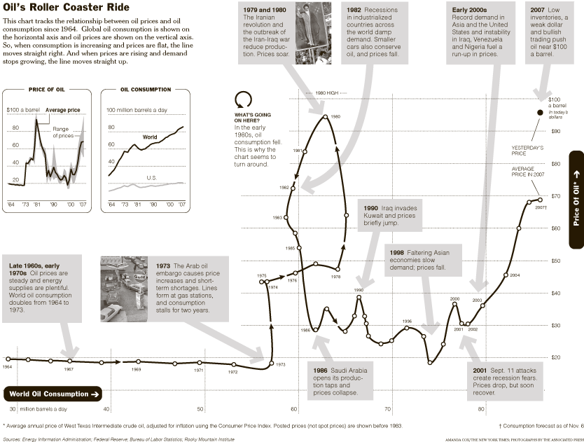
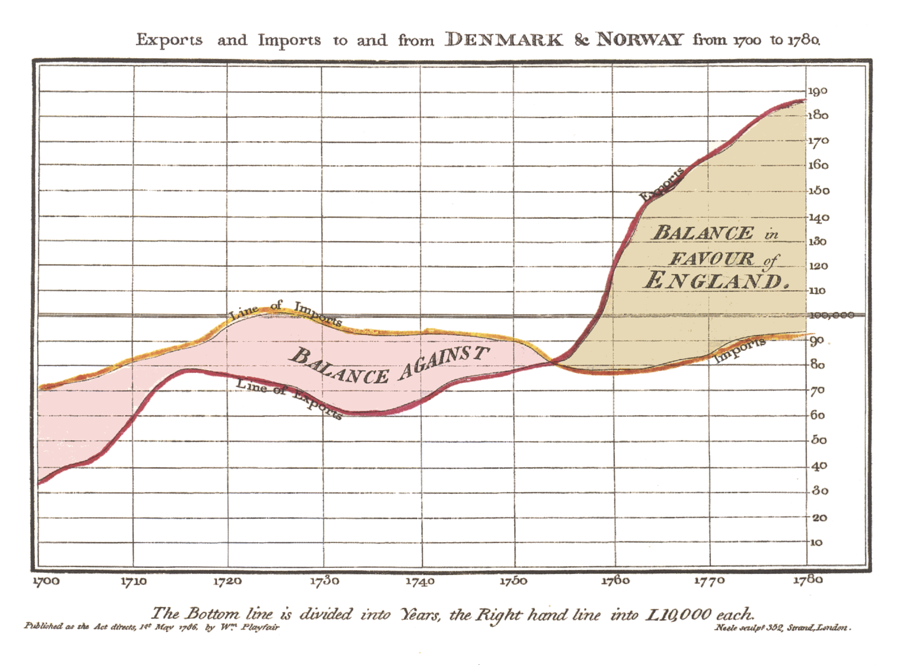
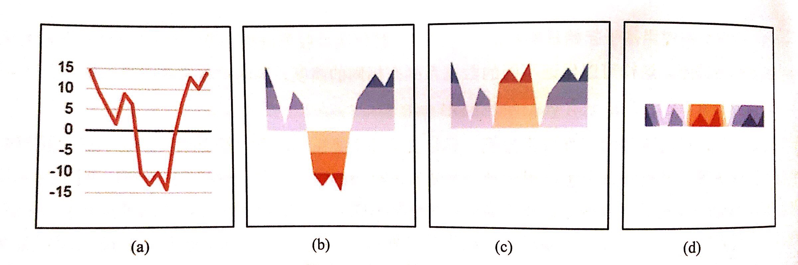
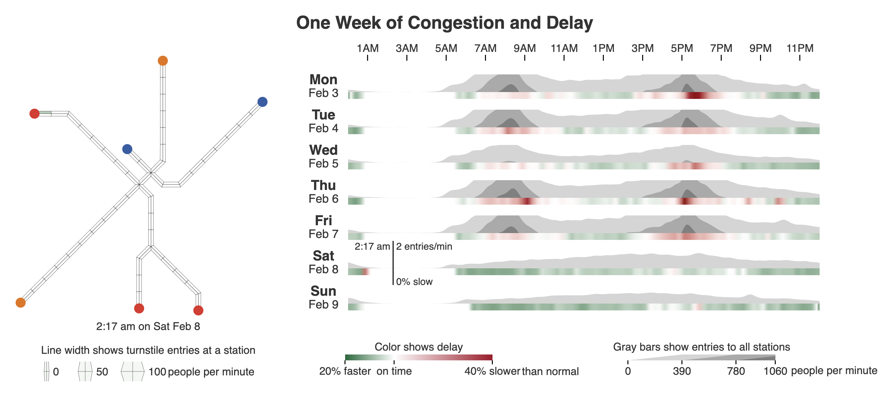
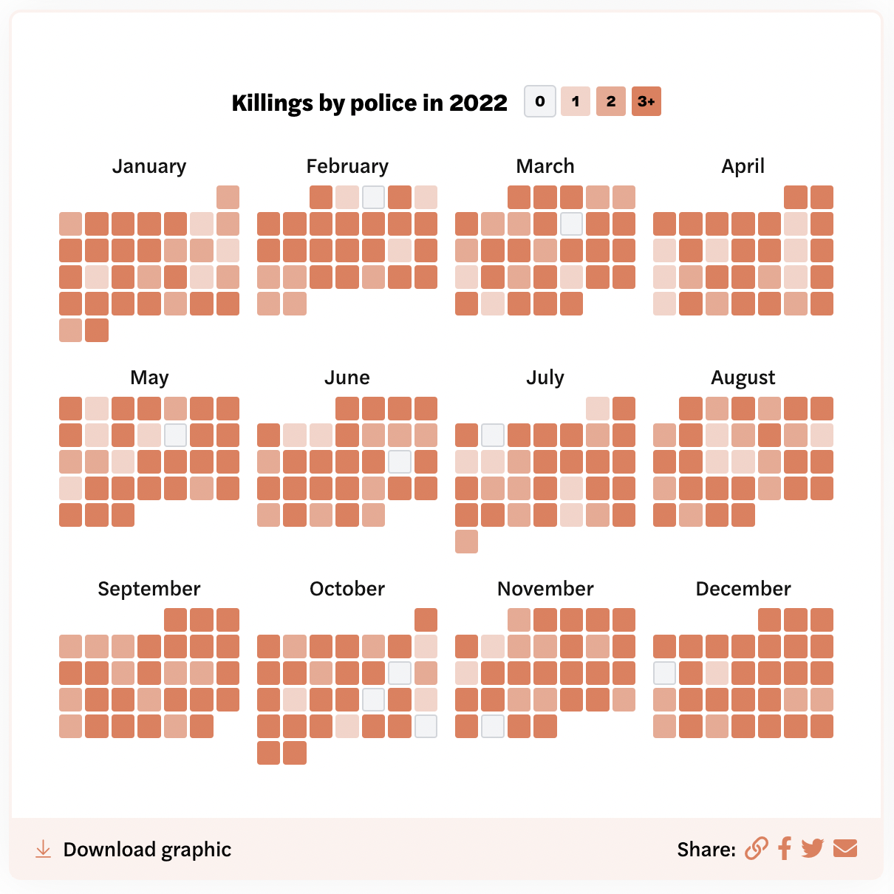

--- 
title: "Ch8 Time Series Data Visualization"
subtitle: "Descriptive Analytics and Data Visualization"
author: "Yichen Qin (qinyn@ucmail.uc.edu), University of Cincinnati"
date: "`r Sys.Date()`"
output: 
  html_document:
    number_sections: true
    code_folding: "show"
    toc: true
bibliography: [book.bib, packages.bib]
biblio-style: apalike
link-citations: yes
---


# Time Series Visualization {-}

In this chapter, we discuss time series visualization.
Time series data is a collection of repeated measurements on one or multiple variables, taken over time.
Different from the previous chapters, the time series visualization needs to display and emphasize on the temporal change of these variables and the interaction among them.

In this chapter, we will use the following R packages.

```{r, eval=TRUE, message=FALSE, warning=FALSE}
library(tidyverse)
library(ggrepel)
library(babynames)
library(gridExtra)
library(streamgraph)#devtools::install_github("hrbrmstr/streamgraph")
library(ggalt)#devtools::install_github("hrbrmstr/ggalt")
library(ggTimeSeries)
library(sugrrants)
library(RColorBrewer)
```

Let us start with the introduction to the data set we will mainly use in this chapter.

# Data: Friends Characters Names

In this chapter, we mainly analyze the babynames data set, available in the R package babynames.
This data set is a running example throughout this chapter, and appears in many subsections to illustrate the visualization techniques. 
In addition to this data set, we will also analyze a few other data sets which will be introduced later.

The babynames data set comes from social security number (SSN) applications administrated by the Social Security Administration (SSA). 
SSA cards were first issued in 1936, but were only needed for people with an income. 
In 1986, the law changed effectively requiring all children to get an SSN at birth.
This data set comes with five variables: year, sex, name, n (the number of applicants/babies with that name of that sex in that year), and prop (n divided by total number of applicants in that year, which means proportions are of babies of that sex with that name born in that year).

For this data set, we focus on six names: Monica, Phoebe, Rachel, Ross, Chandler, and Joey, which are the main characters in sitcom Friends.
Occasionally, we further narrow our focus to two names: Ross and Chandler.

For this data set, we start by loading and printing the data.

```{r}
library(babynames)
data(babynames)
head(babynames)
```

As we can see, the data contains many different names.
Each row represents one name of a particular sex in one year.
For example, 7065 means there were 7065 baby girls with the name Mary in 1880.
For this data set, we keep only the six Friends' characters' names for our analysis.
Since we do not need the variables sex and proportion, we keep only three variables: year, name, and frequency (n).

```{r}
friends_names = babynames %>% 
  #filter(name %in% c("Monica", "Phoebe", "Rachel", "Joey", "Ross", "Chandler")) %>% # note this filter will leave both F and M Rachel in the data set.
  filter((name == "Monica" & sex == "F")|
         (name == "Phoebe" & sex == "F")|
         (name == "Rachel" & sex == "F")|
         (name == "Ross"   & sex == "M")|
         (name =="Chandler"& sex == "M")|
         (name == "Joey"   & sex == "M")) %>%
  select(year,  name, n)
```

The next issue is data structure.
All variables are in the columns and each row represents the frequency of one particular name in a particular year.
This is call long format, where observations are the rows, and variables are the columns.
In addition to the long format, a wide format is also frequently used. 
The wide format means that among all these variables, one variable is selected and spread across the column according its values.
In general, the long and wide format are the two most frequently used data format.
Time series data can comes in either format.
Both data formats are useful when visualizing time series data. 
Depending the purpose, we may choose either one for easy implementation.
So it is useful to prepare data in these format as a preparation.

So we do data wrangling to convert data into these formats and save these two data sets for later use.
Since we already have the long format, we first create the wide format.
Obviously, since our focus is the six names, it makes senses to take character_name to the column and spread it across six columns.

```{r}
friends_wide = pivot_wider(friends_names, id_cols = year, 
                           names_from = name, values_from = n) # wide format
friends_wide
```

As we can see, the six names are now six columns in the data set.
We notice that there are some missing values, especially for Chandler and Joey during the first a few years.
We skip these missing values and focus on more recent years.

Just in case, we convert the wide format back to the long format to verify the conversion process is correct and successful.

```{r}
friends_long = pivot_longer(friends_wide, cols=!year, 
                            names_to = "character_name", values_to = "n") # long format
friends_long
```

It seems the long format is correct.
So we are satisfied with the conversion.
Now we save these data sets as csv files for future use.

```{r, eval=FALSE}
write.csv(friends_wide, file="data/friends_wide.csv", row.names = FALSE)
write.csv(friends_long, file="data/friends_long.csv", row.names = FALSE)
```

These step shown above are examples of data wrangling.
In data visualization, the original data is never exactly in the form that is ready to be visualized.
Therefore, data wrangling is a critical step before visualization.
Data wrangling is essentially to transform the data from its original form into a easy form for visualization.
In fact, each data visualization type may require specific steps of data wrangling.
The interaction between data wrangling and data visualization is illustrate  in our data analysis flowchart in Figure \@ref(fig:data-analysis-flowchart).

```{r data-analysis-flowchart, echo=FALSE, fig.cap="The data analysis flowchart."}
knitr::include_graphics("images/my_data_analysis_flowchart.PNG")
```

Now we are ready to visualize this babynames data set using various techniques to get some data insights.
We start by getting an overview.

# Get an Overview: Line Plot

A line plot is a type of chart which displays time series data as a series of points connected by straight line segments.
It is a basic type of visualization commonly used in many fields. 
It is similar to a scatter plot except that the measurement points are ordered (typically by their x-axis value or time) and joined with straight line segments. 
A line plot is often used to visualize a trend in time series data over intervals of time thus the line is often drawn chronologically.

We draw two and six time series using the line plot for different character names.
Note that we mark a special time period using the shade to highlight the observations, i.e., Friends' air time 1994-2004.

```{r line-plot, fig.width=10, fig.height=5, warning=FALSE}
friends_wide = read.csv(file="data/friends_wide.csv")
friends_long = read.csv(file="data/friends_long.csv")
g1=ggplot(data = friends_wide)+
  annotate("rect", xmin=1994, xmax=2004,
                   ymin=-Inf, ymax=Inf, 
           fill='lightgreen',alpha=0.2) +
  geom_vline(xintercept = 1994) + 
  geom_vline(xintercept = 2004) +
  geom_line(aes(year, y=Chandler,color='Chandler'), size=1.2) +
  geom_line(aes(year, y=Ross,    color='Ross'), size=1.2) +
  scale_color_manual(name='Name', values = c("#FBAD01","#FF0000"))+
  scale_x_continuous(limits = c(1980, 2017)) +
  ylab("Name Frequency") +
  theme(legend.position = "top")
g2=ggplot(data = friends_long, aes(year))+
  geom_line(aes(y=n,color=character_name),size=1)+
  scale_color_discrete("Name")+
  theme(legend.position = "top")
library(gridExtra)
grid.arrange(g1,g2,ncol=2)
```

The left panel is the line plot of the frequencies of the name Ross and Chandler across time. The right panel is the line plot of the frequencies of all six characters' names.

From these figures, we can see that Rachel is the most popular name overall.
Meanwhile, different names are popular during different time periods.
For example, Chandler's popularity peaks during the Friends' air time, which may not be a coincident.
On the other hand, other names seems to be less affected by the show than Chandler.

In the visualization, we have used the shading to emphasize on the period when Friends is on air.
This is a very useful technique for time series visualization that many economists use.
Often times, we need to visualize multiple shading areas, such as recession periods.
For example, suppose we would like to visualize the unemployment rate as a time series data.
It is often more insightful to overlay the recession periods that are defined by National Bureau of Economic Research (NBER).

Here, the unemployment rate data is provided by St. Loius Fed’s Federal Reserve Economic Data (FRED) and the recession dates are provided by NBER.
Here is an example.


```{r line-plot-unemployment, fig.width=7, fig.height=4}
unemp=read.csv("data/unemployment_rate_2021.csv", header = TRUE)
unemp$date=as.Date(unemp$date)
recessions = read.csv("data/recession_dates.csv", header = TRUE)
recessions = subset(recessions, Peak >= min(unemp$date) )
recessions$Peak=as.Date(recessions$Peak)
recessions$Trough=as.Date(recessions$Trough)
unemp$date=as.Date(unemp$date)
ggplot(unemp) + 
  geom_line(aes(x=date, y=UNRATE)) + 
  geom_rect(data=recessions, 
            aes(xmin=Peak, xmax=Trough, 
                ymin=-Inf, ymax=+Inf), 
            fill="dimgrey", alpha=0.2) +
  ylab("Unemployment Rate") +
  theme_bw()
```

As we can see, all the recession periods correspond to the rising of unemployment rate in the history, which again is not a coincident. 
Recession dates are decided by NBER which usually review various data sources including the unemployment rate.

Overall, the line plot is great at getting an overview of the time series data.
Usually, from the line plot, you will be able to see the trend, volatility, max and min, and many other aspects of the data.
However, when we have multiple time series, especially of different scales,  it is often hard to understand the details of the data from the line plot.
In the next section, we will focus on the interaction between a particular pair of time series, for example the name frequencies of Ross and Chandler, who are best friends in the show, according to Ross.


# Invesitage the Interaction: Connected Scatter Plot

A connected scatter plot displays the evolution of a pair of numeric variables across time.
More importantly, it displays the interaction between these variables.
Data points are represented by a dot and connected by straight line segments in the order of time point.
As a comparison, the line plot usually has the time on the x-axis and measurement on the y-axis, whereas the connected scatter plot has the measurement of one variable on the x-axis and another variable on the y-axis.

We continue to use the data set of the character names of the Friends show.
We visualize the interaction between two time series, the name frequencies of Ross and Chandler, using the connected scatter plot.

```{r con-scatter-plot, fig.width=10, warning=FALSE}
library(ggrepel) # for adding text/labels
friends_wide = read.csv(file="data/friends_wide.csv")
friends_wide_lead1 = 
  friends_wide %>%
  mutate(Ross_lead1 = lead(Ross),
         Chandler_lead1 = lead(Chandler))
ggplot(data=friends_wide_lead1, aes(x=Chandler,y=Ross,label=year))+
  geom_segment(aes(x=Chandler, xend = Chandler_lead1,
                   y=Ross, yend = Ross_lead1),
               col="grey",size=1, arrow=arrow(length=unit(0.3,"cm")))+
  geom_point(size=2)+
  geom_text_repel()+
  geom_segment(data = filter(friends_wide, year>=1994, year<=2004), ## the curve from 1994 to 2004
               aes(x=Chandler, xend= c(tail(Chandler,n=-1),NA),
                   y=Ross, yend= c(tail(Ross,n=-1),NA)),
               col="orange",size=1, arrow=arrow(length=unit(0.35,"cm")))+
  geom_abline(slope = 1, intercept = 0, linetype="dotted", color="grey")
```

The x-axis shows the frequency of the name Chandler and the y-axis shows the frequency of the name Ross.
Each observation represents a pair of the frequencies in a particular year.
All observations are connected in the order of the year.

Prior to the 1990s, the name Ross was much more popular than Chandler.
Its frequency began to slowly decrease in 1980s and early 1990s.
It increased slightly from 1994 to 1995, possibly due to the show. 
The frequency of the name Chandler was low before 1990, but suddenly increased in 1995.
Its popularity lasted for about ten years thereafter. 
After 2000, both names have continued to decline in popularity, but the frequency of Chandler has always been higher than that of Ross. 

Because the Friends was aired from 1994 too 2004, we highlight the period in the plot.
We can see that the name Chandler became popular with Friends and Ross was also positively affected. 
After the finale of the TV series, the popularity of both names decreased.

A similar example is on the oil price and oil production.

```{r oil_price, echo=FALSE}

```


Next, we further investigate the names popularity using the area plot.

# Difference and Composition: Area Plot

A area plot is another choice for visualizing time series data. 
It is just the line plot but with the area below the line filled in with a certain color or texture.
The area plot is drawn by first plotting data points on a Cartesian coordinate grid, joining a line between the points and finally filling in the space below the completed line.

We continue to visualize the Friends character names data set, focusing on Ross and Chandler.
To visualize the popularity of the name Ross and Chandler, we can overlap two area plots or stack one area plot on top of the other.
The examples are shown below.

```{r, fig.width=10, warning=FALSE}
friends_wide = read.csv(file="data/friends_wide.csv")
g1=ggplot(data = friends_wide, aes(x=year)) +
  geom_area(aes(y=Chandler,fill="Chandler"),alpha=0.5)+
  geom_area(aes(y=Ross    ,fill="Ross"),alpha=0.5)+
  scale_fill_manual(name='Name',values = c("#FBAD01","#FF0000"))+
  scale_x_continuous(expand = c(0,0))+
  ylab('Name Frequency') + xlab('Year') +
  theme(legend.position = "top")
g2=ggplot(data = friends_wide, aes(x=year))+
  geom_area(aes(y=Ross+Chandler ,fill="Chandler"))+
  geom_area(aes(y=Ross          ,fill="Ross"))+
  scale_fill_manual(name='Name',values = c("#FBAD01","#FF0000"))+
  ylab('Stacked Name Frequency') +
  theme(legend.position = "top")
library(gridExtra)
grid.arrange(g1,g2,ncol=2)
```

The overlapping area plot basically shows the same information as the line plot. So they should be intrepreted the same way.
However, for the stacked area plot, due to the filled color, it can be a little confusing.
This is because the reader cannot easily identify or distinguish them.
For example, in the right panel of the visualization above, it may be hard for the reader to know whether the area plot for Chandler is filled from the bottom or from the top of the Ross's area plot.
If it is the former, then we can see Chandler is much less popular than Ross in the first half of the 20th century.
If it is the latter, then the reader can mistakenly think that chandler is always more popular than Ross, with the margin growing around 2000.

Such a confusion should be avoid.
Alternatively, we could use the area plot to focus on the difference between the frequencies of the two names.

```{r}
ggplot(friends_wide)+
  geom_line(aes(year,y=Chandler,color='Chandler'),size=1.2)+
  geom_line(aes(year,y=Ross,    color='Ross'),size=1.2)+
  scale_color_manual(name='Name',values = c("#FBAD01","#FF0000"))+
  geom_ribbon(aes(x=year,ymin=Chandler,ymax=Ross),fill='lightblue',alpha=0.5)+
  scale_x_continuous(limits=c(1980,2017))+
  ylab("Name Frequency") +
  theme(legend.position = "top")
```

As we can see the difference between these two names is clearly demonstrated by the area plot.
This is a much better use of the area plot in time series visualziaiton.

We now introduce another example of using the area plot to focus on the difference.
William Playfair (1759 - 1823) is a Scottish engineer and economist, serving as a secret agent on behalf of Great Britain during its war with France.
He is regarded as the founder of many graphical tools, for example, in 1786 the line, area and bar chart of economic data, and in 1801 the pie chart and circle graph.
Below is one of his visualization to show the trade relationship between England and both Denmark and Norway in the 1700s.
We can see that the colored area emphasizes on trade advantages/disadvantages over the years.

```{r, echo=FALSE, out.width="60%"}

```

In addition to the difference, the area plot is also great at visualizing the composition, which is the filled area plot.
Supposed we would like to know the proportions of the frequencies of the six names and how their proportions change across time, then the area plot is a good choice.
Note that the long format becomes more useful and more efficient to use.
In the visualization below, we have used the overlapping/stacked/filled area plots to visualize these six time series.
The right panel clearly focus on the proportion of each name among all six names.

```{r, fig.width=10, warning=FALSE}
friends_long = read.csv(file="data/friends_long.csv")
g1=ggplot(data = friends_long, aes(x=year)) +
  geom_area(aes(y=n, fill=character_name), 
            position = "identity", alpha=0.5) +
  scale_x_continuous(expand = c(0,0))+
  scale_fill_viridis_d("Name")+
  ylab('Name Frequency') + xlab('Year')+
  theme(legend.position = "top")
g2=ggplot(data = friends_long, aes(x=year)) +
  geom_area(aes(y=n, fill=character_name),position="stack") +
  scale_x_continuous(expand = c(0,0))+
  scale_fill_viridis_d("Name")+
  ylab('Stacked Name Frequency') + xlab('Year')+
  theme(legend.position = "top")
g3=ggplot(data = friends_long, aes(x=year)) +
  geom_area(aes(y=n, fill=character_name),position="fill") +
  scale_x_continuous(expand = c(0,0))+
  scale_fill_viridis_d("Name")+
  ylab('Proportion') + xlab('Year')+
  theme(legend.position = "top")
library(gridExtra)
grid.arrange(g1,g2,g3,ncol=3)
```

# Comparison: Horizon Plot

One feature of our time series data that makes the comparison and visualization hard is the different scales.
For example, the name Rachel is so popular than the rest.
To solve this problem, we can use the horizon plot to compare different time series.

The horizon plot is a time series visualization method proposed during the development of panopticon software. 
It is often used to display many time series, e.g., stock data, for the same period. 
For a single time series data, a line chart or an area chart is usually used for visualization, but they cannot display the anomalies of the data and often takes up too much space. 
Therefore, the horizon plot is designed to fully represent the data when the range of the data is large but the space of the plot is limited.
Here is how to construct the horizon plot.

```{r, echo=FALSE, out.width="60%"}

```

A horizon plot breaks the y-axis down using colors. 
This is useful when visualizing y values spanning a vast range and/or trying to highlight the outliers without losing context of the rest of the data.

To generate a horizon plot, we need the R packages `ggalt` which contains the function `geom_horizon()`.
Note that ggalt has to be installed by `devtools::install_github("hrbrmstr/ggalt")`.
 which requires the R package `devtools` available at this [website](https://www.r-project.org/nosvn/pandoc/devtools.html).
Note that the installation is different for different operating systems.

```{r, message=FALSE}
# To generate horizon plot, ggalt can only be installed by
# devtools::install_github("hrbrmstr/ggalt")
library(ggalt)
```

We continue to use the Friends characters' names data set, and generate the horizon plot for the name Ross as follows.

```{r}
g1=ggplot(friends_wide)+
  geom_line(aes(x = year, y = Ross, color=Ross))+
  scale_color_viridis_c("Ross")
g2=ggplot(friends_wide)+
  geom_horizon(aes(x = year, y = Ross),bandwidth = 500) + 
  scale_fill_viridis_d("Band")
library(gridExtra)
grid.arrange(g1,g2,ncol=1,heights = c(6, 2.5))
```

Even though the frequency of the name Ross varies by a lot, the horizon plot is able to visualize its variation using a limited space.
Such a feature makes comparison among multiple time series very easy.
Here is an example for comparison across all six names.

```{r, fig.width=10, warning=FALSE}
g3=ggplot(data = friends_long, aes(year))+
  geom_line(aes(y=n, color=character_name),size=1)+
  scale_color_discrete("Name")+
  xlab('Year') + ylab('Frequency') +
  theme(legend.position = "right")
g4=ggplot(friends_long, aes(x = year, y = n) )+
  geom_horizon(bandwidth=3000)+ 
  facet_wrap(~character_name, ncol = 1, strip.position = "left")+
  scale_fill_viridis_d()+
  xlab('Year') + ylab('Frequency')
library(gridExtra)
grid.arrange(g3,g4,ncol=2)
```

On the left panel, it is hard to see the details of the time series at the bottom of the line plot.
By contrast, in the horizon plot on the right panel, not only can we visualize all time series at the same scale, but also compare their magnitudes easily.
For example, the name Rachel is much more popular in 1980s and 1990s.
For the rest of the names, Monica is the second most popular one, while Phoebe, Joey, Ross, and Chandler are on the same scale, with each name having its own peak. 
Phoebe turns out to be most popular right now.

A similar example on Boston's subway system is given by [Visualizing MBTA Data](http://mbtaviz.github.io/)

```{r, echo=FALSE, out.width="100%"}

```


# Improving upon Area Plot: Stream Plot

The stacked area plot is often confusing, because we do not know where the color is filled. 
The stream plot is an alternative.

The stream plot is a modified version of the stacked area plot.
It is displaced around a central axis, resulting in a flowing, organic shape.
Unlike the traditional stacked area plot in which the layers are stacked on top of one axis, in a stream plot, the layers are positioned to minimize their "wiggle".
More formally, the layers are displaced to minimize the sum of the squared slopes of each layer, weighted by the area of the layer.

We need the R package `ggTimeSeries` for the function `stat_steamgraph()` to generate the stream plot. 

```{r}
library(ggTimeSeries) # static stream plot
```

We continue to use the Friends data set and visualize all six names with a stream plot.

```{r}
friends_long = read.csv(file="data/friends_long.csv")
ggplot(friends_long) +
  geom_rect(aes(xmin=1994,xmax=2004,ymin=-Inf,ymax=Inf),fill='snow2')+
  stat_steamgraph(aes(x = year, y = n, group = character_name, fill = character_name),
                  color="black",size=0.25)+
  geom_vline(xintercept = 1994,linetype=2,size=0.5)+
  geom_vline(xintercept = 2004,linetype=2,size=0.5)+
  scale_x_continuous(limits = c(1930, 2017))+
  xlab('Year') + 
  ylab('Frequency') + 
  theme(panel.background = element_rect(fill='transparent'),
        axis.line.x = element_line(color = 'black'),
        axis.line.y = element_line(color = 'black'))
```

When looking at the stream plot, there will not be any confusion as to where are the areas since the boundaries of each area is clearly marked and there is not x-axis.
However, the comparison becomes a little hard since areas are not aligned.

We can also generate an interactive stream plot.
There are also other variations of stream graphs. 
For example, setting the graph to start at y=0.
Please try the following examples on your computer.

```{r, warning=FALSE, eval=FALSE}
library(streamgraph) # interactive stream plot
streamgraph(friends_long, value = n, key=character_name, date = year) %>% sg_legend(show = T,label = 'Names')                   ## Interactive label
streamgraph(friends_long, value = n, key=character_name, date = year, offset = 'zero')
streamgraph(friends_long, value = n, key=character_name, date = year, interpolate = 'linear') %>%
  sg_fill_brewer('PuOr') %>% 
  sg_legend(show = T,label = 'Names') %>%
  sg_axis_x(5,'year','%Y')
```


# Calendar-Based Graphics

## Calendar-Based Line Plot

When the measurements span over a long period of time and contains date information, then we could consider the calendar-based graphics. 
It is able to display the frequency of events in different time periods, for example, years, months, weeks and days.
It can also be used to visually display people's schedules in detail.
Calendar-based graphics is a variant of heat map, which can expand its application through linear transformation. 
Compared with heat maps, it can be used with other types of geom().
Further details of calendar-based graphics can be found at https://robjhyndman.com/publications/calendar-vis/.

We need the R package `sugrrants` for generating calendar-based graphics.

```{r}
library(sugrrants)
```

Here we analyze the Melbourne pedestrian data set available in the R package sugrrants. 
The data contains 7 sensors counting foot traffic at hourly intervals across the city of Melbourne from January 2016 to April 2017.

```{r}
library(tidyverse)
library(lubridate)
library(sugrrants)
data(hourly_peds)
head(hourly_peds)
unique(hourly_peds$Year)
unique(hourly_peds$Sensor_Name)
```

For this example, we focus on visualizing the foot traffic of the Melbourne Convention Exhibition Centre in 2016.
A naive way to visualize the data is through a line plot, but it is obviously not a good idea as the line is crowded.
Here is a visualization of just first two months.
It is already very hard to recognize any patterns.

```{r, fig.width=10, fig.height=2}
hourly_peds %>%
  filter(Year == "2016") %>%
  filter(Sensor_Name == "Melbourne Convention Exhibition Centre") %>%
  filter(Date <= ymd("2016-02-28")) %>%
  ggplot() +
  geom_line(aes(x = Date_Time, y = Hourly_Counts))
```

Alternatively, we could use calendar-based line plot.
It is essentially a facet visualization where each facet represents a day in a month.
As we can easily, the weekdays and weekends are quite different in terms of the traffic patterns.

```{r, fig.height=4, fig.width=10}
hourly_peds %>%
  filter(Sensor_Name == "Melbourne Convention Exhibition Centre",
         Date < ymd("2016-03-01")) %>%
  ggplot() +
  geom_line(aes(x = Time, y = Hourly_Counts)) +
  scale_x_continuous(breaks = c(0, 12, 24),
                     labels = c("","12","24")) +
  facet_calendar(~Date)
```

Using the same techniques, we could easily compare multiple locations.

```{r, fig.width=10, fig.height=5}
hourly_peds %>%
  filter(Date <  as.Date("2016-03-01")) %>% 
  ggplot(aes(x = Time, y = Hourly_Counts, color = Sensor_Name)) +
  geom_line() +
  scale_color_viridis_d() +
  scale_x_continuous(breaks = c(0, 12, 24),
                     labels = c("0","12","24")) +
  facet_calendar(~ Date) + # a variable contains dates
  theme_bw() +
  theme(legend.position = "top")
```

There is no much difference in the flow of people between two locations on weekdays.
Collins Place has a slightly higher traffic than the Melbourne Convention Exhibition Centre.
On the weekends, the flow of people at the Melbourne Convention Exhibition Centre on weekends is far ahead of Collins Place.

We could even plot the entire year of data easily.
Note that we change the font of the line plot.

```{r, fig.width=10, fig.height=8}
hourly_peds %>%
  filter(Sensor_Name == "Melbourne Convention Exhibition Centre",
         Year == "2016") %>%
  ggplot() +
  geom_line(aes(x = Time, y = Hourly_Counts)) +
  scale_x_continuous(breaks = c(0, 12, 24),
                     labels = c("","12","24")) +
  facet_calendar(~Date) +
  theme(axis.text.x = element_text(size = 5),
        axis.text.y = element_text(size = 5),
        strip.text.x = 
          element_text(size = 5.5,
                       margin = margin(0,0,0,0, "cm")))
```

A more compact version of the visualization is below.
The syntax is a little bit different, but the figure is more concise.

```{r}
g1 = hourly_peds %>%
  filter(Year == 2016,
         Sensor_Name == "Melbourne Convention Exhibition Centre") %>%
  frame_calendar(x = Time, y = Hourly_Counts, 
                 date = Date, calendar = "monthly", 
                 scale='fixed') %>% # standardize the data by week
  ggplot() +
  geom_line(aes(x = .Time, y = .Hourly_Counts, group = Date))
prettify(g1) ## theme for the output of frame_calendar
```

We could arrange the line plot by month as follows.

```{r}
g2 = hourly_peds %>%
  filter(Year == "2016",
         Sensor_Name == "Melbourne Convention Exhibition Centre") %>% 
  frame_calendar(x = Time, y = Hourly_Counts, 
                 date = Date, calendar = "daily") %>% #  standardize the data daily
  ggplot() +
  geom_line(aes(x = .Time, y = .Hourly_Counts, group = Date), size=0.3)
prettify(g2)
```


## Calendar-Based Heatmap

In addition to the line plot introduce above, a calendar-based heatmap is also an powerful tool.
We analyze the air quality data set which measures the daily PM2.5 level of the air of Beijing, China from 2015/01/01 to 2018/12/31. The data can be download at https://aqicn.org/map/china/cn/.

We need the R package `ggTimeSeries` which provides the function `ggplot_calendar_heatmap()` for calendar-based heatmap.
The other R package `RColorBrewer` provides us the color pallete.

```{r, message=FALSE}
library(tidyverse)
library(lubridate)
library(ggTimeSeries)
library(RColorBrewer)
air <- read_csv("data/pm25.csv")
air$date <- as.Date(air$date) ## transfer to date format
air$year <- as.integer(strftime(air$date,'%Y'))  ## extract year
air$month <- as.integer(strftime(air$date,'%m')) ## extract month
air$week <- as.integer(strftime(air$date,'%W'))  ## extract week
month_locat <- c()
for(i in 1:12){
  month_locat[i] <- mean(air$week[which(air$month==i)])  ##find the average of every month
}
```

We generate the heatmap for all four years of data as follows.

```{r}
ggplot(data = air, aes(date = date, fill = pm2.5))+
  stat_calendar_heatmap() +
  scale_fill_gradientn(colours= rev(brewer.pal(11,'Spectral')))+
  facet_wrap(~year,ncol = 1,strip.position = 'top') +  ## strip.position:'right','left','top'和'bottom'
  scale_y_continuous(breaks=seq(7,1,-1), labels=c("Mon","Tue","Wed","Thu","Fri","Sat","Sun")) +
  scale_x_continuous(breaks=month_locat,
                     labels=c("Jan","Feb","Mar","Apr","May","Jue",
                              "Jul","Aug","Sep","Oct","Nov","Dec"), 
                     expand = c(0,0))+
  xlab("Month")+ylab("Day of the Week")+
  theme( panel.background = element_blank(),
         panel.border = element_rect(colour="grey60",fill=NA),  ## border for columns
         axis.line = element_line(colour="black",size=0.25),  
         axis.text = element_text(size = 6) )
```

From the visualization, we can observe many interesting patterns. For example, the air quality is generally improving across years.
In addition, the winters are usually worse than the summers, which is due to the consumption of energy and cost of heating.
We are also able identify a few days that are particularly bad.

For this data set, we can focus on 2015, the worst year in air quality and expand on the visualization.

```{r}
air_sin <- air[air$year==2018,]
air_sin$mon_fac <- factor(air_sin$month,levels = as.character(1:12),
                          labels=c("Jan","Feb","Mar","Apr","May","Jun",
                                   "Jul","Aug","Sep","Oct","Nov","Dec"),ordered=TRUE)
air_sin$weekday <- as.integer(strftime(air_sin$date,'%u'))  
air_sin$wd_fac <- factor(air_sin$weekday,levels = (1:7),labels=(c("M","Tu","W","Th","F","Sa","S")), ordered=TRUE)
air_sin <- air_sin %>% 
  group_by(mon_fac) %>% 
  mutate(monthweek= 1+week-min(week)) ## add new variable
ggplot(air_sin, aes(wd_fac, monthweek, fill=pm2.5))+
  geom_tile(color='white')+    ## white background
  scale_fill_gradientn(colours=rev(brewer.pal(11,'Spectral')))+
  facet_wrap(~mon_fac,nrow=3)+
  scale_y_reverse()+
  geom_text(aes(label=pm2.5),size=2)+
  xlab('Day of the Week')+
  ylab('Week of the Month')+
  theme(strip.text = element_text(size=11,face="plain",color="black"))
```

Since we focus on only one year, we are able to display the numbers in the cell for better visualization.
Finally, as an exercise, you can try the following code to generate the calendar-based heatmap with years on the column.

```{r, eval=FALSE}
air_temp <- air
air_temp$year_fac <- as.factor(air_temp$year)
air_temp$mon_fac <- factor(air_temp$month,labels=c("Jan","Feb","Mar","Apr","May","Jun","Jul","Aug","Sep","Oct","Nov","Dec"),ordered=TRUE)
air_temp$weekday <- as.integer(strftime(air_temp$date,'%u'))
air_temp$wd_fac <- factor(air_temp$weekday,levels = (1:7),labels=(c("1","2","3","4","5","6","7")),ordered=TRUE)
air_temp <- air_temp %>% group_by(mon_fac) %>% mutate(monthweek= 1+week-min(week))
ggplot(data = air_temp,aes(wd_fac,mon_fac,fill=pm2.5))+
  geom_tile(aes(wd_fac,monthweek),color='white')+
  scale_fill_gradientn(colours=rev(brewer.pal(11,'Spectral')))+
  scale_y_reverse()+
  xlab('Day of the Week')+
  ylab('Week of the Year')+
  facet_grid(mon_fac~year_fac)+
  theme(
    panel.background = element_blank(),
    panel.border = element_rect(colour="grey60",fill=NA),    ## border for the column
    strip.background = element_blank(),   
    strip.text = element_text(size=10,face="plain",color="black"),
    axis.line=element_line(colour="black",size=0.25),  ## y-axis
    axis.text = element_text(size = 6),
    panel.spacing.y = unit(0,'lines'),   ## addjust the space
    panel.spacing.x = unit(1,'lines')    ## addjust the space
  )
```

Additional examples are given on [Mapping Police Violence](https://mappingpoliceviolence.org/).


```{r, echo=FALSE, out.width="60%"}

```


# Spiral Plot

Spiral plot is also known as a time series spiral. 
This type of visualization plots time-based data along an Archimedean spiral. 
The graph begins at the centre of a spiral and then progresses outwards. 
Spiral Plots are versatile and can use bars, lines or points to be displayed along the spiral path.
Spiral plots are ideal for showing large data sets, usually to show trends over a large time period. 
This makes spiral Plots great for displaying periodic patterns. 
Color can be assigned to each period to break them up and to allow some comparison between each period.

We need the following R packages.

```{r}
library(lubridate)
```

The data set is the average wind speed(m/s) from 06/11/2019 0:00 to 06/16/2019 21:30 in Adigala, Ethiopia (the northeast of Ethiopia). 
The data are collected every 10 mintues.

```{r}
winddf <- read.csv("data/wind_speed.csv")
winddf$time <- ymd_hm(winddf$time)   ## transfer to POSIXct type
winddf$hour <- hour(winddf$time) + minute(winddf$time)/60  ## in hour
winddf$day <- as.Date(winddf$time)  ## everyday
spiral <- winddf %>% 
          mutate(hour_group = cut(winddf$hour,breaks = seq(0,24,0.5),  ## transfer to every 30 mintues
                                   labels = seq(0,23.5,0.5),include.lowest = T),
                  hour_group = as.numeric(as.character(hour_group)))  %>%
          group_by(day,hour_group) %>%  ## group by the cycle time( day )
          summarise(meanS =mean(wind_speed))  %>% ##  the average of group 
          mutate(localtime = as.POSIXct(day) + hour_group*3600)  ##  hour to second
spiral
```

**Spiral histogram**

```{r}
ggplot(spiral)+ 
  geom_rect(aes(xmin=hour_group,xmax=hour_group+0.5,
                ymin=localtime,ymax=localtime+meanS*11111,  ## 11111 is the multiplier
                fill=meanS),color='gray60',size=0.25)+
  scale_fill_gradientn(colors = colorRampPalette(brewer.pal(9,'GnBu'))(9))+
  scale_y_datetime(limits = range(spiral$localtime)+c(-24*3600,6*3600),  ## adjust the position of the cycle
                   breaks = seq(min(spiral$localtime),max(spiral$localtime),'1 day'),#cycle time( day )
                   date_labels ='%e/%b')+
  scale_x_continuous(limits = c(0,24),breaks = 0:23,   ## break time as 0-24
                     minor_breaks = 0:24,labels = paste(0:23,':00'))+
  ylab('Date of 2019')+
  coord_polar()+
  theme( panel.background = element_blank(),  ## delete the background
         panel.border =  element_rect(fill=NA,colour = "grey",size=.25), # add bord
         panel.grid.major.y  = element_blank(),    # add cycles
         panel.grid.major.x  = element_line(colour = "grey",size=0.35),)  # add label line
```

The speed of wind between 9:00-15:00 is higher than the other time.

**Spiral heatmap**

```{r}
ggplot(spiral)+
  geom_rect(aes(xmin=hour_group,xmax=hour_group+0.5,
                ymin=localtime,ymax=localtime+50000,  ## plus the constant
                fill=meanS),color='gray60',size=0.25)+
  scale_fill_gradientn(colors = colorRampPalette(brewer.pal(9,'GnBu'))(9))+
  scale_y_datetime(limits = range(spiral$localtime)+c(-24*3600,18*3600),
                   seq(min(spiral$localtime),max(spiral$localtime),'1 day'),
                   date_labels ='%e/%b')+
  scale_x_continuous(limits = c(0,24),breaks = 0:23,   
                     minor_breaks = 0:24,labels = paste(0:23,':00'))+
  ylab('Date of 2019')+
  coord_polar()+
  theme( panel.background = element_blank(), 
         panel.border =  element_rect(fill=NA,colour = "grey",size=.25),  
         panel.grid.major.y  = element_blank(),   
         panel.grid.major.x  = element_line(colour = "grey",size=0.35) 
  )
```


**Concentric circles**

The concentric circles plots is the extension of spiral plot. We are using the pm25.csv dataset which is the value of PM 2.5 in China from 2017 to 2018.

```{r}
pm25_all <- read.csv("data/pm25.csv")
pm25 <- pm25_all[,c(1,3)]
pm25$date <- ymd(pm25$date)
## Cycle time--year
pm25$year <- year(pm25$date)
## which day in the 
pm25$day <- yday(pm25$date)
pm25_df <- pm25 %>% group_by(day,year) 
ggplot()+
  geom_rect(data=pm25_df,aes(xmin=day,xmax=day+1,
                ymin=year,ymax=year+0.7,fill=pm2.5))+
  scale_fill_gradientn(colors = colorRampPalette(brewer.pal(9,'GnBu'))(9))+
  scale_x_continuous(breaks=c(1,31,59,90,120,151,181,212,243,273,304,334),
                     labels = c())+
  scale_y_continuous(breaks = c(2015,2016,2017,2018),labels = c(2015,2016,2017,2018))+
  geom_text(data=NULL,aes(x=seq(15,345,length=12),
                          y=rep(2019,length=12),                
                        label=c("Jan","Feb","Mar","Apr","May","Jun","Jul","Aug","Sep","Oct","Nov","Dec"),
                        angle=rep(c(-seq(15,345,length=12)[1:3],rev(seq(15,345,length=12)[1:3])),2)),
            size=5,color="black")+
  ylab('Year')+
  xlab('')+
  coord_polar()+
  theme(panel.background = element_blank(), 
        panel.border =  element_rect(fill=NA,colour = "grey",size=.25),  
        panel.grid.major.y  = element_line(colour = "grey",size=0.1),
        panel.grid.major.x  = element_line(colour = "grey60",size=0.5))
```

# Dealing with Date and Time

When visualizing time series data, dealing with date and datetime type variable is unavoidable.
A date variable contains year, month, and day. 
While a datetime variable contains what is in the date variable and also hour, minute, and second.
For date and datetime variables, the common data wrangling techniques are provided in the R package `lubridate`.

When reading time series data into R, if not specified, the date/datetime data is usually read in as a string, such as `"2017-01-31"` and `"2017-01-31 20:11:59"`.
To create the date/datetime variable from the string, we can use `ymd()`, `ymd_hms()`, and similar functions.
Note that the input string should contain the year, month, and day in the order specified by the name of the function.
Alternatively, we could use `as.Date()` to convert too.
Below are some examples.

```{r}
library(lubridate)
#mdy("June 2nd, 2017")
#dmy("31-Jan-2017")
#ymd(20170131)
#ymd_hms("2017-01-31 20:11:59")
#mdy_hm("01/31/2017 08:01")
date1 = ymd("2017-02-18"); date1
date2 = as.Date("2017-02-23"); date2
datetime1 = ymd_hms("2017-01-20 20:11:59");datetime1
```

To create a date/datetime variable from integer values, we could use `make_datetime()`

```{r}
datetime2 = make_datetime(year = 2021, month = 2, day = 10, 
              hour = 16, 
              min = 33,
              sec = 27); datetime2
```

We can compare two date variables or two datetime variables.
The later date/datetime is larger in comparison.

```{r}
date1 < date2
```

We can convert between date and datetime.
 
```{r}
as_date(datetime1)
as_datetime(date1)
```

We can extract the component of the date and time and modify it.

```{r}
year(date1)
month(date1)
mday(date1)
yday(date1)
wday(date1, label = TRUE, abbr = FALSE)
mday(date1) = 5
date1
```

The same operations can be applied on the datetime variable too.

```{r}
hour(datetime1)
minute(datetime1)
second(datetime1)
minute(datetime1) = 27
datetime1
```

We can shift the date/datetime by adding or subtracting time periods.

```{r}
date1 + days(2)
date1 - days(3)
datetime1 + seconds(10)
```

We can calculate the length of the time interval by subtracting one date/datetime from another date/datetime.

```{r}
date2 - date1
as.numeric(date2 - date1)
```