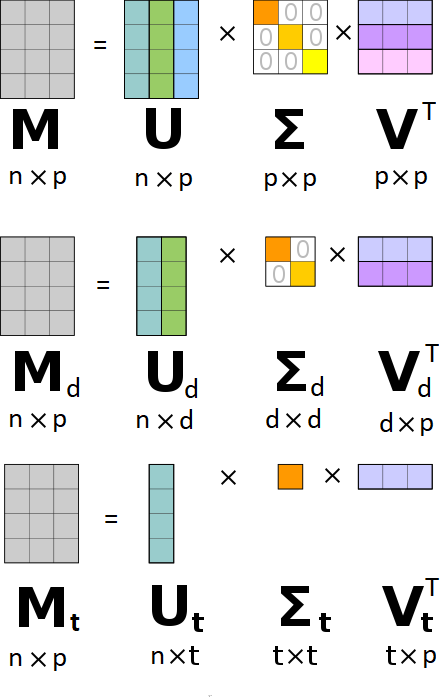
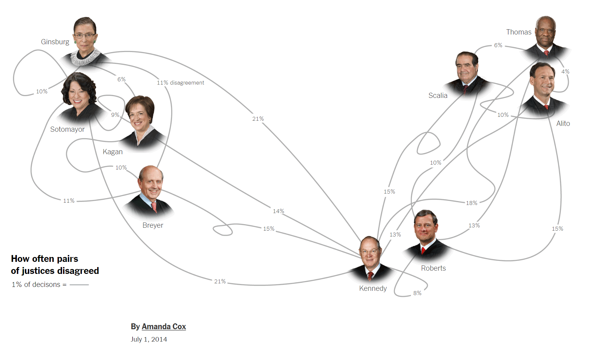
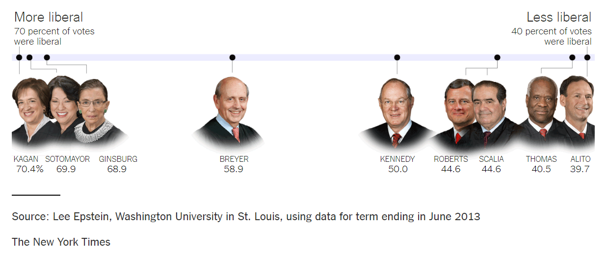

--- 
title: "Ch10 High-Dimensional Data Visualization"
subtitle: "Descriptive Analytics and Data Visualization"
author: "Yichen Qin (qinyn@ucmail.uc.edu), University of Cincinnati"
date: "`r Sys.Date()`"
output: 
  html_document:
    number_sections: true
    code_folding: "hide"
    toc: true
bibliography: [book.bib, packages.bib]
biblio-style: apalike
link-citations: yes
---

# High-Dimensional Data Visualization {-}

In this chapter, we will introduce the visualization techniques for high-dimensional data.
Most of the visualization types are suitable for low-dimensional data with a few variables.
High-dimensional data is usually harder to visualize since the association among many variables may be complex and hard to describe with traditional visualization tools which usually appear on paper or screen.
One alternative is to conduct dimension reduction before visualization, so that we can visualize the low-dimensional representation of the high-dimensional data.
Another commonly used technique is clustering analysis, which partition data in different groups according to their similarities, making the visualization easier.
In this chapter, we will discuss these two important techniques, dimension reduction and clustering.

Here is a list of R packages used in this section.

```{r, warning=FALSE, message=FALSE}
library(tidyverse)
library(plotly)
library(devtools)
library(ggbiplot)#devtools::install_github("vqv/ggbiplot")
library(gridExtra)
library(ggrepel)
library(Rtsne)
library(GGally)
library(clue)
library(factoextra)
library(mclust)
```


# Dimension Reduction

We start with the dimension reduction techniques.
The high-dimensional data usually comes in two different forms.
First, it can be represented by a $n$ by $p$ matrix where each row is one observation and each column is one variable.
In this case, we can often apply principal component analysis and etc.
Second, it can also be a $n$ by $n$ similarity/dissimilarity matrix of $n$ units, where the element on the $i$-th row and $j$-th column represents the similarity or dissimilarity measure between units $i$ and $j$.
In this case, we can apply multidimensional scaling and etc.
Note that even if data comes in the first form, we can convert it to the second form by calculating its similarity/dissimilarity matrices.

## Principal Component Analysis

Principal component analysis (PCA) approximates a high-dimensional data set, a $n$ by $p$ matrix, with a low-dimensional data set, a $n$ by $d$ matrix,
so that the low-dimensional data preserves the variation of the high-dimensional data as much as possible.
In particular, each column of the low-dimensional data set is called a principal component, which is a linear combination the columns/variables in the high-dimensional data set.
In particular, suppose the high-dimensional data sets contains $p$ columns/variables $X_1, ..., X_p$. 
And the low-dimensional data set contains $d$ principal components $PC_1, ..., PC_d$.
Then these principal components can be represented as
$$
PC_1 = \beta_{11} X_1 + ... + \beta_{1p} X_p,\\
...\\
PC_d = \beta_{d1} X_1 + ... + \beta_{dp} X_p.
$$
where these coefficients $\beta_{kl}$ are called the loading.
The variance of the these principal components are in descending order, i.e., $Var(PC_1) \geq ... \geq Var(PC_d)$, meaning the first principal component represents the most variance in the original data, the second principal component represents the second most variance.
Note that these coefficients are designed to be orthogonal to each other across different principal components to ensure different principal components represent different aspects of the original data.
Also note that in theory, we can calculate $p$ principal components, but in that case, the dimension is not reduced.
To select an appropriate $d$, we often look at the value $Var(PC_d)$ as a function $d$ and find the elbow point. 

Let us see an example.
Suppose we are given the `mtcars` data set with only three variables, miles per gallon (mpg), displacement (disp), and 1/4 mile time (qsec).
Here we use only three variables for the ease of illustration.
Real data sets usually come with many more variables.
Since it has only three variables, we can visualize it with a 3D scatterplot.

```{r, warning=FALSE, message=FALSE}
library(tidyverse)
library(plotly)
X = select(mtcars, mpg, disp, qsec)
p1 <- plot_ly(X, x = ~qsec, y = ~mpg, z = ~disp, text = rownames(mtcars), marker = list(size = 5, color = 'rgba(200, 128, 128, 1)'))
p1
```

The 3D plot seems OK, especially when it is interactive.
However, as we can mentioned previously, 3D visualization should generally be avoided because most visualizations are meant to be printed either on paper or screen in which case the relative positions among these data points are hard to see.
Besides, what if we have more than three variables, say four?
There is no 3D plot suitable for 4-dimensional data.
Hence, we need to visualize this data set in lower dimensions, say two dimensions.

To visualize the data in a two dimensional space, we need to compress the data.
A simple approach is push all the data points into a two-dimensional hyperplane, i.e., projection.
But which hyperplane?
Ideally, we would like to have these projected data points to best represents the original data.
Intuitively, the hyperplane is decided according the the directions in which the original data points spread the most.
We would like to have projected data points to have as much variance as the original data points have.

In the figure, the directions in which the data points' variation is the largest, second and third largest are shown in orange, green, and yellow.
To preserve the variance of the data and push the data to two dimension space, it makes sense to project the data points to the hyperplane determined by the first and second directions.
The projected data points are shown in blue.
Note that these projected data points still live in three dimensional space with three coordinates (x,y,z).
When we look at only the hyperplane, then each blue point can be indexed by two coordinate (PC1, PC2), which are what principal components represent.
In other words, the principal components can understood as the coordinates of these projects data points in the subspace hyperplane.

```{r, echo=FALSE}
Xscaled = as_tibble(scale(X))
Xsvd <- svd(Xscaled)
X2d_in3d = Xsvd$u[,1:2] %*% diag(Xsvd$d[1:2]) %*% t(Xsvd$v[,1:2])
X1p_in3d = Xsvd$d[1] * Xsvd$u[,1] %*% t(Xsvd$v[,1])
X2p_in3d = Xsvd$d[2] * Xsvd$u[,2] %*% t(Xsvd$v[,2])
X3p_in3d = Xsvd$d[3] * Xsvd$u[,3] %*% t(Xsvd$v[,3])
X2d = as.matrix(Xscaled) %*% Xsvd$v[,1:2]
X2d_in3d=as.data.frame(X2d_in3d)
X1p_in3d=as.data.frame(X1p_in3d)
X2p_in3d=as.data.frame(X2p_in3d)
X3p_in3d=as.data.frame(X3p_in3d)
names(X2d_in3d)=names(X)
names(X1p_in3d)=names(X)
names(X2p_in3d)=names(X)
names(X3p_in3d)=names(X)
Xcombo=rbind(Xscaled,X2d_in3d,X1p_in3d,X2p_in3d,X3p_in3d)
Xcombo$label=rep(c("original","2d","1p","2p","3p"),each = nrow(X))
Xcombo$label=factor(Xcombo$label,levels = c("original","2d","1p","2p","3p"))
p2 <- plot_ly(Xcombo, x = ~qsec, y = ~mpg, z = ~disp, color=~label, 
              colors = c("#cccccc","blue","#ff9900","#ffcc00","yellow")) %>% add_markers(marker = list(size = 5))
p2
```

Mathematically, the principal components are calculated using the singular value decomposition (SVD).
For an arbitrary $n$ by $p$ matrix, it can be decomposed to the product of three matrices.
The last matrix essentially presents the $d$ orthogonal directions in which the variation of the data is the descending.
The middle matrix is diagonal, that is only elements in the diagonal positions are non zero and the rest elements are all zero.
These diagonal elements represents the variance in these directions.
The first matrix represents the standardized coordinates of the projected data points in the sense that the variance in all directions are one.
Therefore, the product of the first and second matrices are essentially the principal components.
Here we pick the first two principal components.
Note that if we use all three principal components, then we essentially just rotate the data without reducing the dimension.

```{r, echo=FALSE, out.width = "50%"}

```

Now let us conduct PCA on the 3-dimensional mtcars data set to obtain the 2-dimensional approximation.
PCA is provided in the `prcomp()` function in R.
It is often recommended to standardize the data before applying PCA.

```{r, fig.width=8,fig.height=6}
Xscaled = as_tibble(scale(X))
PCA <- prcomp(Xscaled, center = TRUE, scale. = TRUE)
summary(PCA)
```

As we can see the first principal component has a standard deviation of `1.46` or variance of `1.46^2`, which explains 72% of the total variance of the original data.
If we consider the first two principal components, they account for 94% of the total variance, which is sufficient for representing the data.
We can also take a look at these principal components, which are very different from the original data in value.

```{r}
head(PCA$x)
```

We can plot these principal components in a scatter plot.
Comparing the blue points in the scatter plot with the blue points in 3D plot, we can see the identical pattern, confirming our understanding that the principal components are just the projection of the original data set.
We can also plot the directions of the three original variables in the principal components space.

```{r}
p3 <- ggplot(cbind(as.data.frame(PCA$x),name = rownames(mtcars)))+
  geom_hline(yintercept = 0, color="#ff9900")+
  geom_vline(xintercept = 0,color="#ffcc00")+
  geom_point(aes(x=PC1, y=PC2),size=2,color="blue")+
  geom_text_repel(aes(x=PC1, y=PC2, label=name), size=2)
library(ggbiplot)
p4=ggbiplot(PCA)
grid.arrange(p3, p4, ncol=2)
```


<!---
Alternatively, we can conduct PCA manually as follows.

```{r}
d=3
X_PC = Xsvd$u[,1:d] %*% diag(Xsvd$d[1:d]) 
# Or we can obtain the principal component through projection as follows. It is equivalent to the above.
# X_PC = as.matrix(Xscaled) %*% Xsvd$v[,1:d]
loadings_var2PC = Xsvd$v[,1:d]
# as.matrix(Xscaled) %*% loadings_var2PC generates X_PC, i.e., principal components.
sum(abs(X_PC - as.matrix(Xscaled) %*% loadings_var2PC))
loadings_PC2var = t(Xsvd$v[,1:d]) 
# X_PC %*% loadings_PC2var generates the approximation of Xscaled.
sum(abs(Xscaled - X_PC %*% loadings_PC2var)) 
d=2
X_PC = Xsvd$u[,1:d] %*% diag(Xsvd$d[1:d]) 
loadings_var2PC = Xsvd$v[,1:d]
sum(abs(X_PC - as.matrix(Xscaled) %*% loadings_var2PC))
loadings_PC2var = t(Xsvd$v[,1:d]) 
sum(abs(Xscaled - X_PC %*% loadings_PC2var)) 
X_PC_df = as.data.frame(X_PC)
names(X_PC_df)=c("PC1","PC2")
p5 <- ggplot(X_PC_df)+
  geom_point(aes(x=PC1,y=PC2),color="blue") +
  geom_hline(yintercept = 0, color="#ff9900")+
  geom_vline(xintercept = 0,color="#ffcc00")
loadings_PC2var_df = as.data.frame(t(loadings_PC2var))
p6 <- ggplot(as.data.frame(scale(X_PC_df)))+
  geom_point(aes(x=PC1,y=PC2),color="blue") +
  geom_hline(yintercept = 0, color="#ff9900")+
  geom_vline(xintercept = 0,color="#ffcc00")+
  geom_point(data=loadings_PC2var_df, mapping = aes(x=V1, y=V2),col="red",size=3)+
  xlab("Standardized PC1")+ylab("Standardized PC2")
library(gridExtra)
grid.arrange(p5, p6, ncol=2)
```

Another representation.

```{r, eval=FALSE}
mtcars_svd = svd(mtcars_center)
mtcars_approxd3=mtcars_svd$u[,1:3] %*% diag(mtcars_svd$d[1:3]) %*% t(mtcars_svd$v[,1:3])
mtcars_approxd2=mtcars_svd$u[,1:2] %*% diag(mtcars_svd$d[1:2]) %*% t(mtcars_svd$v[,1:2])
mtcars_approxd1=mtcars_svd$u[,1] %*% as.matrix(mtcars_svd$d[1])%*% t(mtcars_svd$v[,1])
colnames(mtcars_approxd3)=
  colnames(mtcars_approxd2)=
  colnames(mtcars_approxd1)=
  names(mtcars_center)
heatmap(as.matrix(mtcars_center), Colv = NA, Rowv = NA)
heatmap(mtcars_approxd3, Colv = NA, Rowv = NA)
heatmap(mtcars_approxd2, Colv = NA, Rowv = NA)
heatmap(mtcars_approxd1, Colv = NA, Rowv = NA)
```

```{r, fig.height=10,fig.width=8, eval=FALSE}
par(mfrow=c(2,2))
image(t(mtcars_center))
image(t(mtcars_approxd3))
image(t(mtcars_approxd2))
image(t(mtcars_approxd1))
```
--->

Now let us look at a more realistic example using the entire mtcars data set (excluding the discrete variables).
When conducting PCA, the first decision is $d$, i.e., the dimension to reduce to.
The selection of $d$ is usually based on the variance of the principal components.
The rule of thumb is to select the "elbow" point as the dimension to reduce to.
So in this case, two or three dimensions are appropriate choices.

```{r}
mtcars_data = mtcars[,c(1:7,10,11)]
p=dim(mtcars_data)[2]
n=dim(mtcars_data)[1]
mtcars_center = as_tibble(scale(mtcars_data))
mtcars_pca <- prcomp(mtcars_center, center = TRUE,scale. = TRUE)
summary(mtcars_pca)
# check: sum(abs(mtcars_pca$x - as.matrix(mtcars_center)%*%as.matrix(mtcars_pca$rotation)))
```

```{r, fig.height=3,fig.width=10, message=FALSE, warning=FALSE}
library(ggbiplot)
g1=ggbiplot(mtcars_pca)
g2=ggplot(cbind(as.data.frame(mtcars_pca$x),name = rownames(mtcars)))+
  geom_point(aes(x=PC1, y=PC2),size=2)+
  geom_text_repel(aes(x=PC1, y=PC2, label=name), size=2)
g3=ggplot(data.frame(dim = 1:p, var_percentage=mtcars_pca$sdev^2/sum(mtcars_pca$sdev^2)))+
  geom_point(aes(x=dim, y=var_percentage))
grid.arrange(g1, g2, g3, ncol=3)
```


## Multidimensional Scaling

When the high dimensional data is a $n$ by $n$ similar matrix, where the element on the $i$-th row and $j$-th column represents the distance between units $i$ and $j$, then multidimensional scaling (MDS) is usually a suitable method for dimension reduction.
MDS translates these pairwise distances among $n$ observations into a coordinates of the units in a low-dimensional space, which is often called embedding.
And the Euclidean distances among points in the embedding space maximally preserve the distance in the original similarity matrix.

$$
\arg\min_{y_{1},...,y_{n}}{\sum _{i < j}(d_{ij}-\|y_{i}-y_{j}\|)^{2}}.
$$

We use the following example to demonstrate the usage of MDS.
We have a similar matrix showing the number of times 15 congressmen from New Jersey voted differently in the House of Representatives on 19 environmental bills. 
Abstentions are not recorded.
The data is in the R package `HSAUR` for @Hothorn2009.
We also show the party affiliation of these congressmen.
We first show the similar matrix as follows.

```{r}
voting=read.csv("./data/voting_NJ.csv",row.names = 1)
voting
heatmap(as.matrix(voting), Rowv=NA, Colv=NA)
```

As we can see, these 15 congressmen are quite different in their voting patterns, but the heatmap is still hard to digest and we do not have holistic view of how these 15 congressmen are different.
To solve that, we apply MDS on this similar matrix.

```{r}
voting_mds <- as.data.frame(cmdscale(voting))
ggplot(voting_mds, aes(x=V1, y=V2, label=rownames(voting_mds))) + 
  geom_point()+
  geom_text_repel()
```

Clearly, the democrats vote similarly.
Interestingly, the republicans vote differently from the democrats and also from themselves, since their coordinates in the MDS are far apart from each other.
One republican actually votes similarly to the democrats, i.e., Rinaldo_R.
These patterns cannot be identified from the heatmap of the similarity matrix.

Lastly, PCA and classical MDS are equivalent if the similarity matrix for MDS is calculated using Euclidean distance.
This is shown below using the mtcars data set.

```{r, message=FALSE, warning=FALSE}
# Classical MDS
# n rows (objects) x p columns (variables)
# each row identified by a unique row name
mtcars_dist <- dist(mtcars_center) # euclidean distances between the rows
mtcars_mds <- cmdscale(mtcars_dist, k=3) # k is the number of dim
mtcars_mds <- cbind(as.data.frame(mtcars_mds),
                    name=rownames(mtcars))
ggplot(mtcars_mds)+
  geom_point(aes(x=V1, y=V2))+
  geom_text_repel(aes(x=V1, y=V2, label=name))
```


Similar examples are given by [An Even More Nuanced Breakdown of the Supreme Court is](https://www.nytimes.com/2014/07/02/upshot/an-even-more-nuanced-breakdown-of-the-supreme-court.html) and [A More Nuanced Breakdown of the Supreme Court](https://www.nytimes.com/2014/06/27/upshot/a-more-nuanced-breakdown-of-the-supreme-court.html)

```{r scotus, echo=FALSE}


```


## Isomap

Isomap (@Tenenbaum2000) is another dimension reduction method similar to MDS. 
It is a common technique in manifold learning.
It computes a low-dimensional representation of a set of high-dimensional data points. 
The key difference between Isomap and MDS is that Isomap uses geodesic distance, which is often approximated by the distances between two observations induced by a neighborhood graph.
The key difference is the distance is induced by neighbors instead of Euclidean distance.


**Swiss roll example**

```{r, message=FALSE, warning=FALSE}
d = read_csv("data/swiss.csv")
swiss = d[,1:3]
swiss_label = d$y
library(plotly)
p1 <- plot_ly(d, x = ~x1, y = ~x2, z = ~x3, color = ~y)
p1
```

If we apply MDS i.e., PCA with Euclidean distance, the results are not very surprising.

```{r}
swiss_dist <- dist(swiss) # euclidean distances between the rows
swiss_mds  <- cmdscale(swiss_dist, k=2) # k is the number of dim
swiss_mds  <- as.data.frame(swiss_mds)
ggplot(swiss_mds) +
  geom_point(aes(x=V1, y=V2))
swiss_mds_lab = data.frame(swiss_mds, label = swiss_label)
ggplot(swiss_mds_lab) +
  geom_point(aes(x = V1, y = V2, color = label)) +
  scale_color_viridis_c()
```

On the other hand, we can apply isomap.

```{r, eval=FALSE}
isomap <- function(data_csv) {
    dist_vec <- dist(data_csv, method = "euclidean", diag = FALSE, upper = FALSE, p = 2)
    #size = length(data_csv[,1])
    size = dim(data_csv)[1]
    matrix <- matrix(Inf, nrow = size, ncol = size)
    for (i in 1:(size - 1)) {
        for (j in (i + 1):size) {
            matrix[i, j] = dist_vec[size*(i - 1) - i*(i - 1)/2 + j - i]
            matrix[j, i] = matrix[i, j]
        }  
    }
    
    knn <- 5
    nn = matrix(0, size, knn)
    mtx <- matrix
    
    for (i in 1:size) {
        matrix[i, i] <- Inf
    }
    
    for(i in 1:size){
        nn[i,] <- order(mtx[i,])[1:knn]
    }
    
    for (i in 1:length(nn[,1])) {
        matrix[i, -nn[i,]] <- Inf
    }
    
    for (i in 1:size) {
        matrix[i, i] <- 0
    }
    
    # All-Pairs Shortest Path Algorithms
    for (k in 1:size) {
        for (i in 1:size) {
            for (j in 1:size) {
                matrix[i, j] <- min(matrix[i, j], matrix[i, k] + matrix[k, j])
                matrix[j, i] <- matrix[i, j]
            }
        }
    }

    #maxind <- which(matrix == max(matrix), arr.ind = T)
    #matrixmax <- matrix[maxind[1], maxind[2]]
    #print(matrixmax)
    # for (i in 1:size) {
    #     for (j in 1:size) {
    #         if (matrix[i,j] == Inf) {
    #             matrix[i,j] <- matrixmax * 2
    #         }
    #     }
    # }

    adj_mat = matrix
    num_inf = sum(is.infinite(adj_mat))
    adj_mat[is.infinite(adj_mat)] = max(adj_mat[is.finite(adj_mat)]) * runif(num_inf)
    fit <- cmdscale(adj_mat, eig = FALSE, k = 2)
}
swiss_isomap <- isomap(swiss)
swiss_isomap_lab = data.frame(swiss_isomap, label = swiss_label)
ggplot(swiss_isomap_lab) +
  geom_point(aes(x = X1, y = X2, color = label)) +
  scale_color_viridis_c() +
  ylim(-5,5)
```

```{r, echo=FALSE, message=FALSE, warning=FALSE}
#saveRDS(swiss_isomap, "data/swiss_isomap.rds")
swiss_isomap <- readRDS("data/swiss_isomap.rds")
swiss_isomap_lab = data.frame(swiss_isomap, label = swiss_label)
ggplot(swiss_isomap_lab) +
  geom_point(aes(x = X1, y = X2, color = label)) +
  scale_color_viridis_c() +
  ylim(-5,5) +
  coord_fixed(4)
```


## t-Distributed Stochastic Neighbor Embedding

The t-SNE also aims to learn the $d$-dimensional embeddings $z_{1}, \dots , z_{n} \in \mathbb{R}^d$ of the original observation $x_{1}, \dots , x_{n} \in \mathbb{R}^p$, so that the similarity matrix among the embeddings mimics the similarity matrix among the original observations as closely as possible.
This is very similar to the concept of MDS.
In the case of MDS, the similarity matrix consists of the pairwise Euclidean distance and the closeness between two similarity matrices are measure by matrix norm 
The key part in t-SNE is the way similarities are defined and the distance between two set of similarities.
In particular, the similarities are defined in the following way.

First, the similarities among the original observations are defined as

$$p_{ij} = (p_{i|j} + p_{j|i})/(2n),\\
p_{j\mid i}= \frac {\exp(-\lVert \mathbf {x} _{i}-\mathbf {x} _{j}\rVert ^{2}/2\sigma _{i}^{2})}
{\sum _{k\neq i}\exp(-\lVert \mathbf {x} _{i}-\mathbf {x} _{k}\rVert ^{2}/2\sigma _{i}^{2})}.$$

Then, the similarities among the embeddings are defined as 

$$q_{ij} = \frac {(1+\lVert z_i-z_j \rVert^{2})^{-1}}
{\sum _{k} \sum _{l\neq k} (1+\lVert z_{k}-z_{l}\rVert ^{2})^{-1}}$$

Note that $p_{ji}=p_{ji}$ and $q_{ji}=q_{ji}$, $p_{ii}=q_{ii}=0$, and $\sum_{i,j}p_{ij} = \sum_{i,j}q_{ij}=1$.

Finally, the embeddings are determined by minimizing the (non-symmetric) Kullback–Leibler divergence of the distribution of $p_{ij}$ from that of $q_{ij}$,

$$\text{KL} ( P | Q )= \sum_{i \neq j} p_{ij} \log {\frac {p_{ij}}{q_{ij}}}$$

The minimization of the Kullback–Leibler divergence with respect to the points $z_{i}$ is performed using gradient descent. 
The result of this optimization is a map that reflects the similarities between the high-dimensional inputs.

```{r}
library(Rtsne)
set.seed(123)
mtcars_tSNE <- Rtsne(mtcars_center, perplexity=10)
head(mtcars_tSNE$Y)
```


```{r}
embedding = cbind(as.data.frame(mtcars_tSNE$Y),name=rownames(mtcars))
ggplot(embedding)+
  geom_point(aes(x=V1, y=V2))+
  geom_text_repel(aes(x=V1, y=V2, label=name))
```

We now visualize a much larger data set --- MINST.
The 


```{r, fig.width=8, fig.height=4}
library(tidyverse)
library(Rtsne)
d = readRDS("data/mnist.rds")
X = d[,-1]
Y = d[, 1]
par(mfrow=c(2,5))
for (i in 1:10){
  image(matrix(as.numeric(X[i,]), nrow=28)[,28:1])
}
```

We conduct tSNE on this data set and visualize the data in 2-dimensional space.
As we can see, the observations that corresponding to the same digit are close to each other.

```{r, eval=FALSE}
mnist_tsne <- Rtsne(X, perplexity=5)
tsne = data.frame(mnist_tsne$Y, label = Y)
ggplot(tsne) +
  geom_point(aes(x = X1, y = X2, color = as.factor(label))) +
  scale_color_viridis_d()
```

```{r, echo=FALSE}
#saveRDS(mnist_tsne, "data/mnist_tsne.rds")
mnist_tsne <- readRDS("data/mnist_tsne.rds")
tsne = data.frame(mnist_tsne$Y, label = Y)
ggplot(tsne) +
  geom_point(aes(x = X1, y = X2, color = as.factor(label),
                 shape = as.factor(label))) +
  scale_shape_manual(values=c(6,4,0,15,1,16,2,17,5,18)) +
  scale_color_viridis_d()
```

As a comparison, we reduce the dimension using PCA. 
The scree plot shows that the best dimension is around 50.
Due to the limit of space, we plot the first four principal components below.
As we can see, the PCA does not separate the observations as well as tSNE.
In fact, 

```{r, fig.width=3, fig.height=3}
Xclean = X[, apply(X, 2, sd) != 0]
Xscaled = as_tibble(scale(Xclean))
PCA <- prcomp(Xscaled, center = TRUE, scale. = TRUE)
plot(PCA$sdev^2, pch=20)
```

We plot the first a few principal components in a pairwise scatterplot.

```{r, fig.width=10, fig.height=10}
PCA_df = data.frame(PCA$x, Y)
library(GGally)
ggpairs(PCA_df,          # Data frame
        columns = 1:5,
        aes(color = as.factor(Y), alpha = 0.1))
```

**Swiss roll example**

```{r}
swiss_tsne <- Rtsne(swiss, perplexity=5)
swiss_tsne_lab = data.frame(swiss_tsne$Y, label = swiss_label)
ggplot(swiss_tsne_lab) +
  geom_point(aes(x = X1, y = X2, color = label)) +
  scale_color_viridis_c()
```


## Autoencoder

Autoencoder uses a neural network to learn a low-dimensional representation of a set of high-dimensional data points. 
It consists a encoder and a decoder.
The encoder reduces the dimension of the original data set, while the decoder uses the output from encoder to recover the original data set.


## Radviz

```{r, eval=FALSE}
library(ggplot2)
library(Radviz)
library(dplyr)
library(tidyr)
library(GGally)
library(bodenmiller)
data(refPhenoMat) 
head(refPhenoMat) 
data(refAnnots)
ref.df <- data.frame(refAnnots,
                     refPhenoMat)
data(refPhenoMat)
data(refFuncMat)
data(refAnnots)
ref.df <- data.frame(refAnnots,
                     refPhenoMat,
                     refFuncMat)


trans <- function(coln) 
do.L(coln,fun=function(x) quantile(x,c(0.005,0.995)))

hist(ref.df$CD3)
abline(v=quantile(ref.df$CD3,c(0.005,0.995)),col=2,lty=2)

ct.S <- make.S(dimnames(refPhenoMat)[[2]])
##取一个列名称的向量，并返回一个由[x,y]位置组成的矩阵
ct.sim <- cosine(as.matrix(ref.df[,row.names(ct.S)]))
in.da(ct.S,ct.sim)
rv.da(ct.S,ct.sim)
optim.ct <- do.optimRadviz(ct.S,ct.sim,iter=100,n=1000)
ct.S <- make.S(get.optim(optim.ct)) 
##获取维度排列的最优顺序
ct.S <- recenter(ct.S,'CD3') 
##把CD3的位置维持在中间

ct.rv <- do.radviz(ref.df,ct.S,trans=trans) 
summary(ct.rv)
##投影
ct.rv ##输出图
plot(ct.rv,anchors.only=FALSE) #绘制radviz图
plot(ct.rv) + geom_point()
plot(ct.rv) +
  geom_point(data=. %>% 
               arrange(CD4), 
##按照CD4排序
             aes(color=CD4))+
  scale_color_gradient(low='grey80',high="dodgerblue4") ##调整颜色，可以加其他图层
smoothRadviz(ct.rv)
smoothRadviz(ct.rv)+
  geom_point(shape='.',alpha=1/5)
contour(ct.rv) ##轮廓图
hexplot(ct.rv) ##六角形装仓图

cur.pop <- 'igm+'
sub.rv <- subset(ct.rv,refAnnots$Cells==cur.pop)
smoothRadviz(ct.rv)+
  geom_density2d(data=sub.rv$proj$data,
                 aes(x=rx,y=ry),
                 color='black')
hexplot(ct.rv)
hexplot(ct.rv,color='CD4')
hexplot(ct.rv,color='pS6')
hexplot(ct.rv,color='pAkt')
```


# Clustering

When the high-dimensional data is reduced to a lower dimension, it is often useful to conduct clustering analysis to show the similarity and dissimilarity among data points.
Alternatively, we could also conduct the clustering on the high-dimensional data.
Either way, clustering is useful in identifying the patterns in the data.

## K-means Clustering

K-means clustering is an algorithm that partitions $n$ observations into $k$ clusters. 
Given an initial $k$ centroids (centers of the clusters), for each iteration, it first assigns each observation to the nearest centriod, and then recalculate the centroid of each cluster using newly assigned observations by taking the mean.
The algorithm stops when the assignment of observations converge.

We use k-means clustering to analyze a real data set of different mall customers with measurements of their annual incomes and spending scores (1-100)^[https://github.com/SteffiPeTaffy/machineLearningAZ/blob/master/Machine%20Learning%20A-Z%20Template%20Folder/Part%204%20-%20Clustering/Section%2025%20-%20Hierarchical%20Clustering/Mall_Customers.csv].
We would like to segment these customers into different groups so that the marketing strategies can be differentiated.
Spending score is determined based on customer behavior and purchasing data.


```{r}
customer = read.csv("./data/Mall_Customers.csv",check.names = FALSE)
head(customer)
customer = as.data.frame(apply(customer[,4:5], 2, scale))
customer_clust = customer
```

```{r,fig.height=10,fig.width=10,warning=FALSE, message=FALSE, echo=FALSE}
library(clue)
set.seed(123)
# First make a grid
n <- 500
pred_mat <- expand.grid(
  Annual_Income  = seq(-2,3, length.out = n),
  Spending_Score = seq(-2,3, length.out = n))
centers = matrix(c(-1.5,0.25,-1,-1.5, 0.5,0.5, 1.5,-1.5,2,1),5,2, byrow = TRUE)
km <- kmeans(customer, centers=centers, algorithm = "Forgy", iter.max = 1)
centers <- aggregate(customer, by=list(cluster=factor(km$cluster)), mean)
customer_clust$cluster <- factor(km$cluster)
pred_mat$cluster <- factor(cl_predict(km, pred_mat))
p1 <- ggplot(main= "iteration = 1") +
        geom_raster(data = pred_mat, aes(x = Annual_Income, y = Spending_Score, fill = cluster),alpha=0.3) +
        geom_point(data = customer_clust, aes(x = Annual_Income, y = Spending_Score, color = cluster,shape=cluster)) +
        geom_point(data = centers, aes(x = Annual_Income, y = Spending_Score, color = cluster, shape=cluster), size=5) +
        theme_bw() + coord_fixed(ratio = 1, expand = FALSE)
km <- kmeans(customer, centers=centers[,-1], algorithm = "Forgy", iter.max = 1)
centers <- aggregate(customer, by=list(cluster=factor(km$cluster)), mean)
customer_clust$cluster <- factor(km$cluster)
pred_mat$cluster <- factor(cl_predict(km, pred_mat))
p2 <- ggplot(main= "iteration = 1") +
        geom_raster(data = pred_mat, aes(x = Annual_Income, y = Spending_Score, fill = cluster),alpha=0.3) +
        geom_point(data = customer_clust, aes(x = Annual_Income, y = Spending_Score, color = cluster,shape=cluster)) +
        geom_point(data = centers, aes(x = Annual_Income, y = Spending_Score, color = cluster, shape=cluster), size=5) +
        theme_bw() + coord_fixed(ratio = 1, expand = FALSE)
km <- kmeans(customer, centers=centers[,-1], algorithm = "Forgy", iter.max = 1)
centers <- aggregate(customer, by=list(cluster=factor(km$cluster)), mean)
customer_clust$cluster <- factor(km$cluster)
pred_mat$cluster <- factor(cl_predict(km, pred_mat))
p3 <- ggplot(main= "iteration = 1") +
        geom_raster(data = pred_mat, aes(x = Annual_Income, y = Spending_Score, fill = cluster),alpha=0.3) +
        geom_point(data = customer_clust, aes(x = Annual_Income, y = Spending_Score, color = cluster,shape=cluster)) +
        geom_point(data = centers, aes(x = Annual_Income, y = Spending_Score, color = cluster, shape=cluster), size=5) +
        theme_bw() + coord_fixed(ratio = 1, expand = FALSE)
km <- kmeans(customer, centers=centers[,-1], algorithm = "Forgy", iter.max = 1)
centers <- aggregate(customer, by=list(cluster=factor(km$cluster)), mean)
customer_clust$cluster <- factor(km$cluster)
pred_mat$cluster <- factor(cl_predict(km, pred_mat))
p4 <- ggplot(main= "iteration = 1") +
        geom_raster(data = pred_mat, aes(x = Annual_Income, y = Spending_Score, fill = cluster),alpha=0.3) +
        geom_point(data = customer_clust, aes(x = Annual_Income, y = Spending_Score, color = cluster,shape=cluster)) +
        geom_point(data = centers, aes(x = Annual_Income, y = Spending_Score, color = cluster, shape=cluster), size=5) +
        theme_bw() + coord_fixed(ratio = 1, expand = FALSE)
grid.arrange(p1,p2,p3,p4,nrow = 2)
```

We can apply k-means on the MDS embedding of the mtcars.

```{r,fig.height=10,fig.width=10,warning=FALSE}
mtcars_data = mtcars[,c(1:7,10,11)]
mtcars_center = as_tibble(scale(mtcars_data))
mtcars_dist <- dist(mtcars_center)
data = as.data.frame(cmdscale(mtcars_dist, k=2)) # k is the number of dim
ngrid <- 500
pred.mat <- expand.grid(
  `V1` = with(data, seq(-4,4, length.out = ngrid)),
  `V2` = with(data, seq(-4,4, length.out = ngrid))
)
km <- kmeans(data, centers=4, algorithm = "Forgy", iter.max = 1)
updated_centroids = aggregate(data, by=list(cluster=factor(km$cluster)), mean)
data_clust <- data.frame(data, cluster = factor(km$cluster))
pred.mat$cluster <- factor(cl_predict(km, pred.mat))
p1 <- ggplot(main= "iteration = 1") +
        geom_raster(data = pred.mat, aes(x = V1, y = V2, fill = cluster), alpha = 0.3) +
        geom_point(data = data_clust, aes(x = V1, y = V2, color = cluster, shape=cluster) ) +
        geom_point(data = updated_centroids, aes(x = V1, y = V2, color = cluster, shape=cluster), size=5)  +
        theme_bw() + coord_cartesian(expand = FALSE)
km <- kmeans(data, centers=updated_centroids[,-1], algorithm = "Forgy", iter.max = 2)
updated_centroids = aggregate(data, by=list(cluster=factor(km$cluster)), mean)
data_clust <- data.frame(data, cluster = factor(km$cluster))
pred.mat$cluster <- factor(cl_predict(km, pred.mat))
p2 <- ggplot(main= "iteration = 1") +
        geom_raster(data = pred.mat, aes(x = V1, y = V2, fill = cluster), alpha = 0.3) +
        geom_point(data = data_clust, aes(x = V1, y = V2, color = cluster, shape=cluster) ) +
        geom_point(data = updated_centroids, aes(x = V1, y = V2, color = cluster, shape=cluster), size=5)  +
        theme_bw() + coord_cartesian(expand = FALSE)
km <- kmeans(data, centers=updated_centroids[,-1], algorithm = "Forgy", iter.max = 2)
updated_centroids = aggregate(data, by=list(cluster=factor(km$cluster)), mean)
data_clust <- data.frame(data, cluster = factor(km$cluster))
pred.mat$cluster <- factor(cl_predict(km, pred.mat))
p3 <- ggplot(main= "iteration = 1") +
        geom_raster(data = pred.mat, aes(x = V1, y = V2, fill = cluster), alpha = 0.3) +
        geom_point(data = data_clust, aes(x = V1, y = V2, color = cluster, shape=cluster) ) +
        geom_point(data = updated_centroids, aes(x = V1, y = V2, color = cluster, shape=cluster), size=5)  +
        theme_bw() + coord_cartesian(expand = FALSE)
km <- kmeans(data, centers=updated_centroids[,-1], algorithm = "Forgy", iter.max = 2)
updated_centroids = aggregate(data, by=list(cluster=factor(km$cluster)), mean)
data_clust <- data.frame(data, cluster = factor(km$cluster))
pred.mat$cluster <- factor(cl_predict(km, pred.mat))
p4 <- ggplot(main= "iteration = 1") +
        geom_raster(data = pred.mat, aes(x = V1, y = V2, fill = cluster), alpha = 0.3) +
        geom_point(data = data_clust, aes(x = V1, y = V2, color = cluster, shape=cluster) ) +
        geom_point(data = updated_centroids, aes(x = V1, y = V2, color = cluster, shape=cluster), size=5)  +
        theme_bw() + coord_cartesian(expand = FALSE)
library(gridExtra)
grid.arrange(p1, p2, p3, p4, ncol=2)
```


## Model Based Clustering

As a generalization of k-means, model based clustering assumes that the observations from each cluster are generated by a distinct distribution.
Model based clustering first estimates these distributions simultaneously and used the estimated distributions to segment the data points.
Among all the distributions, Gaussian distribution are most frequently assumed, hence the model based clustering is conducted by fitting a Gaussian mixture model (GMM) to the data.
Note that when these Gaussian distributions are assumed to have the identical spherical covariance matrix, i.e., diagonal and all elements on the diagonal are equal $\Sigma = \lambda I$, then model based clustering reduces to k-means.

 1. Accounting for distribution variance (can handle oblong clusters) v.s. k-means circular cluster
 2. Soft classification
 
 Example: Gaussian Mixture model (GMM): Assume data are generated from multiple Gaussian distributions, our goal is to assign the data points to the appropriate gaussian distribution center.
 
Using the same data set, we fit a GMM to the data and 

```{r,fig.height=5,fig.width=5,warning=FALSE}
set.seed(111)
library(factoextra)
library(mclust)
data = read.csv("./data/Mall_Customers.csv",check.names = FALSE)
head(data)
data[,3:5] = apply(data[,3:5],2,scale)
fit_gmm = Mclust(data[,4:5], G=5)
data$cluster_gmm <- fit_gmm$classification
p5 <- fviz_cluster(fit_gmm, data[,c(4,5)],
             geom = "point",
             ellipse.type = "norm",
             main = "gmm cluster",
             ggtheme = theme_bw(),
             ylim = c(-2,3)
             )
p5
```

## Hierarchical Clustering

Treating each observation as a separate cluster, for each iteration, 

1. Identify the two clusters that are closest together.

2. Merge the two most similar clusters. 

This algorithm stops until all the clusters are merged into 1.

```{r}
set.seed(111)
hc_result <- hclust(dist(data[,c(4,5)]))
plot(hc_result,xlab="data")
#Cut Dendrogram into 3 Clusters
rect.hclust(hc_result, k=3)
```


